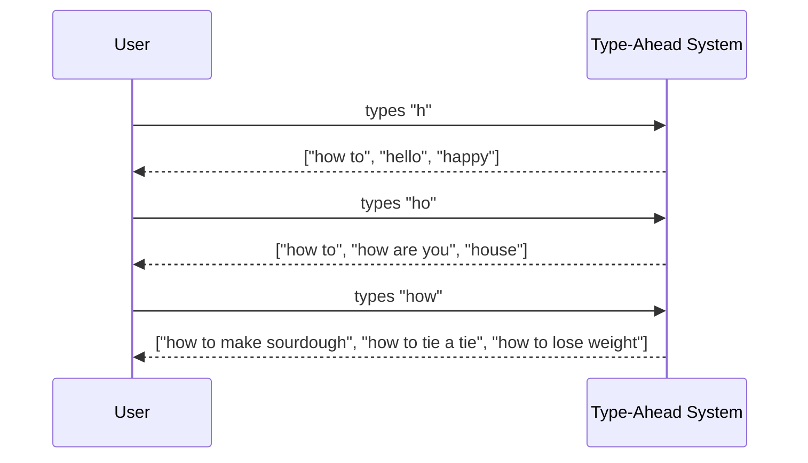

## What Are We Building?

A **type-ahead system** (also called autocomplete or autosuggest) shows you a list of suggestions as you type — updating in real time with every keystroke.

You use it dozens of times a day without thinking about it:

- Type `"how to"` in Google → instantly see `"how to make sourdough"`, `"how to tie a tie"`
- Type `"shir"` on Amazon → instantly see `"shirt"`, `"shorts"`, `"shoes"`
- Type a friend's name in WhatsApp → their full name appears before you finish

Every character typed is a new request. Suggestions get more specific as the prefix gets longer.

---
