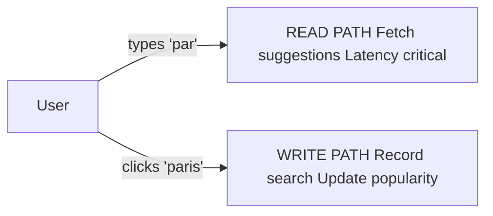

> Functional requirements describe **what the system must do**.
> For type-ahead, there are two distinct paths: a **read path** (fetch suggestions) and a **write path** (record what users searched). Both must be designed separately.

---

## 1. Autocomplete Suggestions

The system must return relevant suggestions for a given prefix, updating with every keystroke.

```
User types "par"  →  system returns:
  1. "paris"
  2. "paris city guide"
  3. "parking near me"
  4. "parenting tips"
  5. "paramount plus"
```

This is the core feature — everything else in this document exists to make this work correctly and efficiently.

---

## 2. Ranking by Popularity

Returning *any* matching words is not enough. The system must return the **most useful** ones first.

**Default ranking: historical search frequency**

```
"par" matches hundreds of words. Return the top 10 most searched:

  "paris"           → searched 50M times  ← show first
  "parking"         → searched 40M times
  "paramount plus"  → searched 30M times
  ...
  "parenchyma"      → searched 200 times  ← don't show
```

**Why top 10?**
- More than 10 overwhelms the user — they stop reading the list
- Fewer than 5 may miss what they're looking for
- 5–10 is the UX sweet spot; Google uses 10

**What's out of scope (for now):**

| Feature | Why excluded |
|---|---|
| **Recency boost** | Trending topics (e.g., "earthquake 2026") should rank higher temporarily — this requires a separate freshness pipeline, added later |
| **Personalisation** | Ranking based on your location, history, language — primarily an ML problem layered on top of base retrieval, separate system |

> [!info] Interview tip
> Always acknowledge these exist but explicitly park them: *"Personalisation is out of scope for the base design — it's an ML ranking layer we'd add later."* This shows awareness without derailing the design.

---

## 3. Prefix Length Constraints

Autocomplete only triggers when:

```
3 ≤ prefix length ≤ 20
```

### Why minimum 3 characters?

| Prefix | Matches | Problem |
|---|---|---|
| `"a"` | Millions of words | Useless — too broad, high backend load, no signal |
| `"ap"` | Hundreds of thousands | Still too broad |
| `"app"` | Thousands | Manageable, useful suggestions start appearing |

Single and double character queries generate enormous load for near-zero value. The 3-character minimum is a practical filter.

### Why maximum 20 characters?

Prefixes longer than 20 characters are almost always:
- A full sentence the user has already typed (they don't need suggestions anymore)
- A rare edge case not worth optimising storage for

Capping at 20 limits the keyspace we need to pre-compute and cache.

---

## 4. Two Distinct Request Types

This is the most important structural insight of the functional requirements. Type-ahead has **two completely separate paths** that need different designs:



### Read Path — Typeahead Query

**Triggered by:** every keystroke in the search box

**Input:** current prefix (e.g., `"par"`)

**Output:** top 10 matching suggestions ranked by popularity

**Characteristics:**
- Extremely **read-heavy** — fires on every keystroke
- **Latency critical** — user is actively waiting, finger on keyboard
- Same prefix gets queried millions of times per day → **heavily cacheable**

---

### Write Path — Search Submission

**Triggered by:** user clicks a suggestion or hits Enter to submit

**Input:** the full search query (e.g., `"paris city cost of living"`)

**Output:** popularity counter for that query gets incremented

**Characteristics:**
- **Write-heavy** — every completed search is a write
- **Not latency critical** — can be processed asynchronously, user doesn't wait for this
- Feeds the ranking pipeline — over time, popular searches rise to the top

> [!info] Why separate these two paths?
> They have opposite characteristics. Reads need sub-100ms responses and are cacheable. Writes can be batched and processed in the background. Designing them as one system would force unnecessary trade-offs.

---

## 5. Client-Side Optimisations

These are requirements on the **client** (browser/app), not the server. They exist to protect the backend from being overwhelmed.

### Debouncing

Without debouncing, every single keystroke fires a request immediately:

```
User types "paris" quickly:
  p  →  request 1
  a  →  request 2
  r  →  request 3
  i  →  request 4
  s  →  request 5   ← only this one matters
```

Requests 1–4 are wasted — by the time they return, the user has already typed more.

**With debouncing:** wait for the user to pause before firing a request.

```
Debounce interval: 250ms

User types "paris" in 200ms (fast typist):
  p  →  no request (still typing)
  a  →  no request (still typing)
  r  →  no request (still typing)
  i  →  no request (still typing)
  s  →  user pauses 250ms → ONE request fired for "paris" ✅
```

> [!info] What is 250ms?
> It's the typical pause between "still typing" and "stopped to think". Short enough that the user doesn't notice the delay, long enough to batch several keystrokes into one request. Google uses ~100–150ms; 250ms is a conservative starting point.

**Impact on backend load:**

Scale to 1M concurrent users:
```
Without debouncing:  5 requests(paris) × 1,000,000 users = 5,000,000 QPS

With debouncing:     1 request(paris)  × 1,000,000 users = 1,000,000 QPS
```


### Additional Client Guards

| Guard | What it does | Why |
|---|---|---|
| **Cancel in-flight requests** | If user types again before response arrives, cancel the old request | Prevents stale suggestions appearing after fresh ones |
| **Minimum prefix check** | Don't send request if prefix < 3 chars | Enforces the prefix constraint client-side before hitting the server |
| **Local cache** | Cache the last few prefix responses in the browser | If user deletes a character and retypes, no server round-trip needed |

---

## Summary

```
Read path:   prefix → top 10 suggestions ranked by popularity  (latency critical)
Write path:  completed search → increment popularity counter   (async, not latency critical)

Constraints:
  - Prefix length: 3–20 characters
  - Return top 10 results
  - Client debounces at 250ms to reduce QPS
  - Personalisation and recency boost: out of scope for base design
```
