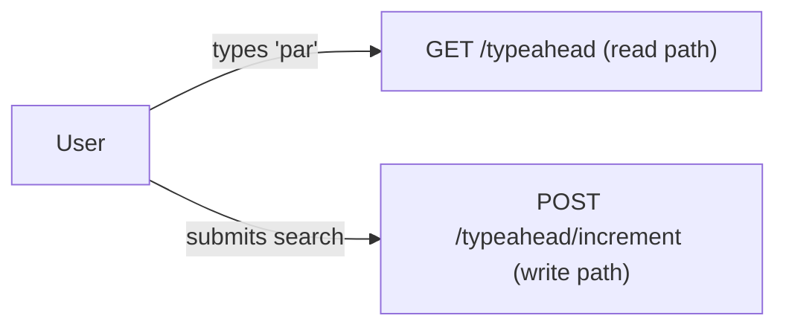
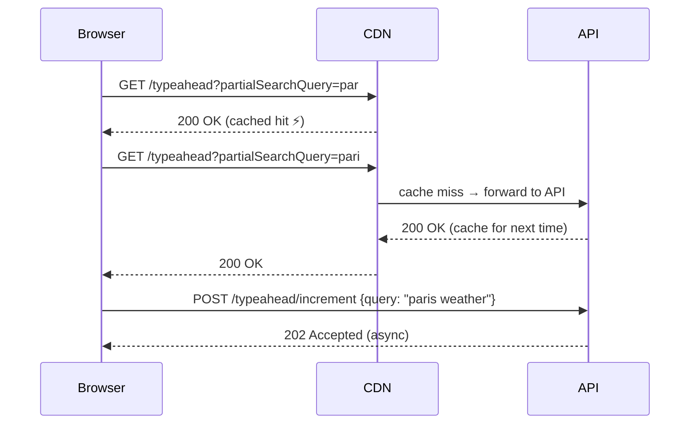

> An API spec defines the **contract** between the client (browser/app) and the server — what requests can be made, what parameters they take, and what responses to expect.
>
> We design the API before the architecture because the API is the **outside view** of the system. The architecture is the inside implementation. Getting the contract right first prevents redesigning it later.

---

## Two Endpoints — One Per Path



| Endpoint | HTTP Method | Purpose | Latency critical? |
|---|---|---|---|
| `/typeahead` | GET | Fetch ranked suggestions for a prefix | ✅ Yes — P99 < 50ms |
| `/typeahead/increment` | POST | Record a completed search, update popularity | ❌ No — async |

---

## Base Path

```http
/api/v1
```

> [!info] Why `/v1`?
> Versioning the API path means if we change the contract in the future (rename a field, change response structure), we can release `/v2` without breaking existing clients still on `/v1`. Always version public APIs from day one.

---

## 1. Fetch Autocomplete Suggestions — Read Path

### Endpoint

```http
GET /api/v1/typeahead?partialSearchQuery={prefix}
```

### Why GET?

GET is the correct HTTP method here because:
- It's a **pure read** — no data is created or modified
- GET responses are **automatically cacheable** by CDNs and browsers — critical for our < 50ms latency target
- The prefix goes in the **query string** (not the body) because GET requests have no body by convention

### Query Parameters

| Name | Type | Required | Constraints | Description |
|---|---|---|---|---|
| `partialSearchQuery` | string | Yes | Length 3–20 chars | The prefix the user has typed so far |

### Example Request

```http
GET /api/v1/typeahead?partialSearchQuery=paris HTTP/1.1
Host: api.google.com
Accept: application/json
```

### Success Response — 200 OK

```json
{
  "success": true,
  "message": "Fetched results for prefix: paris",
  "data": [
    "paris weather",
    "paris hotels",
    "paris city cost of living"
  ],
  "error": null
}
```

> [!info] Why this response envelope structure?
> The `success`, `data`, `error` wrapper is called a **response envelope**. Every API response follows the same shape regardless of success or failure — the client always knows where to look. `data` holds the payload on success. `error` holds details on failure. One or the other is always `null`.

### Error Responses

**400 Bad Request** — client sent an invalid request (wrong prefix length, missing parameter)

```json
{
  "success": false,
  "message": "Invalid request",
  "data": null,
  "error": {
    "code": "INVALID_PARAMETER",
    "details": "partialSearchQuery must be between 3 and 20 characters"
  }
}
```

**429 Too Many Requests** — client is sending requests too fast (rate limit exceeded)

```http
HTTP/1.1 429 Too Many Requests
Retry-After: 1
Content-Type: application/json
```

```json
{
  "success": false,
  "message": "Rate limit exceeded",
  "data": null,
  "error": {
    "code": "RATE_LIMITED",
    "details": "Too many requests. Retry after 1 second."
  }
}
```

> [!info] What is the `Retry-After` header?
> An HTTP response header the server sends alongside a 429 to tell the client **exactly how long to wait before trying again**.
>
> ```
> Retry-After: 1       ← wait 1 second, then retry
> Retry-After: 60      ← wait 60 seconds
> ```
>
> **Without it:** the client doesn't know when to retry. It either retries immediately (hammers the server again, making things worse) or gives up entirely (bad UX).
>
> **With it:** the client backs off for exactly the right amount of time, then retries once. The user barely notices.
>
> This is the difference between a thundering herd (everyone retrying at random times and overwhelming the server further) and a controlled backoff (clients spread out their retries predictably).
>
> ```
> Without Retry-After:               With Retry-After: 1
>
> t=0s  → 429, client retries NOW    t=0s  → 429
> t=0s  → 429, client retries NOW    t=1s  → client retries (controlled)
> t=0s  → 429, retries NOW           t=1s  → 200 OK ✅
> → server gets hammered ❌
> ```

---

## 2. Increment Search Popularity — Write Path

Records that a user submitted a full search query. Increments the popularity counter for that query, which feeds the ranking pipeline.

### Endpoint

```http
POST /api/v1/typeahead/increment
```

### Why POST and not PUT?

> [!info] HTTP method semantics
> - **PUT** = replace a resource. Calling it twice with the same data = same result (idempotent).
> - **POST** = trigger an action. Calling it twice = action happens twice (not idempotent).
>
> Incrementing a counter is **not idempotent** — calling it twice adds 2 to the count, not 1. POST is the correct choice here. Using PUT would be semantically misleading.

### Request Body

```json
{
  "query": "paris city cost of living"
}
```

### Field Schema

| Field | Type | Required | Description |
|---|---|---|---|
| `query` | string | Yes | The full search query the user submitted |

### Example Request

```http
POST /api/v1/typeahead/increment HTTP/1.1
Host: api.google.com
Content-Type: application/json

{
  "query": "paris city cost of living"
}
```

### Success Response — 202 Accepted

```json
{
  "success": true,
  "message": "Query recorded",
  "data": null,
  "error": null
}
```

> [!info] Why 202 and not 200?
> **200 OK** means "request processed and done."
> **202 Accepted** means "request received and will be processed asynchronously."
>
> Since this write goes into a queue and is processed in the background, 202 is the honest response — we've accepted it but haven't actually incremented the counter yet. Using 200 here would imply it's already done, which is a lie.

### Error Response — 500 Internal Server Error

```json
{
  "success": false,
  "message": "Failed to record query",
  "data": null,
  "error": {
    "code": "WRITE_TIMEOUT",
    "details": "Queue operation timed out"
  }
}
```

---

## Full Request Flow



---

## Summary

| | GET `/typeahead` | POST `/typeahead/increment` |
|---|---|---|
| **When** | Every keystroke after debounce | On search submission |
| **Latency** | P99 < 50ms | Not critical |
| **Cacheable** | ✅ Yes — CDN + browser | ❌ No — write operation |
| **Async** | ❌ No — user waits | ✅ Yes — fire and forget |
| **Idempotent** | ✅ Yes | ❌ No |
| **Status on success** | 200 OK | 202 Accepted |
