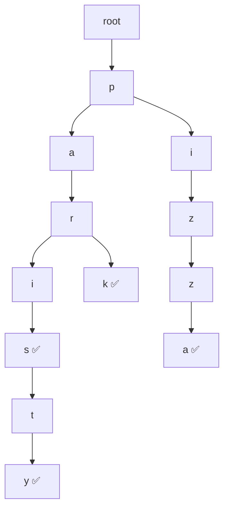
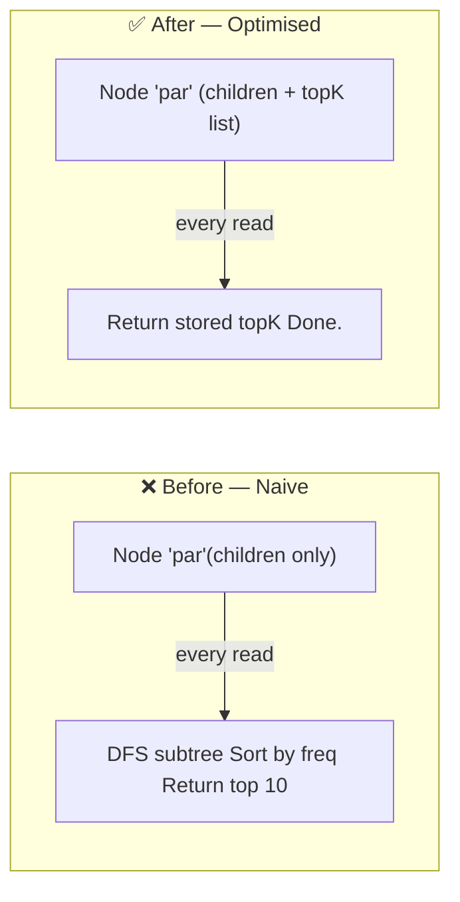
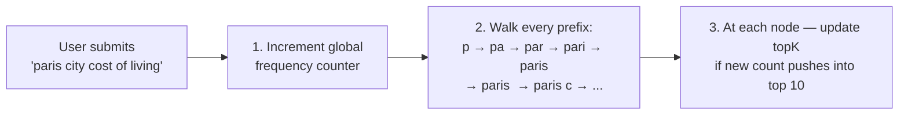

# Type-Ahead System — Tries & Data Structure Design

> [!question] The one question this file answers
> **What data structure do we use to serve prefix lookups at 1M QPS?**
> We start with the obvious answer, build it up, optimise it, then reveal why it's still painful at scale.

---

## What Is a Trie?

A ==Trie== (pronounced "try") is a tree where **each node is one character**. You spell out a word by following a path from root to leaf.



> [!example] Prefix lookup in action
> To find all words starting with `"par"`:
> traverse `p → a → r` then collect **everything** in the subtree below that node.
>
> **Time complexity:** `O(length of prefix)` to reach the node — independent of how many total words are stored.

---

## Why a Trie Looks Perfect for Autocomplete

```
User types "par"
  → traverse p → a → r          (3 steps, always)
  → collect subtree
  → return suggestions
```

- Reaches the right node in `O(prefix length)` — fast regardless of dataset size
- Structure naturally mirrors how typing works character by character
- Adding new words doesn't slow down existing lookups

So the instinct is: ==*"put all queries in a Trie"*== — correct direction. Let's build it.

---

## The Naive Approach — And Why It Collapses

Put the Trie in RAM. Store frequency count at each leaf node. On every request:

```
1. Traverse to prefix node     O(prefix length)
2. DFS entire subtree          O(subtree size)  ← 💀 the killer
3. Collect all matching words
4. Sort by frequency
5. Return top 10
```

> [!danger] For the prefix `"p"` at 1M QPS
> ```
> Subtree size = millions of words
> DFS cost     = O(millions) per request
> At 1M QPS   → millions × millions ops/sec → instant collapse ❌
> ```

Also — a Trie returns **every word** under a prefix. For `"p"` that's millions. But autocomplete needs only the **top 10 by popularity**.

```
Prefix "p" matches:
  paris, pizza, python, php, paris travel, paris weather ...
  + millions more

We need only:
  1. paris     (searched 50M times)  ← show
  2. pizza     (searched 40M times)  ← show
  3. python    (searched 30M times)  ← show
  ❌ parenchyma (searched 200 times) ← don't show
```

Steps 2–4 happen on ==every single request==, even though the top 10 for `"par"` barely changes from one second to the next. This is wasteful.

---

## The Key Insight — Precompute Top K at Every Node

> [!success] The breakthrough
> **Top 10 suggestions for a prefix don't change on every request.**
> They only change when new searches come in and popularity shifts.
> So why recompute them on every read?

**Fix: store the top K results directly at each prefix node.**



New request flow:
```
1. Traverse to prefix node    O(prefix length)
2. Return stored topK list    O(1)
✅ Done.
```

Response time = ==`O(prefix length)`== — no DFS, no sorting, nothing extra.

### The Trade-off: Space for Time

Storing top K at every node means the same query appears in multiple nodes:

```
"paris" stored in top K of:
  node "p"     → ["paris", "pizza", ...]
  node "pa"    → ["paris", "party", ...]
  node "par"   → ["paris", "park",  ...]
  node "pari"  → ["paris", ...]
  node "paris" → ["paris weather", ...]
```

> [!info] Is this worth it?
> "paris" gets stored 5 times — but total storage is ~30GB which fits in RAM.
> The read performance gain (no DFS at 1M QPS) is absolutely worth the extra memory.
> This is a classic ==space-time trade-off== — buy speed with memory.

---

## How Top K Gets Updated When New Searches Come In

When a user submits `"paris city cost of living"`:



This is called ==incremental propagation== — the update ripples from the full query up to all its prefixes.

### Write Cost Per Submission

```
1 query submission   → updates ~10 prefix nodes
1B searches/day      × 10 updates = 10B prefix writes/day

10,000,000,000 ÷ 86,400 = ~115,000 ≈ 100,000 write QPS
```

> [!warning] 100k write QPS is the bottleneck
> If every search submission directly updates the in-memory Trie, it becomes a write hotspot.
> The fix — covered in [[07 Redis]] — is to batch updates and write periodically instead of on every submission.

---

## Problems With Tries

We now have a working, optimised Trie. But operating it at Google scale reveals three deeper problems.

---

### Problem 1 — A Trie Can't Live in a Database

The Trie must stay in RAM. Here's why attempting to store it in a database fails.

Each Trie node holds **pointers** — direct memory addresses of its children:

```
Node {
  character: 'p'
  children: {
    'a' → pointer to Node(a)   ← memory address
    'i' → pointer to Node(i)   ← memory address
  }
}
```

Traversing `p → a → r` = 3 pointer dereferences = ~3 nanoseconds in RAM.

**In MySQL / Postgres** — you'd store each node as a row:

```sql
| id | character | parent_id |
|----|-----------|-----------|
| 1  | p         | null      |
| 2  | a         | 1         |
| 3  | r         | 2         |
```

Each level of traversal = one disk read. Traversing "paris" (5 levels) = 5 disk reads.

**In DynamoDB / Cassandra** — no concept of pointer traversal. You'd need a separate network call per level:

```
GET node:root:p   → network call 1  (~1ms)
GET node:1:a      → network call 2  (~1ms)
GET node:2:r      → network call 3  (~1ms)
GET node:3:i      → network call 4  (~1ms)
GET node:4:s      → network call 5  (~1ms)
Total:  ~5ms just for traversal ❌
```

| Storage | Cost per level | "paris" (5 levels) |
|---|---|---|
| HDD | ~10ms | ~50ms ❌ |
| SSD | ~150µs | ~0.75ms ❌ |
| DynamoDB | ~1ms (network) | ~5ms ❌ |
| **RAM** | ~1ns | ~5ns ✅ |

> [!warning] A Trie must live in memory
> The moment you move it to disk or a remote database, you lose the entire performance advantage. In-memory is not an optimisation — it is a requirement.

---

### Problem 2 — Replicating a Trie Is Operationally Painful

30GB fits on one machine easily. QPS is the real forcing function for multiple machines:

```
Peak demand:     1,000,000 QPS
One machine:       ~150,000 QPS
──────────────────────────────────
Machines needed:   1M ÷ 150k ≈ 7 replicas
+1 for N+1:                     1 spare
──────────────────────────────────
Total:                          8 nodes
```

> [!info] How to reason about single machine QPS capacity
> ```
> ~64 CPU cores × 2 threads = ~128 concurrent threads
> Request overhead (HTTP parse + lookup + serialize + network) ≈ 1ms
> 1 thread × (1000ms ÷ 1ms) = 1,000 req/sec per thread
> 128 threads × 1,000 = ~128,000 QPS per machine
> ```

> [!info] Why N+1?
> Without the spare: one node fails → 6 nodes absorb 1M QPS → each at ~167k → over capacity ❌
> With N+1: one node fails → 7 nodes absorb 1M QPS → each at ~143k → within capacity ✅

Each machine holds the full 30GB Trie. 30GB × 8 = 240GB total RAM — feasible at Google scale, but not cheap.

**But keeping 8 in-memory Tries in sync is where it gets painful:**

| Problem | Why it hurts |
|---|---|
| **Keeping replicas in sync** | Every update must hit all 8 replicas simultaneously — complex coordination |
| **Rebuilding after restart** | A restarted machine must rebuild the full 30GB Trie before serving traffic — long cold start |
| **No persistence** | Trie lives only in RAM — all replicas crash together → entire index is lost |
| **Write amplification** | 1 submission → 10 prefix nodes × 8 replicas = 80 write operations |

> [!danger] The Trie is hard to operate at scale
> Not because of sharding — replication handles QPS fine. The problem is keeping 8 large in-memory structures consistent, recoverable, and up-to-date simultaneously.

---
