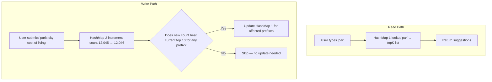
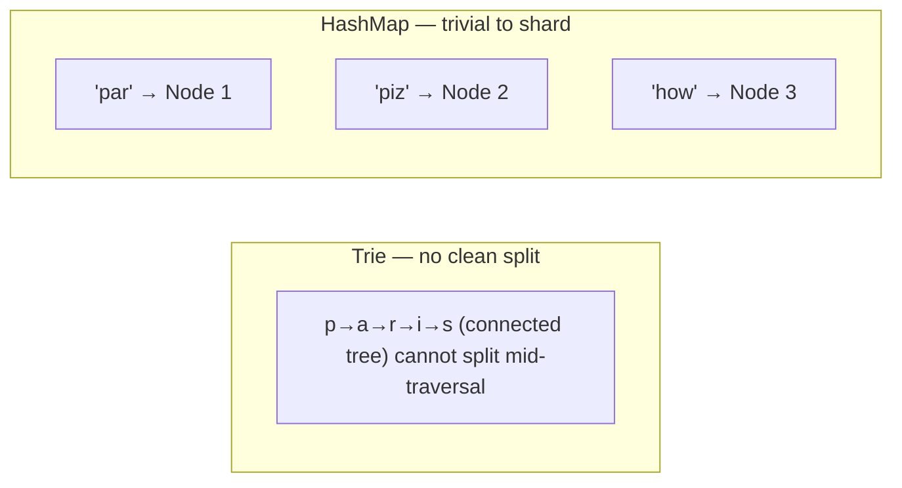

# Two HashMaps — The Better Approach

> [!question] Why abandon the Trie at all?
> We just built an optimised Trie with precomputed topK. It works. Why replace it?
>
> Because the Trie's **tree structure** creates operational problems — hard to persist, hard to sync across replicas, slow to rebuild. The Two HashMaps approach gives identical lookup performance with none of those problems.

---

## The Core Realisation

Think about what the Trie is actually doing for us:

```
User types "par"
Trie traverses: p → a → r
Returns: topK stored at node "r"
```

The tree structure (`p → a → r`) exists only to **navigate to the right answer**. Once we're there, we just return the stored topK list.

But what if we skipped the navigation entirely and just did a direct lookup?

```
User types "par"
HashMap lookup: "par" → topK list
Returns: topK immediately
```

Same result. Same `O(prefix length)` time — because hashing "par" takes `O(3)` just like traversing 3 nodes. But now there's no tree, no pointers, no complex structure.

> [!success] The Trie's tree structure was never doing useful work
> It was just a way to organise data by prefix. A HashMap with the prefix as the key does the same job, directly.

---

## HashMap 1 — Prefix → Top K Results

This replaces the entire Trie. Every possible prefix is a key. The value is the precomputed top 10 suggestions for that prefix.

```
Key (prefix)   →   Value (top 10 suggestions, ranked by popularity)

"p"     →  ["paris", "pizza", "python", "php", "paypal", ...]
"pa"    →  ["paris", "party", "park", "password", "paypal", ...]
"par"   →  ["paris", "party", "park"]
"pari"  →  ["paris", "paris travel", "paris hotels"]
"paris" →  ["paris weather", "paris hotels", "paris city guide"]
```

**How a read works:**

```
User types "par"
  → compute hash("par")
  → look up in HashMap
  → return stored list: ["paris", "party", "park"]
  → done ✅
```

One operation. No traversal. No DFS. No sorting.

> [!info] Why is hashing O(prefix length)?
> To hash the string "par", the hash function reads each character once — p, a, r.
> That's 3 operations for a 3-character prefix.
> For "paris" it's 5 operations. This is `O(length of prefix)` — same as Trie traversal.
> So the lookup time is identical to a Trie, but with none of the structural complexity.

---

## HashMap 2 — Query → Frequency

This is the global popularity counter. Every time a user submits a search, we increment the count for that full query string.

```
Key (full query)                  →   Value (total search count)

"paris"                           →   50,000,000
"pizza near me"                   →   40,000,000
"python tutorial"                 →   35,000,000
"paris city cost of living"       →   12,045
"paris budget hotels 2026"        →   3,201
```

**Why do we need this separately?**

When a new search comes in, we need to know the query's current total count to decide whether it belongs in the top 10 for each of its prefix keys. HashMap 2 is where we look that up.

```
User submits "paris city cost of living"
  → check HashMap 2: current count = 12,045
  → increment to 12,046
  → does 12,046 beat any of the current top 10 for "par"?
    → if yes, update HashMap 1 for "par", "pari", "paris" etc.
    → if no, skip
```

---

## How Both HashMaps Work Together



---

## Why HashMaps Beat a Trie in Production

Both give `O(prefix length)` lookup. The HashMap wins on every operational dimension:

### Sharding

```
Trie:
  To shard, you must split the tree — but the tree is one connected structure.
  Splitting by first letter creates hotspots ("p" and "s" get most English traffic).
  There's no clean boundary.

HashMap:
  Each prefix is an independent key.
  Apply consistent hashing on the key → distribute across nodes naturally.
  Any prefix can live on any node. No tree structure to preserve.
```



### Persistence (Saving to Disk)

```
Trie:
  Nodes are objects connected by pointers (memory addresses).
  Memory addresses are meaningless after a restart — they change every time.
  To save a Trie you must serialise the entire pointer graph into a file format,
  then deserialise it back and rebuild all pointers on load.
  Complex, slow, error-prone.

HashMap:
  It's just a list of key → value pairs.
  Write each line: "par" → ["paris", "party", "park"]
  To reload: read each line, insert into HashMap.
  A flat file. Trivially simple.
```

### Rebuild After Crash

```
Trie:
  Restart → RAM is wiped → must rebuild the full 30GB tree node by node
  from the source data. Could take minutes.

HashMap:
  Restart → reload the snapshot file into memory.
  HashMap is populated entry by entry from a flat file.
  Same data volume but much simpler to load — no pointer reconstruction.
```

### Full Comparison

| | Trie | Two HashMaps |
|---|---|---|
| **Lookup time** | `O(prefix length)` | `O(prefix length)` — identical |
| **Sharding** | ❌ Tree structure can't be cleanly partitioned | ✅ Each key is independent |
| **Persistence** | ❌ Must serialise/deserialise pointer graph | ✅ Flat key-value file |
| **Rebuild after crash** | ❌ Reconstruct entire tree | ✅ Load flat file line by line |
| **Code complexity** | ❌ Tree traversal, pointer management | ✅ Standard HashMap operations |
| **Memory layout** | ❌ Pointer-chasing hurts CPU cache | ✅ Flat array — cache friendly |
