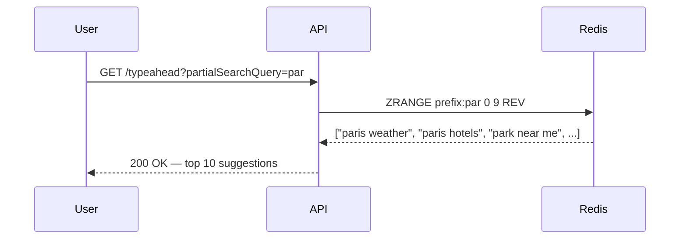

# Type-Ahead System — Redis as the Serving Layer

> [!question] Why Redis?
> We need the two-HashMap model to work at 1M QPS across multiple machines.
> A plain in-memory HashMap on one server can't do that.
> Redis is essentially a **distributed, persistent, in-memory HashMap** — exactly what we need.

---

## Why Not a Plain In-Memory HashMap?

| Requirement | Plain HashMap | Redis |
|---|---|---|
| Sub-millisecond reads | ✅ | ✅ |
| Survives server restart | ❌ Lost on crash | ✅ Built-in persistence |
| Multiple machines | ❌ Single machine only | ✅ Native clustering |
| Replication | ❌ None | ✅ Primary + replicas |
| Sharding | ❌ Manual, painful | ✅ Redis Cluster handles it |

> [!info] What is Redis?
> Redis is an open-source, ==in-memory data store== that supports rich data structures — strings, lists, sets, sorted sets, hashmaps. Everything lives in RAM so reads are sub-millisecond. It's the most widely used cache in the world. Used by Twitter, GitHub, Snapchat, and Google-scale systems.

---

## How Redis Maps to Our Two-HashMap Model

we need:
1. `prefix → top K results` (read path)
2. `query → frequency count` (write path)

Redis has native data structures for both.

### Structure 1 — Sorted Set (ZSET) for Prefix → Top K

A ==Redis Sorted Set== stores members with a **score**. Members are automatically ordered by score. Perfect for ranking.

```
Key:   prefix:par
Type:  ZSET (Sorted Set)

Members + scores:
  "paris weather"           →  score: 5,421,000
  "paris hotels"            →  score: 4,980,000
  "park near me"            →  score: 3,900,000
  "paris city cost of living" → score: 2,100,000
  ...
```

To read top 10 for prefix `"par"`:

```redis
ZRANGE prefix:par 0 9 REV WITHSCORES
```

> [!info] What does this command mean?
> - `ZRANGE` — get a range of members from a sorted set
> - `prefix:par` — the key
> - `0 9` — positions 0 through 9 (first 10)
> - `REV` — reversed order (highest score first)
> - `WITHSCORES` — also return the scores
>
> Redis executes this in `O(log N + K)` time — nearly instant even with millions of members.

### Structure 2 — Hash for Query → Frequency

```
Key:   query_counts
Type:  HASH

Fields:
  "paris"                      →  50,000,000
  "pizza near me"              →  40,000,000
  "paris city cost of living"  →  12,045
```

To increment a count:
```redis
HINCRBY query_counts "paris city cost of living" 1
```

---

## Read Path — How a Typeahead Request Works



**Latency:** < 1ms for the Redis call. Total response under 5ms including network.
No Trie traversal. No DFS. No sorting. Redis does it all.

---

## Write Path Problem — 100k Writes/sec is Too Much

From [[05 Estimations]] and [[06 Tries]], every search submission triggers ~10 prefix updates:

```
1 search "paris city cost of living"
→ update prefix:p, prefix:pa, prefix:par ... (10 prefixes)
→ update query_counts hash

1B searches/day × 10 updates = 10B writes/day = ~100,000 write QPS
```

> [!danger] Updating Redis directly on every search submission
> - Redis write throughput: ~100k ops/sec per node
> - We're already at that limit just from writes — reads get zero budget
> - Redis cluster starts thrashing, read latency spikes
> - ==This kills the system==

We need to ==drastically reduce write volume== without breaking ranking quality.

---
