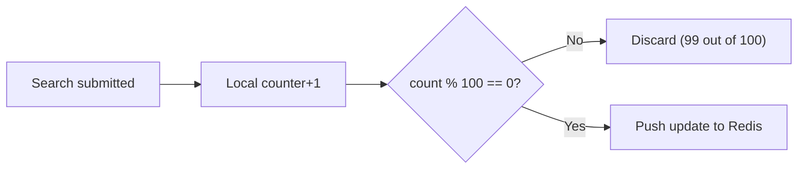
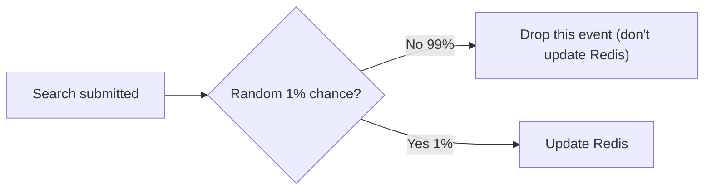
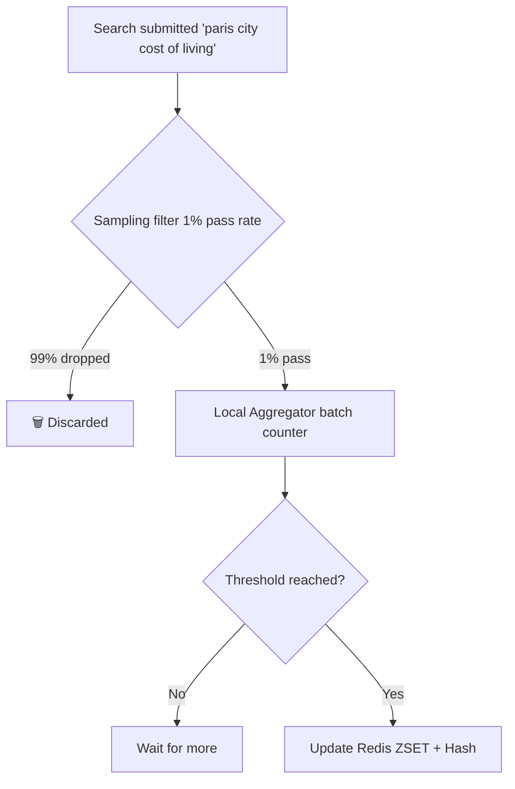
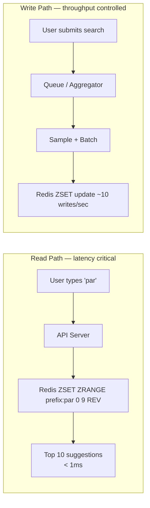

## Key Insight — Autocomplete Doesn't Need Exact Counts

> [!success] The saving grace
> Autocomplete only needs **relative ordering** — which query is more popular than another.
> It does NOT need exact counts.

```
Exact counts:                 Approximate counts:
  "paris"      = 50,000,000    "paris"      = 500,000
  "pizza"      = 40,000,000    "pizza"      = 400,000
  "python"     = 30,000,000    "python"     = 300,000

Rankings are identical ✅ — the user sees the same suggestions either way.
```

This means we can ==trade accuracy for throughput== — as long as relative order is preserved, the user experience is identical.

---

## Strategy 1 — Batching

Instead of pushing every single count increment to Redis, accumulate locally and push only when the count crosses a threshold.



```
Without batching:   "paris" searched 100 times → 100 Redis writes
With batching:      "paris" searched 100 times → 1 Redis write

Reduction: 100x fewer writes ✅
```

> [!info] How stale does this make the ranking?
> If a query gets searched 1,000 times a day and we batch every 100:
> Redis gets 10 updates per day for that query — about every 2.4 hours.
> For popular stable queries ("paris", "pizza") this is completely fine.
> For breaking news ("earthquake 2026"), this introduces ~hours of lag.
> The freshness trade-off is acceptable for most queries.

---

## Strategy 2 — Sampling

Instead of batching by threshold, randomly decide whether to record each search at all.



```
Without sampling:   "paris" searched 1,000 times → Redis count = 1,000
With 1% sampling:   "paris" searched 1,000 times → Redis count = ~10

Reduction: ~100x fewer writes ✅
Relative order: still preserved ✅
```

> [!info] Why does sampling preserve relative order?
> If "paris" is 2× more popular than "pizza", then 1% sampling still records "paris" ~2× more than "pizza".
> Proportions are preserved even when absolute numbers shrink.

---

## Strategy 3 — Combined Pipeline (Production Style)

In production, both strategies are combined:



**Effect:**
```
Raw search events:        100,000 / sec
After 1% sampling:          1,000 / sec
After 100x batching:           10 / sec  ← actual Redis writes
```

> [!success] From 100,000 writes/sec down to ~10 writes/sec
> A 10,000x reduction in Redis write load — with no visible impact on suggestion quality for the user.

---

## Why This Is Safe — The Math

```
Query A is searched 10,000 times/day
Query B is searched  5,000 times/day

After 1% sampling + 100x batching:
  Redis sees A = 1 update/day
  Redis sees B = 0 or 1 update/day

After enough time: A consistently ranks above B ✅
```

> [!warning] One edge case — brand new trending queries
> A query that explodes from 0 to 1M searches in 1 hour (breaking news) may take hours to surface in suggestions because of batching lag.
> This is the freshness trade-off. Acceptable for most use cases. Can be partially mitigated with a separate "trending" pipeline that bypasses batching.

---

## Final Mental Model

> [!abstract] Redis is not the source of truth — it's the serving cache
>
> ```
> Source of truth:   Offline analytics pipeline (exact counts, updated daily)
> Redis:             High-speed approximate ranking cache (updated in near-real-time)
> ```
>
> Exact counts live in the data warehouse.
> Typeahead uses fast, approximate, good-enough data from Redis.
> The user never knows the difference.

---

## Read vs Write Path Summary



| | Read Path | Write Path |
|---|---|---|
| **Trigger** | Every keystroke (after debounce) | Every search submission |
| **Redis operation** | `ZRANGE` — top K by score | `ZADD` / `HINCRBY` — update score |
| **Latency** | < 1ms | Not critical — async |
| **Volume** | 1M QPS peak | ~10 writes/sec after batching + sampling |
