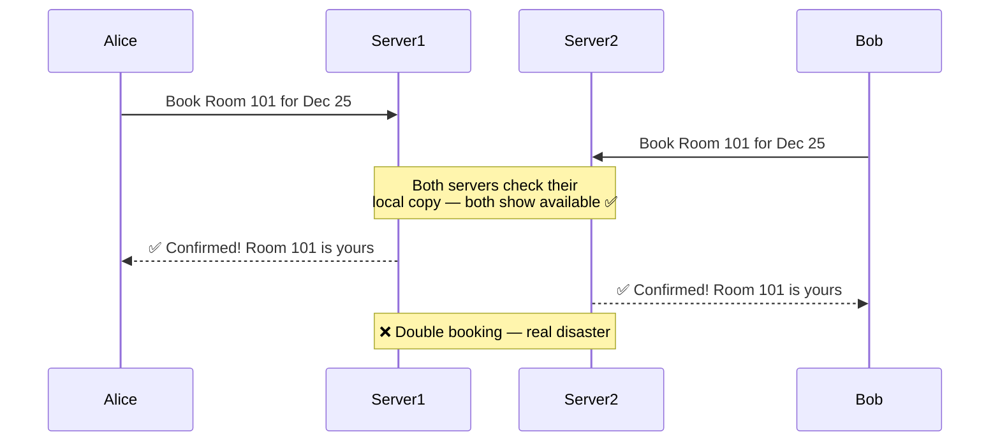

## Functional

### What users can do

- **Browse Hotels**
	- See featured hotels on the homepage
	- Discover hotels by location
	- View active promotions and deals

- **View Room Details**
	- See room types (single, double, suite, etc.)
	- See pricing per night
	- See amenities (WiFi, pool, gym, etc.)
	- Check room availability on a calendar

- **Make a Reservation**
	- Select check-in and check-out dates
	- Enter guest details
	- Complete payment
	- Receive booking confirmation

- **Admin Panel**
	- Add new rooms to the system
	- Update room pricing
	- Change room availability
	- Remove room listings

---

## Non-Functional

### 1. Consistency Over Availability

> [!important] This is the single most critical design decision in the entire system
> A hotel room **cannot be booked by two people at the same time**. This one rule forces us to choose consistency over availability.

#### What do "Consistency" and "Availability" even mean?

Before we explain the decision, let's understand the two terms with a simple analogy.

Think of a bank ATM:

| Term | What it means | ATM example |
|---|---|---|
| **Consistency** | Every part of the system sees the same, up-to-date data | Every ATM shows your real balance. Withdraw ₹500 from one ATM, and no other ATM will let you withdraw that ₹500 again. |
| **Availability** | The system always responds, even if the data might be slightly stale | The ATM always gives you *some* answer — even if it hasn't synced with the bank in the last second. |

In system design you often **cannot have both perfectly** at the same time — this is a fundamental concept called the **CAP theorem**. You have to pick which one matters more for your use case.

---

#### Why hotel booking MUST be consistent

Imagine what happens if we prioritise availability over consistency:

Alice and Bob both get a confirmation for the **same room on the same night**. One of them arrives on Christmas Eve with their family and has **no room**. This is not a bug you can patch later — it is a direct harm to a real person.

> [!note] Compare this to a Netflix-style system
> If Netflix shows you a movie that hasn't finished processing yet — you get an error and try again in 5 minutes. Annoying, but no lasting damage.
>
> If a hotel double-books a room — a real person with real luggage shows up at midnight and has nowhere to sleep. **That cannot ever happen.**
>
> This difference in consequence is *exactly* why we make different consistency choices for different systems.

---

#### The core guarantee this creates

> [!important] Only one person can ever hold a confirmed booking for a specific room on a specific date.
> The system must make this guarantee even when hundreds of users are attempting to book the same room simultaneously.

> [!tip] The trade-off we accept
> We are okay with the system occasionally being **slow** or a booking attempt failing under high load.
> We are **not** okay with two people holding confirmed bookings for the same room.
> Slow is recoverable. Double-booking is not.

---

### 2. High Concurrency

Thousands of users search and attempt to book rooms simultaneously — especially around popular dates (New Year's Eve, school holidays, major events). The system must handle this without crashing or slowing to a crawl.

> [!note] Searching and Booking have different consistency needs
>
> | Operation | Consistency needed | Why |
> |---|---|---|
> | **Search / Browse** | Weak (slightly stale is fine) | Showing a room as available when it was booked 2 seconds ago is harmless — the user finds out when they try to book |
> | **Book a room** | Strong (must be real-time) | A booking must reflect the true current state of the room — stale data here causes double-bookings |

---

### 3. Moderate Latency

| Operation | Acceptable Latency | Reason |
|---|---|---|
| Homepage / Search | 300–500 ms | Slightly stale data from cache is acceptable |
| Booking / Payment | As fast as possible | User is actively waiting; must feel responsive |

