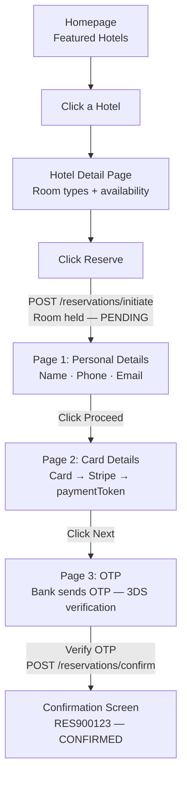
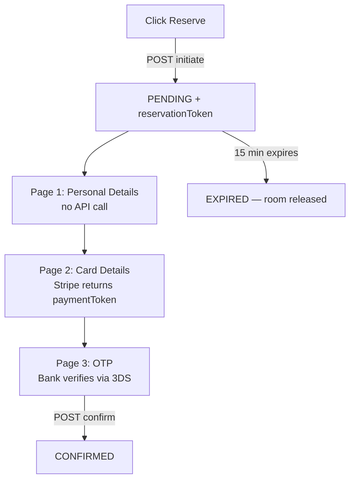

See also: [[13-HTTP-Methods]] for HTTP method definitions

---

## The Booking.com Flow



> [!note] Why room TYPE and not a specific room?
> On Booking.com you pick **"Deluxe King — $180/night"**, not **"Room 423"**.
> The hotel has 50 Deluxe King rooms — any one of them can fulfil your booking.
> The hotel assigns you a specific physical room only at check-in.
>
> This matters for availability — we track inventory per room type ("8 Deluxe Kings left"),
> not per individual room. Booking against a type is simpler and scales better.

---

## 1. Homepage APIs

### Featured Hotels

User lands on Booking.com. Show a curated list of featured hotels and deals.

```http
GET /api/v1/hotels/featured
```

**Response `200 OK`**
```json
{
  "hotels": [
    {
      "hotelId": "H1001",
      "name": "Marriott Times Square",
      "city": "New York",
      "rating": 4.5,
      "startingFromPrice": 180,
      "thumbnailUrl": "https://..."
    }
  ]
}
```

---

### Destination Autocomplete

As the user types in the search box, suggestions appear in a dropdown.

```http
GET /api/v1/destinations/autocomplete?q=New+Yor
```

**Response `200 OK`**
```json
{
  "suggestions": [
    { "label": "New York, United States", "destId": "DEST_NYC", "type": "city" },
    { "label": "New York JFK Airport",    "destId": "DEST_JFK", "type": "airport" }
  ]
}
```

> [!tip] This endpoint is called on every keystroke — it must be extremely fast.
> It is served from cache (Redis), not a live database query.

---

## 2. Search & Browse APIs

### Search Hotels

User fills in city, dates, guests and hits Search.

```http
GET /api/v1/hotels?city=New+York&checkIn=2026-02-10&checkOut=2026-02-13&guests=2&page=1&limit=20
```

| Query Param | Required | Description |
|---|---|---|
| `city` | Yes | Destination city |
| `checkIn` | Yes | Check-in date (YYYY-MM-DD) |
| `checkOut` | Yes | Check-out date (YYYY-MM-DD) |
| `guests` | Yes | Number of guests |
| `minPrice` | No | Filter by minimum price per night |
| `maxPrice` | No | Filter by maximum price per night |
| `minRating` | No | Filter by minimum review score (e.g. 8.0) |
| `freeCancel` | No | `true` to show only free cancellation hotels |
| `page` | No | Page number (default: 1) |
| `limit` | No | Results per page (default: 20, max: 50) |

**Response `200 OK`**
```json
{
  "page": 1,
  "totalResults": 142,
  "hotels": [
    {
      "hotelId": "H1001",
      "name": "Marriott Times Square",
      "city": "New York",
      "rating": 4.5,
      "reviewCount": 2841,
      "distanceFromCenter": "0.3 km",
      "startingFromPrice": 180,
      "freeCancel": true,
      "urgencySignal": "Only 2 rooms left!",
      "thumbnailUrl": "https://..."
    }
  ]
}
```

> [!tip] Why is this response lightweight?
> The card shows only what you need to compare hotels — name, rating, price, distance.
> Full details (amenities, room list, policies, reviews) are fetched separately when the user clicks in.

> [!note] What is `thumbnailUrl`?
> A small, compressed preview image of the hotel — shown on the card in the search results list.
> The client uses this URL to separately fetch and render the image. The image itself is never inside the JSON — that would make every response enormous.

---

### Get Hotel Details

User clicks a hotel card — they see the full hotel page.

```http
GET /api/v1/hotels/{hotelId}
```

**Response `200 OK`**
```json
{
  "hotelId": "H1001",
  "name": "Marriott Times Square",
  "city": "New York",
  "address": "1535 Broadway, Manhattan, NY",
  "rating": 4.5,
  "reviewCount": 2841,
  "amenities": ["wifi", "pool", "gym", "spa"],
  "checkInTime": "15:00",
  "checkOutTime": "11:00",
  "cancellationPolicy": "Free cancellation up to 24 hours before check-in",
  "photoUrls": ["https://...", "https://..."]
}
```

---

### Check Room Availability

On the same hotel page, the room table shows which room types are available for the selected dates.

```http
GET /api/v1/hotels/{hotelId}/rooms/availability?checkIn=2026-02-10&checkOut=2026-02-13&guests=2
```

**Response `200 OK`**
```json
{
  "hotelId": "H1001",
  "checkIn": "2026-02-10",
  "checkOut": "2026-02-13",
  "nights": 3,
  "availableRoomTypes": [
    {
      "roomTypeId": "RT007",
      "name": "Deluxe King",
      "pricePerNight": 180,
      "totalPrice": 540,
      "capacity": 2,
      "amenities": ["king bed", "city view", "bathtub"],
      "freeCancel": true,
      "remainingRooms": 2,
      "urgencySignal": "Only 2 left!"
    },
    {
      "roomTypeId": "RT008",
      "name": "Suite",
      "pricePerNight": 350,
      "totalPrice": 1050,
      "capacity": 4,
      "amenities": ["living room", "jacuzzi", "butler service"],
      "freeCancel": false,
      "remainingRooms": 5,
      "urgencySignal": null
    }
  ]
}
```

> [!note] `remainingRooms` is approximate
> This number can go stale within seconds — many users may be viewing the same room simultaneously.
> It is shown as a nudge ("Only 2 left!") to create urgency, not as a hard guarantee.
> The guarantee only comes once a booking is confirmed.

---

## 3. Reservation APIs

The reservation stays `PENDING` across 3 pages. Only **one API call at the start** (initiate) and **one at the very end** (confirm after OTP).



---

### Step 1 — Initiate Reservation (Click Reserve)

User clicks "Reserve" on a room type. The system immediately holds the room and creates a `PENDING` reservation with a 15-minute countdown.

```http
POST /api/v1/reservations/initiate
Authorization: Bearer <user_token>
Idempotency-Key: 7f3k92md-a12b-4c9d-b831-9f2e1d3a8c74
```

**Request Body**
```json
{
  "hotelId": "H1001",
  "roomTypeId": "RT007",
  "checkIn": "2026-02-10",
  "checkOut": "2026-02-13",
  "guests": 2,
  "guestDetails": {
    "firstName": "John",
    "lastName": "Smith",
    "email": "john@example.com",
    "phone": "+1-555-0123",
    "country": "US",
    "specialRequests": "High floor, quiet room preferred"
  }
}
```

**Response `201 Created`**
```json
{
  "reservationToken": "tok_7f3k92md_abc123xyz",
  "status": "PENDING",
  "expiresAt": "2026-02-01T15:30:00Z",
  "summary": {
    "hotelName": "Marriott Times Square",
    "roomType": "Deluxe King",
    "checkIn": "2026-02-10",
    "checkOut": "2026-02-13",
    "nights": 3,
    "totalPrice": 540
  }
}
```

> [!important] Why return a `reservationToken` instead of a `reservationId`?
> The reservation is not confirmed yet — it is a temporary hold.
> The `reservationToken` is a short-lived token (expires in 15 minutes) that proves you currently hold this room.
> It is passed to the confirm step along with the payment. Only then does a permanent `reservationId` get created.

**Error — Room no longer available `409 Conflict`**
```json
{
  "error": "ROOM_UNAVAILABLE",
  "message": "No Deluxe King rooms are available for the selected dates."
}
```

> [!note] Why 409 and not 400?
> `400 Bad Request` = the client sent invalid data (wrong date format, missing field).
> `409 Conflict` = the request was valid but conflicts with the current state of the system — someone else just grabbed the last room.

---

### Step 2 — Confirm Reservation (After OTP Verified)

Here is what happens across pages 2 and 3 before this API is called:

**Page 2 — Card Details:**
User enters card details. The browser sends the card directly to Stripe (never to our server). Stripe returns a one-time `paymentToken`.

**Page 3 — OTP:**
The bank sends an OTP to the user's phone. This is called **3D Secure (3DS)** — a fraud prevention step mandated by the bank. The user enters the OTP, the bank verifies it, and only then does our `confirm` call fire.

> [!important] Why does card data go to Stripe and not our server?
> Handling raw card numbers requires extremely strict security certification called **PCI DSS compliance** — expensive and complex to maintain.
> Instead, the browser sends the card directly to Stripe, which returns a safe one-time `paymentToken`.
> Our server uses that token to charge the card — without ever seeing the card number itself.

> [!note] What is 3DS / OTP?
> 3D Secure is a bank-level fraud check. When you enter your card, your bank sends an OTP to your registered phone number to confirm it is really you making the payment.
> This happens between the user and their bank — our server just waits.
> The `POST /reservations/confirm` only fires after the OTP is successfully verified.

```http
POST /api/v1/reservations/confirm
Authorization: Bearer <user_token>
Idempotency-Key: 9g4m03ne-b23c-5d0e-c942-0g3f2e4b9d85
```

**Request Body**
```json
{
  "reservationToken": "tok_7f3k92md_abc123xyz",
  "paymentToken": "pay_tok_stripe_4xYz9mKp"
}
```

**Response `200 OK`**
```json
{
  "reservationId": "RES900123",
  "confirmationNumber": "4521 887 609",
  "status": "CONFIRMED",
  "hotelName": "Marriott Times Square",
  "roomType": "Deluxe King",
  "checkIn": "2026-02-10",
  "checkOut": "2026-02-13",
  "totalPrice": 540,
  "cancellationDeadline": "2026-02-09T23:59:00Z"
}
```

**Error — Hold expired `409 Conflict`**
```json
{
  "error": "RESERVATION_EXPIRED",
  "message": "Your room hold expired. Please start the booking again."
}
```

**Error — Payment failed `402 Payment Required`**
```json
{
  "error": "PAYMENT_FAILED",
  "message": "Your card was declined. Please try a different payment method."
}
```

---

### Get Reservation (Confirmation Screen)

After confirmation, the confirmation screen fetches the booking details to display to the user.

```http
GET /api/v1/reservations/{reservationId}
Authorization: Bearer <user_token>
```

**Response `200 OK`**
```json
{
  "reservationId": "RES900123",
  "confirmationNumber": "4521 887 609",
  "status": "CONFIRMED",
  "hotelName": "Marriott Times Square",
  "hotelAddress": "1535 Broadway, Manhattan, NY",
  "hotelPhone": "+1-212-555-0100",
  "roomType": "Deluxe King",
  "checkIn": "2026-02-10",
  "checkOut": "2026-02-13",
  "nights": 3,
  "totalPrice": 540,
  "cancellationDeadline": "2026-02-09T23:59:00Z"
}
```

---

### List User's Reservations

```http
GET /api/v1/reservations?page=1&limit=10
Authorization: Bearer <user_token>
```

> [!note] No `userId` in the query param
> The user's identity comes from the `Authorization` token, not a query param.
> Putting `userId` in the URL would let any user see another user's bookings by changing the ID — a security hole.

**Response `200 OK`**
```json
{
  "page": 1,
  "totalResults": 5,
  "reservations": [
    {
      "reservationId": "RES900123",
      "hotelName": "Marriott Times Square",
      "checkIn": "2026-02-10",
      "checkOut": "2026-02-13",
      "status": "CONFIRMED"
    },
    {
      "reservationId": "RES900456",
      "hotelName": "Hilton Midtown",
      "checkIn": "2025-12-24",
      "checkOut": "2025-12-27",
      "status": "CANCELLED"
    }
  ]
}
```

---

### Cancel Reservation

```http
POST /api/v1/reservations/{reservationId}/cancel
Authorization: Bearer <user_token>
```

**Response `200 OK`**
```json
{
  "reservationId": "RES900123",
  "status": "CANCELLED",
  "refundAmount": 540,
  "refundNote": "Full refund — cancelled more than 24 hours before check-in."
}
```

> [!important] Why `POST /cancel` and not `DELETE`?
> `DELETE` means remove the record from the system entirely.
> Cancellation is a **state change** — `CONFIRMED → CANCELLED`.
> The record must stay in the database for refund processing, audit history, and the user's booking history.
> We are not deleting anything — we are triggering a cancellation action.

---

## 4. Admin APIs

Admin endpoints live under `/admin/` — not a different version number. This lets you apply stricter auth middleware to everything under `/admin/` in one place.

### Create Hotel

```http
POST /api/v1/admin/hotels
Authorization: Bearer <admin_token>
```

**Request Body**
```json
{
  "name": "Marriott Downtown",
  "city": "San Francisco",
  "address": "Market Street, SF",
  "amenities": ["wifi", "spa"],
  "checkInTime": "15:00",
  "checkOutTime": "11:00"
}
```

**Response `201 Created`**
```json
{ "hotelId": "H2002" }
```

---

### Update Hotel

```http
PATCH /api/v1/admin/hotels/{hotelId}
Authorization: Bearer <admin_token>
```

**Request Body** *(only send fields you want to change)*
```json
{ "amenities": ["wifi", "spa", "gym"] }
```

**Response `200 OK`**
```json
{ "hotelId": "H2002", "status": "UPDATED" }
```

---

### Delete Hotel

```http
DELETE /api/v1/admin/hotels/{hotelId}
Authorization: Bearer <admin_token>
```

**Response `200 OK`**
```json
{ "hotelId": "H2002", "status": "DELETED" }
```

---

### Add Room Type to Hotel

```http
POST /api/v1/admin/hotels/{hotelId}/room-types
Authorization: Bearer <admin_token>
```

**Request Body**
```json
{
  "name": "Suite",
  "pricePerNight": 350,
  "capacity": 4,
  "totalRooms": 10,
  "amenities": ["living room", "jacuzzi"]
}
```

**Response `201 Created`**
```json
{ "roomTypeId": "RT009" }
```

---

### Update Room Type

```http
PATCH /api/v1/admin/hotels/{hotelId}/room-types/{roomTypeId}
Authorization: Bearer <admin_token>
```

**Request Body**
```json
{ "pricePerNight": 375 }
```

**Response `200 OK`**
```json
{ "roomTypeId": "RT009", "status": "UPDATED" }
```
