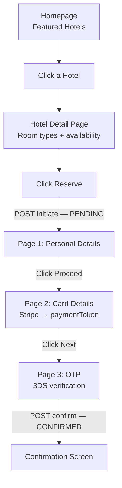

> [!important] Always identify your query patterns before picking a database.
> The queries your system needs to run tell you exactly what kind of database will serve you best.

---

## The Booking.com Flow

Each screen triggers different queries. Each file below covers one part of the flow.

---

## Files in This Section

| File | What it covers |
|---|---|
| [[04a Read-Queries]] | Homepage, Search Results, Hotel Detail — all read-only queries |
| [[04b Initiate-Reservation]] | Click Reserve — creates a PENDING reservation (soft hold) |
| [[04c Confirm-Reservation]] | Payment succeeds — upgrades reservation to CONFIRMED |
| [[04d Background-Jobs]] | Cleans up expired PENDING holds every minute |
| [[04e Database-Choice]] | Why relational DB, ACID explained, read replicas |

---

## Quick Summary

| User Action | Query Type | Consistency Needed |
|---|---|---|
| Homepage — Featured Hotels | Simple SELECT | Low — cached is fine |
| Hotel Detail Page | 2 SELECTs | Low — cached is fine |
| Click Reserve | Transaction (lock + UPDATE + INSERT) | **High** — must be real-time |
| Page 1: Personal Details | No query — client-side form | — |
| Page 2: Card Details | No query — Stripe handles this | — |
| Page 3: OTP | No query — bank handles 3DS | — |
| Confirm after OTP | Transaction (UPDATE + INSERT) | **High** — must be real-time |
| Background cleanup | Transaction (UPDATE + UPDATE) | **High** — must be accurate |

> Every step involving money or inventory requires a **transaction**.
> Every read-only step can be served from cache or a read replica.
