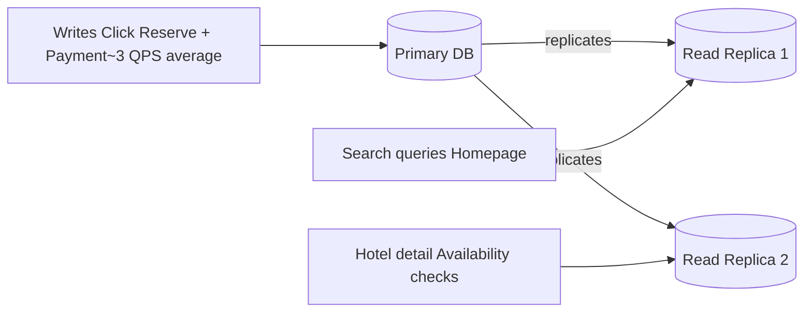

# Database Choice — Why Relational

---

## The Short Answer

> [!tip] Every query in this system either needs a JOIN, a transaction, or both.
> That points directly to a relational database — PostgreSQL or MySQL.

---

## Reason 1 — ACID Guarantees

ACID is a set of 4 guarantees a relational database makes automatically. Without them, you'd have to implement this logic yourself in application code — which is complex, error-prone, and has been a source of major bugs at real companies.

> [!example] **A — Atomicity** — "All or nothing"
> When you click Reserve: inventory decreases AND a PENDING reservation is created — together.
> When you pay: reservation becomes CONFIRMED AND a payment record is created — together.
>
> If the server crashes between any two steps, the database rolls everything back.
> There is no state where your card is charged but no reservation exists.

> [!example] **C — Consistency** — "Rules are always enforced"
> The database enforces constraints at all times.
> `available_count` has a constraint: it can never go below 0.
> Even if 100 users click Reserve on the last room simultaneously, only one transaction succeeds.
> The rest get a constraint violation — not a silent double booking.

> [!example] **I — Isolation** — "Concurrent transactions don't corrupt each other"
> Alice and Bob both click Reserve on the last Deluxe King room at the same moment.
> We use optimistic locking — the UPDATE includes `AND available_count > 0`.
> Alice deducts first → `available_count = 0`. Bob's UPDATE finds `available_count = 0`, condition fails → 0 rows affected → ROLLBACK.
> The `CHECK (available_count >= 0)` constraint is the final safety net — the database never allows a negative count regardless of how many concurrent transactions run.

> [!example] **D — Durability** — "Confirmed means confirmed, permanently"
> The moment the user sees "Booking Confirmed", that row is written to disk.
> Even if the entire server rack loses power 1 second later, the booking survives when it restarts.
> It is not sitting in memory waiting to be flushed.

---

## Reason 2 — The Data Is Relational by Nature

Every entity in this system references another. That is the definition of relational data.

```
hotels
  └──< room_types
          └──< room_inventory  (one row per room type per date)

reservations ──> hotels
reservations ──> room_types
reservations ──> users
reservations ──< payments
```

A NoSQL document store would force you to either:
- **Duplicate data** across documents (e.g. embed hotel info inside every reservation) → data gets out of sync
- **Lose cross-entity queries** (e.g. can't easily JOIN reservations with room_inventory)

Neither is acceptable for a booking system.

---

## Reason 3 — Read Replicas Handle the Read-Heavy Load

The system is overwhelmingly read-heavy — search, hotel detail, and availability checks happen far more than bookings.



- All **writes** → **primary** — strong consistency, no shortcuts
- All **reads** → **read replicas** — scales horizontally, lower latency

This gives read throughput without sacrificing write correctness.

---

## Why NOT NoSQL

| What NoSQL is good at | Does hotel booking need this? |
|---|---|
| Flexible / schema-less data | ❌ Hotel data is well-structured and stable |
| Massive write throughput (millions QPS) | ❌ Writes are only ~3 QPS average, ~30 at peak |
| No joins required | ❌ Every page requires joins across multiple tables |
| Eventual consistency is acceptable | ❌ Inventory and payments must be strongly consistent |

Choosing NoSQL here would mean implementing transaction logic, consistency guarantees, and join behaviour yourself in application code — all of which a relational database gives you for free.
