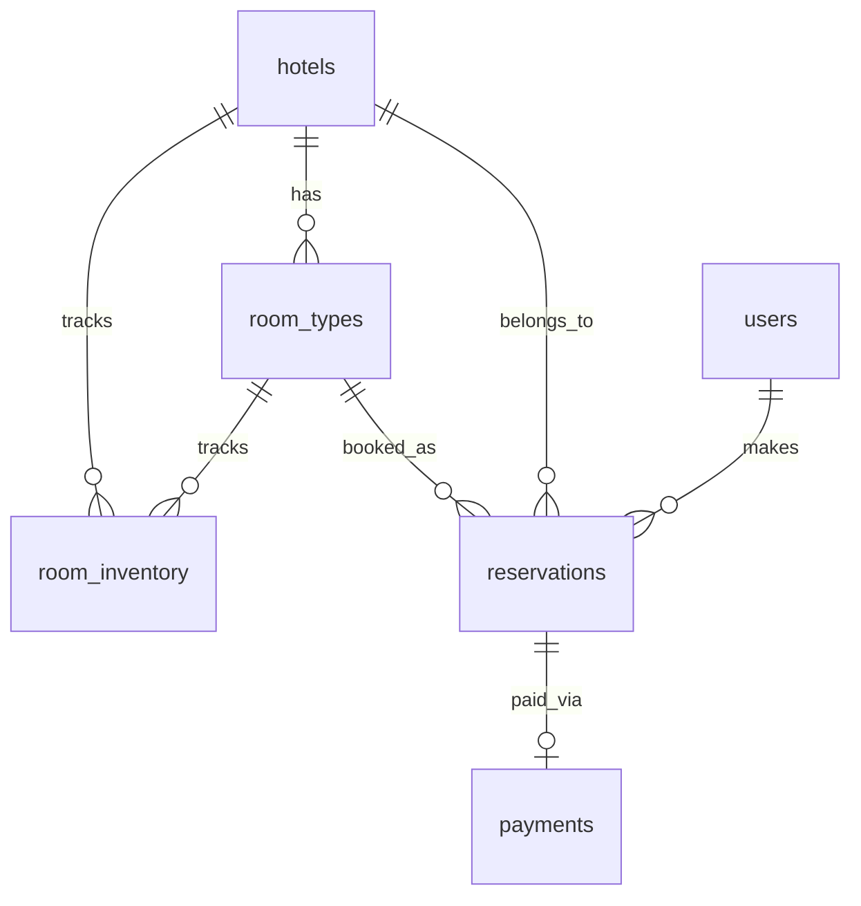

# Schema Design

---

## Entity Relationships



---

## Table 1 — `hotels`

```sql
CREATE TABLE hotels (
    hotel_id            VARCHAR(20)     PRIMARY KEY,        -- e.g. H1001
    name                VARCHAR(255)    NOT NULL,
    city                VARCHAR(100)    NOT NULL,
    country             VARCHAR(100)    NOT NULL,
    address             TEXT            NOT NULL,
    latitude            DECIMAL(9, 6),                      -- for map/geo queries
    longitude           DECIMAL(9, 6),
    is_featured         BOOLEAN         DEFAULT false,
    check_in_time       TIME            NOT NULL,           -- e.g. 15:00
    check_out_time      TIME            NOT NULL,           -- e.g. 11:00
    cancellation_policy TEXT,
    created_at          TIMESTAMP       DEFAULT NOW()
);
```

**Indexes:**
```sql
CREATE INDEX idx_hotels_city ON hotels(city);
```

> [!note] Why index `city`?
> The search query filters `WHERE city = 'New York'` on every single search request.
> Without this index, the database scans every row in the hotels table for each search.
> With the index, it jumps directly to New York hotels.

**Sample data:**

| hotel_id | name | city | is_featured | check_in_time | check_out_time |
|---|---|---|---|---|---|
| H1001 | Marriott Times Square | New York | true | 15:00 | 11:00 |
| H1002 | Hilton Midtown | New York | false | 14:00 | 12:00 |
| H1003 | Park Hyatt | New York | true | 15:00 | 11:00 |

---

## Table 2 — `room_types`

Shared configuration for a category of rooms. The hotel has 50 Deluxe Kings — they all share one `room_types` row.

```sql
CREATE TABLE room_types (
    room_type_id        VARCHAR(20)     PRIMARY KEY,        -- e.g. RT007
    hotel_id            VARCHAR(20)     NOT NULL REFERENCES hotels(hotel_id),
    name                VARCHAR(100)    NOT NULL,           -- e.g. Deluxe King
    capacity            INT             NOT NULL,           -- max guests
    bed_type            VARCHAR(50),                        -- King, Twin, Double
    price_per_night     DECIMAL(10, 2)  NOT NULL,
    total_rooms         INT             NOT NULL,           -- total physical rooms of this type
    amenities           TEXT[],                             -- array of amenity strings
    created_at          TIMESTAMP       DEFAULT NOW()
);
```

**Indexes:**
```sql
CREATE INDEX idx_room_types_hotel ON room_types(hotel_id);
```

**Sample data:**

| room_type_id | hotel_id | name | capacity | price_per_night | total_rooms |
|---|---|---|---|---|---|
| RT007 | H1001 | Deluxe King | 2 | 180.00 | 50 |
| RT008 | H1001 | Suite | 4 | 350.00 | 10 |
| RT009 | H1002 | Standard Double | 2 | 150.00 | 80 |

---

## Table 3 — `room_inventory` ⭐ The Most Important Table

This is the **source of truth for availability**. One row per room type per date.

```sql
CREATE TABLE room_inventory (
    hotel_id            VARCHAR(20)     NOT NULL REFERENCES hotels(hotel_id),
    room_type_id        VARCHAR(20)     NOT NULL REFERENCES room_types(room_type_id),
    date                DATE            NOT NULL,
    available_count     INT             NOT NULL,
    PRIMARY KEY (room_type_id, date),
    CONSTRAINT available_count_non_negative CHECK (available_count >= 0)  -- last line of defence
);
```

**Indexes:**
```sql
CREATE INDEX idx_inventory_room_date  ON room_inventory(room_type_id, date);
CREATE INDEX idx_inventory_hotel_date ON room_inventory(hotel_id, date);
```

> [!note] Why add `hotel_id` here when `room_type_id` already implies it?
> Without `hotel_id`, the availability query must JOIN through `room_types` just to filter by hotel — an extra join on every search request.
> With `hotel_id` directly in this table, we can filter `WHERE hotel_id = 'H1001' AND date BETWEEN ...` in one table scan.
> This is called **denormalization** — intentionally duplicating a value to avoid an expensive join.

> [!important] Why one row per date?
> A guest staying Feb 10–13 needs availability checked on Feb 10, 11, and 12 separately.
> If we stored a single "available: true/false" per room type, we could not handle the case where a room type is available on Feb 10 and 12 but sold out on Feb 11.
> One row per date lets us check each night independently.

> [!important] How optimistic locking works with this table
> We do not use `FOR UPDATE` locks. Instead, the UPDATE itself includes the condition:
> `AND available_count > 0`
> This means the deduction only happens if inventory is still available at the moment of writing.
> The application then checks `rows_affected = number of nights` — if any night was 0, the whole transaction rolls back.

> [!important] Why `CHECK (available_count >= 0)` — the last line of defence
> Even with the `AND available_count > 0` check, two transactions could theoretically slip through simultaneously in extreme edge cases.
> This constraint makes it physically impossible for `available_count` to go negative — the database rejects the write outright.
> Slow is recoverable. A negative count is not.

> [!note] Why no `is_available` boolean?
> A boolean would need to be updated every time a booking is made or cancelled.
> `available_count` is more expressive — it tells you how many rooms are left, not just yes/no.
> It also handles overbooking naturally (count > 0 means available).

**Sample data:**

| hotel_id | room_type_id | date | available_count |
|---|---|---|---|
| H1001 | RT007 | 2026-02-10 | 8 |
| H1001 | RT007 | 2026-02-11 | 8 |
| H1001 | RT007 | 2026-02-12 | 2 |
| H1001 | RT008 | 2026-02-10 | 5 |
| H1001 | RT008 | 2026-02-11 | 5 |
| H1001 | RT008 | 2026-02-12 | 5 |
| H1002 | RT009 | 2026-02-10 | 12 |
| H1002 | RT009 | 2026-02-11 | 0 |
| H1002 | RT009 | 2026-02-12 | 10 |

---

## Table 4 — `users`

```sql
CREATE TABLE users (
    user_id             VARCHAR(20)     PRIMARY KEY,        -- e.g. U5001
    first_name          VARCHAR(100)    NOT NULL,
    last_name           VARCHAR(100)    NOT NULL,
    email               VARCHAR(255)    NOT NULL UNIQUE,
    phone               VARCHAR(20),
    country             VARCHAR(100),
    created_at          TIMESTAMP       DEFAULT NOW()
);
```

**Indexes:**
```sql
CREATE UNIQUE INDEX idx_users_email ON users(email);
```

**Sample data:**

| user_id | first_name | last_name | email | phone | country |
|---|---|---|---|---|---|
| U5001 | John | Smith | john@example.com | +1-555-0123 | US |
| U5002 | Priya | Sharma | priya@example.com | +91-9876543210 | IN |

---

## Table 5 — `reservations`

```sql
CREATE TABLE reservations (
    reservation_id      VARCHAR(20)     PRIMARY KEY,              -- e.g. RES900123
    reservation_token   VARCHAR(100)    UNIQUE,                   -- short-lived checkout token
    user_id             VARCHAR(20)     NOT NULL REFERENCES users(user_id),
    hotel_id            VARCHAR(20)     NOT NULL REFERENCES hotels(hotel_id),
    room_type_id        VARCHAR(20)     NOT NULL REFERENCES room_types(room_type_id),
    check_in            DATE            NOT NULL,
    check_out           DATE            NOT NULL,
    guest_count         INT             NOT NULL,
    status              VARCHAR(20)     NOT NULL,                 -- PENDING, CONFIRMED, CANCELLED, EXPIRED
    total_price         DECIMAL(10, 2),                          -- NULL until confirmed
    expires_at          TIMESTAMP,                               -- NULL once confirmed
    confirmed_at        TIMESTAMP,
    created_at          TIMESTAMP       DEFAULT NOW()
);
```

**Indexes:**
```sql
CREATE INDEX idx_reservations_user    ON reservations(user_id);
CREATE INDEX idx_reservations_hotel   ON reservations(hotel_id);
CREATE INDEX idx_reservations_status  ON reservations(status, expires_at);
```

> [!note] Why is `total_price` nullable?
> When the user clicks Reserve (PENDING), we haven't confirmed the price yet — they haven't completed payment.
> `total_price` is only set when the reservation moves to CONFIRMED.

> [!note] Why is `expires_at` nullable?
> Only PENDING reservations have an expiry timer.
> Once confirmed, `expires_at` is set to NULL — the booking is permanent.

> [!note] Why `reservation_token` separate from `reservation_id`?
> `reservation_id` is the permanent ID used after confirmation — shown to the user, used in all future lookups.
> `reservation_token` is a short-lived checkout session token generated at initiate and discarded after confirm.
> Keeping them separate means the permanent ID is never exposed during the vulnerable checkout window.

> [!note] Why index `(status, expires_at)`?
> The background cleanup job runs `WHERE status = 'PENDING' AND expires_at < NOW()` every minute.
> This compound index makes that query fast even with millions of reservations.

**Sample data:**

| reservation_id | reservation_token | user_id | room_type_id | status | total_price | expires_at | confirmed_at |
|---|---|---|---|---|---|---|---|
| RES900123 | null | U5001 | RT007 | CONFIRMED | 540.00 | null | 2026-02-01 15:20:00 |
| RES900456 | tok_9g4m03ne | U5002 | RT007 | PENDING | null | 2026-02-01 15:30:00 | null |
| RES900789 | tok_2h5n14of | U5003 | RT009 | EXPIRED | null | 2026-02-01 14:00:00 | null |

---

## Table 6 — `payments`

```sql
CREATE TABLE payments (
    payment_id          VARCHAR(20)     PRIMARY KEY,        -- e.g. PAY001
    reservation_id      VARCHAR(20)     NOT NULL REFERENCES reservations(reservation_id),
    amount              DECIMAL(10, 2)  NOT NULL,
    currency            VARCHAR(3)      DEFAULT 'USD',
    status              VARCHAR(20)     NOT NULL,           -- SUCCESS, FAILED, REFUNDED
    payment_token       VARCHAR(255),                       -- token from Stripe/Adyen
    paid_at             TIMESTAMP
);
```

**Indexes:**
```sql
CREATE INDEX idx_payments_reservation ON payments(reservation_id);
```

> [!note] Why store `payment_token`?
> The `payment_token` from Stripe is needed if we need to issue a refund later.
> For example: reservation expires just as payment completes → we need to refund.
> We call Stripe's refund API using this token.

**Sample data:**

| payment_id | reservation_id | amount | currency | status | paid_at |
|---|---|---|---|---|---|
| PAY001 | RES900123 | 540.00 | USD | SUCCESS | 2026-02-01 15:20:00 |

---

## Design Decisions Summary

| Decision | Why |
|---|---|
| Book room type, not physical room | Users don't care which specific room — any Deluxe King will do. Physical room assigned at check-in. |
| One `room_inventory` row per date | Enables per-night availability checks across a date range |
| `AND available_count > 0` in UPDATE | Optimistic locking — deduct only if still available at write time |
| `CHECK (available_count >= 0)` | Last line of defence — database physically prevents negative counts |
| `reservation_token` separate from `reservation_id` | Token is short-lived for checkout; permanent ID is created only on confirmation |
| `total_price` nullable | Not known until payment is confirmed |
| `expires_at` nullable | Only meaningful for PENDING reservations |
| Index on `(status, expires_at)` | Background cleanup job runs this filter every minute — needs to be fast |
| `hotel_id` in `room_inventory` | Avoids JOIN through `room_types` on every availability query — denormalization for speed |
