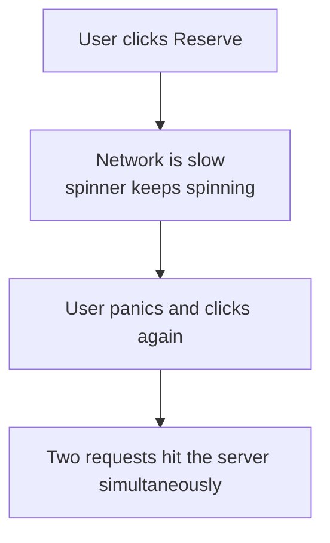
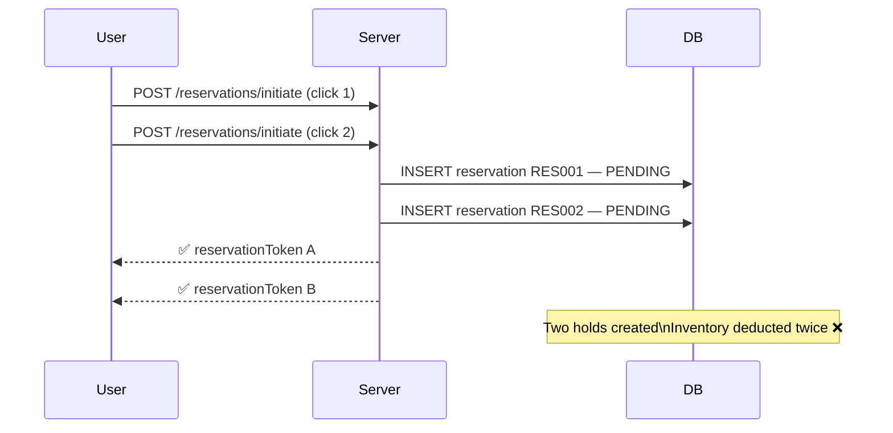

# Concurrency Problem — Same User, Multiple Requests

---

## What Causes This?



This also happens when:
- Mobile app auto-retries on a dropped connection
- Browser asks "Resend form data?" on page refresh
- User opens two tabs and books in both

---

## What Goes Wrong Without Protection?



User ends up with two PENDING reservations and gets charged twice if both reach the confirm step.

---

## Solution Layer 1 — Disable the Button (Client Side)

When the user clicks Reserve:
- Disable the button immediately
- Show a loading spinner
- Block all further clicks until the response arrives

```
[  Reserve  ]  →  [  Processing...  ]  (greyed out, unclickable)
```

> [!important] This is not enough on its own
> The button is JavaScript — it can be bypassed.
> A user can open Postman, disable JS, or simply open two browser tabs.
> Client-side prevention improves UX but **never trust it for correctness**.

---

## Solution Layer 2 — Idempotency Key (Server Side)

The client generates a unique key per booking attempt and sends it in the request header:

```http
POST /api/v1/reservations/initiate
Idempotency-Key: 7f3k92md-a12b-4c9d-b831-9f2e1d3a8c74
```

The server uses this key to detect duplicate requests and return the same response without processing the request again — no second reservation, no second charge.

> For the full server-side implementation of how this works, see [[07 Idemptent-Api]]

---

## Two Layers Together

| Layer | Where | What it stops |
|---|---|---|
| Disable button | Client | Accidental double clicks from impatient users |
| Idempotency key | Server | Duplicate requests from retries, refreshes, multi-tab |

Client-side stops accidents. Server-side guarantees correctness.
