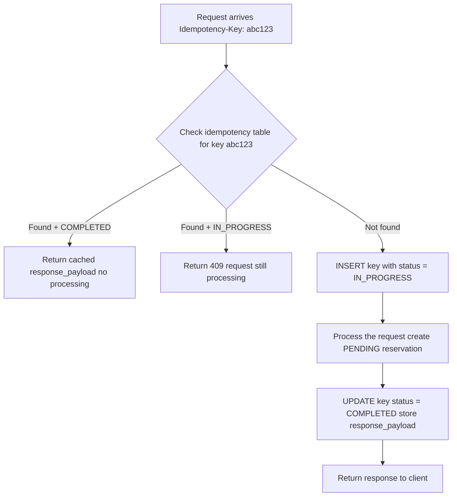

# Idempotent API — Implementation

> The problem this solves and why it exists is covered in [[06 Concurrency-Problems]].
> This file covers only **how** idempotency is implemented server-side.

---

## What Idempotency Means

> Multiple identical requests produce **one logical operation** and **one final state** — no duplicates, no double charges.

---

## The Idempotency Table

A dedicated table stores every processed request by its key.

```sql
CREATE TABLE idempotency (
    key              VARCHAR(100)    PRIMARY KEY,   -- UUID sent by client
    status           VARCHAR(20)     NOT NULL,      -- IN_PROGRESS, COMPLETED
    response_payload TEXT,                          -- cached response to replay
    created_at       TIMESTAMP       DEFAULT NOW(),
    expires_at       TIMESTAMP                      -- keys expire after 24 hours
);
```

**Sample data:**

| key | status | response_payload | expires_at |
|---|---|---|---|
| 7f3k92md-a12b... | COMPLETED | `{"reservationToken":"tok_abc"}` | 2026-02-02 15:00:00 |
| 9g4m03ne-b23c... | IN_PROGRESS | null | 2026-02-01 16:00:00 |

---

## How the Client Generates the Key

When the user lands on the checkout page, the browser generates a UUID and stores it in `sessionStorage`:

```javascript
const idempotencyKey = crypto.randomUUID();
sessionStorage.setItem('booking_key', idempotencyKey);
```

Every retry of the same booking attempt reuses the same key from `sessionStorage`.
A fresh booking (new session) generates a new UUID.

---

## Server-Side Flow



---

## Step-by-Step

### Step 1 — Request arrives

```http
POST /api/v1/reservations/initiate
Idempotency-Key: 7f3k92md-a12b-4c9d-b831-9f2e1d3a8c74
```

---

### Step 2 — Check if key already exists

```sql
SELECT status, response_payload
FROM idempotency
WHERE key = '7f3k92md-a12b-4c9d-b831-9f2e1d3a8c74';
```

**Case A — Key found, status = COMPLETED (retry/refresh)**

Return the cached `response_payload` immediately. No reservation created. No inventory touched.

```json
{ "reservationToken": "tok_abc123xyz", "status": "PENDING" }
```

**Case B — Key found, status = IN_PROGRESS (concurrent duplicate)**

The first request is still being processed. Return `409` — tell the client to wait and retry shortly.

**Case C — Key not found (genuine new request)**

Continue to Step 3.

---

### Step 3 — Insert placeholder row

Before doing any work, mark this key as in-progress. This prevents a second concurrent request with the same key from also proceeding.

```sql
INSERT INTO idempotency (key, status, expires_at)
VALUES ('7f3k92md-a12b-4c9d-b831-9f2e1d3a8c74', 'IN_PROGRESS', NOW() + INTERVAL '24 hours');
```

---

### Step 4 — Process the request

Create the PENDING reservation and deduct inventory as normal. See [[04b Initiate-Reservation]] for the full transaction.

---

### Step 5 — Store the result

Once the reservation is created, update the idempotency row with the response:

```sql
UPDATE idempotency
SET status           = 'COMPLETED',
    response_payload = '{"reservationToken":"tok_abc123xyz","status":"PENDING"}'
WHERE key = '7f3k92md-a12b-4c9d-b831-9f2e1d3a8c74';
```

---

### Step 6 — Return response

Return the response to the client. If the same request arrives again, Step 2 will find the COMPLETED row and replay this exact response — nothing else runs.

---

## What Each Scenario Returns

| Scenario | What happens | Response |
|---|---|---|
| First click | Key not found → process → store | Fresh response |
| Double click (race) | Key found, IN_PROGRESS | 409 — retry shortly |
| Retry after network drop | Key found, COMPLETED | Cached response replayed |
| Page refresh | Key found in sessionStorage, COMPLETED | Cached response replayed |
| New booking session | New UUID generated | Fresh request, processed normally |

---

> [!note] Why do idempotency keys expire after 24 hours?
> Old keys are useless after the booking window has passed.
> Keeping them forever would grow the table indefinitely.
> 24 hours gives enough window for any realistic retry scenario.
