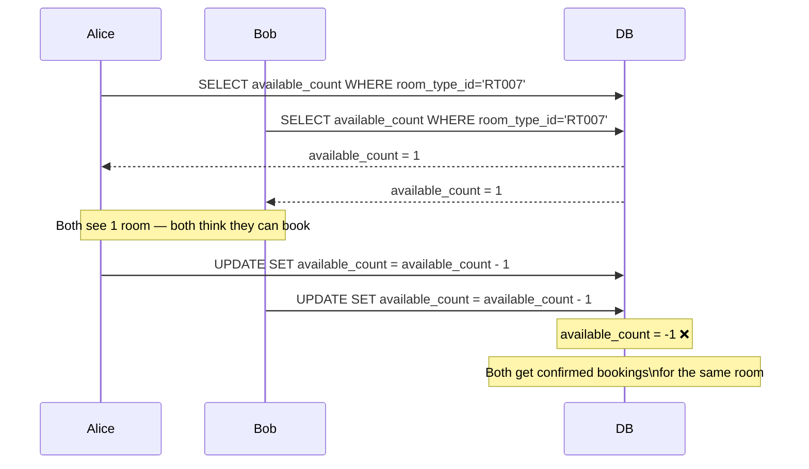

## What Is a Race Condition?

A race condition happens when two operations read the same data at the same time, both think they can proceed, and both write — corrupting the final state.

---

## The Hotel Booking Scenario

At time `t0`, one Deluxe King room is left:

| room_type_id | date | available_count |
|---|---|---|
| RT007 | 2026-02-12 | **1** |

Alice and Bob both search, both see "1 room left", and both click Reserve at the same moment.

---

## What Goes Wrong Without Protection

The read and the write are two separate steps. Between Alice's read and her write, Bob also reads the same value. Neither knows about the other.

This is the **lost update problem** — Bob's update overwrites Alice's without knowing it happened.

---

## The Two Solutions

There are two industry-standard approaches to fix this. They solve the same problem with opposite philosophies:

| Approach | Philosophy | File |
|---|---|---|
| **Pessimistic Locking** | Assume conflicts WILL happen — block others early | [[09 Pessimistic-Locking]] |
| **Optimistic Locking** | Assume conflicts are RARE — let everyone try, detect conflict at commit time | [[10 Optimistic-Locking]] |

> [!note] Which does our hotel system use?
> We use **optimistic locking**.
> Hotel booking has ~30 QPS spread across 1,100,000 rooms. The chance of two users booking the exact same room type at the same hotel on the same dates simultaneously is very low — conflicts are rare, not guaranteed.
> Pessimistic locking would be correct for BookMyShow (thousands of users racing for the same seat in a 2-minute window) but is overkill here.
> See [[10 Optimistic-Locking]] for the full implementation.
