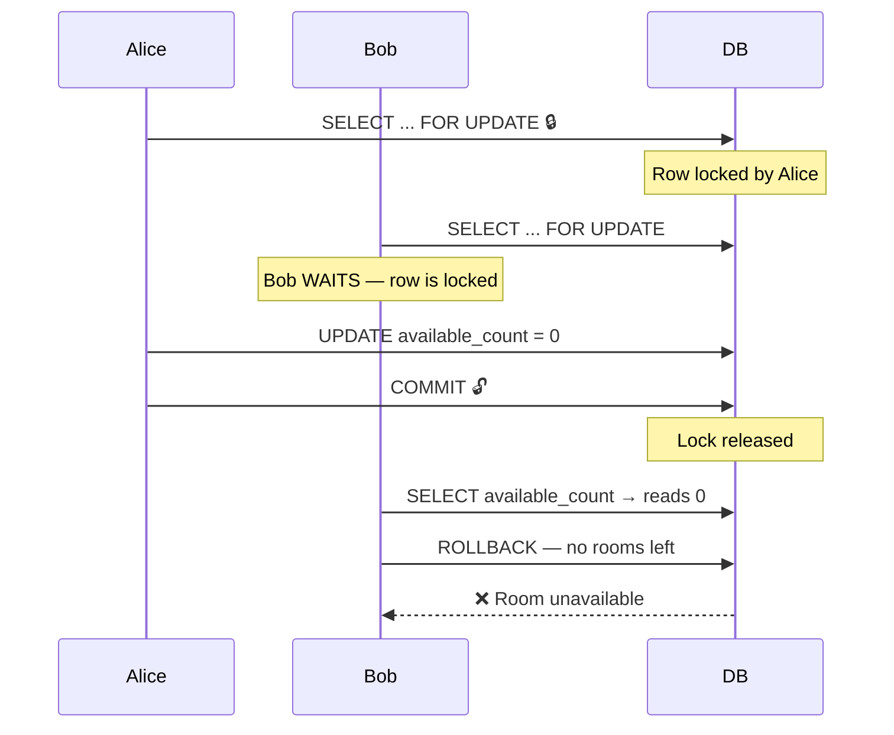
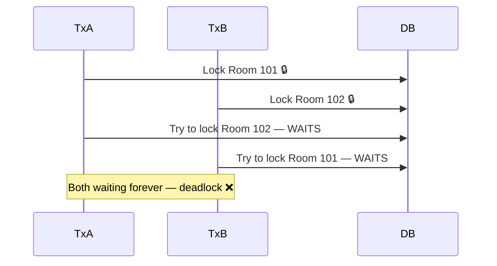

# Pessimistic Locking

> The race condition this solves is explained in [[08 Race-Condition]]

---

## The Philosophy

> Assume conflicts **will** happen. Block everyone else before doing any work.

Lock the row the moment you read it. No other transaction can touch that row until you are done.

---

## How It Works — `FOR UPDATE`

```sql
BEGIN;

  SELECT available_count
  FROM room_inventory
  WHERE room_type_id = 'RT007'
    AND date = '2026-02-12'
  FOR UPDATE;             -- 🔒 row is locked the moment it is read

  UPDATE room_inventory
  SET available_count = available_count - 1
  WHERE room_type_id = 'RT007'
    AND date = '2026-02-12';

COMMIT;                   -- 🔓 lock released
```

`FOR UPDATE` tells the database: "I am about to modify this row — don't let anyone else touch it until I'm done."

---

## What Happens With Two Users



Alice gets the room. Bob waits, reads 0, and fails cleanly. No double booking.

---

## Advantages

- **Guarantees consistency** — conflicts are physically impossible, not just unlikely
- **Simple mental model** — lock it, update it, release it
- **No retry logic needed** — the losing transaction simply fails and returns an error

---

## Problems

### 1 — Lock Holding Waste

The lock is held for the entire duration of the transaction. If the user:
- Abandons the checkout page
- Closes the browser
- Loses network connection

The lock stays until the transaction times out. Other users trying to book that room are blocked for no reason.

> This is why we use a **15-minute expiry** on PENDING reservations — to bound how long a hold can last.

---

### 2 — Deadlocks

Happens when two transactions each hold a lock the other needs:



The database detects this and kills one transaction automatically. But it means one booking attempt fails for a reason that has nothing to do with availability.

---

### 3 — Scalability Bottleneck

Under very high traffic, many transactions queue up waiting for the same lock. Throughput drops, latency spikes.

Not ideal for systems where:
- Inventory is large (thousands of items)
- Conflicts are actually rare
- You need to handle millions of concurrent users

---

## When to Use Pessimistic Locking

| Situation | Use pessimistic? |
|---|---|
| Small inventory (hotel rooms, concert seats) | ✅ Yes — conflicts are guaranteed |
| High conflict guaranteed (last room on NYE) | ✅ Yes |
| Bank balance transfer | ✅ Yes — must never allow overdraft |
| Large inventory (millions of products) | ❌ No — use optimistic instead |
| Read-heavy, rarely conflicting | ❌ No — unnecessary blocking |
