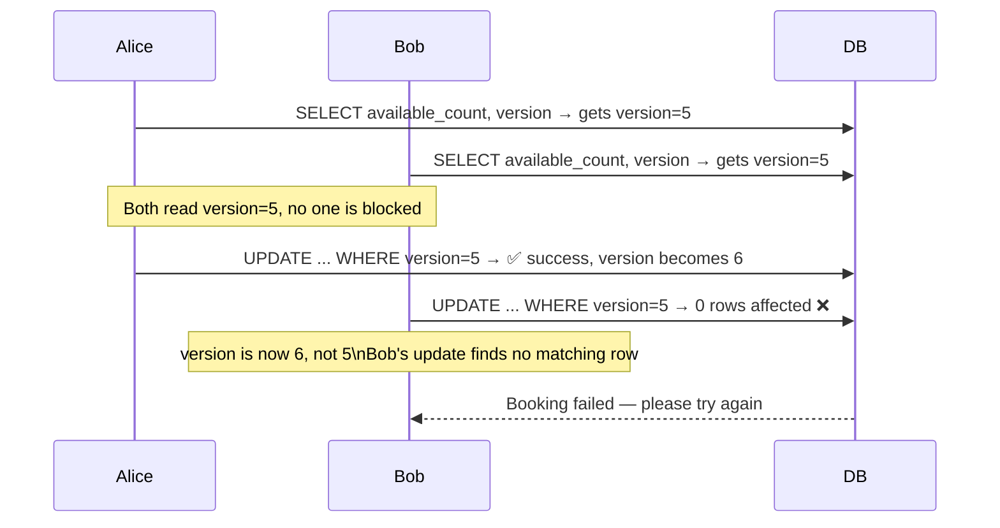

## The Philosophy

> Assume conflicts are **rare**. Don't block anyone upfront. Let everyone try — but at the moment of writing, check if anyone else changed the data first.

No locks held during the transaction. Conflict is detected at commit time, not at read time.

---

## How It Works — Version Number

Add a `version` column to the table. Every successful update increments it by 1.

```sql
ALTER TABLE room_inventory ADD COLUMN version INT DEFAULT 1;
```

### Reading

When Alice reads the row, she gets the current version:

| room_type_id | date | available_count | version |
|---|---|---|---|
| RT007 | 2026-02-12 | 1 | **5** |

---

### Writing

When Alice writes, she includes `WHERE version = 5` in her update:

```sql
UPDATE room_inventory
SET available_count = available_count - 1,
    version         = version + 1
WHERE room_type_id = 'RT007'
  AND date         = '2026-02-12'
  AND version      = 5;             -- only succeeds if version hasn't changed
```

If no one else modified the row since she read it, version is still 5 → update succeeds → version becomes 6.

---

## What Happens With Two Users



Alice wins. Bob's update silently affects 0 rows — the application detects this and returns an error to Bob.

---

## Detecting the Failure in Application Code

The application checks how many rows were affected:

```python
rows_affected = db.execute(update_query)

if rows_affected == 0:
    raise ConflictException("Room was just booked by someone else. Please try again.")
```

0 rows affected = someone else changed the data between your read and your write = retry or show error.

---

## Advantages

- **No locks held** — no blocking, no waiting, no deadlocks
- **Higher throughput** — all transactions run in parallel
- **Better for distributed systems** — locks don't work across multiple database nodes

---

## Problems

### Retry Storms Under High Contention

If many users compete for the same last room, only one succeeds per attempt. All others fail and retry. They all fail again. This creates a cascade of retries that hammers the database.

```
Round 1: 100 users try → 1 wins, 99 fail and retry
Round 2: 99 users try → 1 wins, 98 fail and retry
Round 3: 98 users try → ...
```

Under pessimistic locking, 99 users would just wait in a queue — more orderly and less database load.

> This is exactly why hotel rooms use pessimistic locking — inventory is small and contention is high. Optimistic locking would create retry storms on popular dates.

---

## Timestamp Variant

Instead of a version number, some systems use `last_updated_at`:

```sql
UPDATE room_inventory
SET available_count  = available_count - 1,
    last_updated_at  = NOW()
WHERE room_type_id   = 'RT007'
  AND date           = '2026-02-12'
  AND last_updated_at = '2026-02-01 14:30:00';
```

Same idea — if the timestamp changed since you read it, your update affects 0 rows.

> Version numbers are preferred over timestamps because two updates in the same millisecond can have identical timestamps, making the check unreliable.

---

## When to Use Optimistic Locking

| Situation | Use optimistic? |
|---|---|
| Large inventory (e-commerce, millions of products) | ✅ Yes — conflicts are rare |
| Read-heavy, low write contention | ✅ Yes |
| Distributed system across multiple DB nodes | ✅ Yes — locks don't work across nodes |
| Small inventory with guaranteed conflicts | ❌ No — retry storms |
| Hotel rooms, concert seats | ❌ No — use pessimistic instead |

---

## Side-by-Side Comparison

| | Pessimistic | Optimistic |
|---|---|---|
| Locks upfront | Yes | No |
| Blocks others | Yes | No |
| Deadlock risk | Yes | No |
| Retry on conflict | No | Yes |
| Retry storms | No | Yes (under high contention) |
| Throughput | Lower | Higher |
| Best for | Small inventory, high conflict | Large inventory, low conflict |
