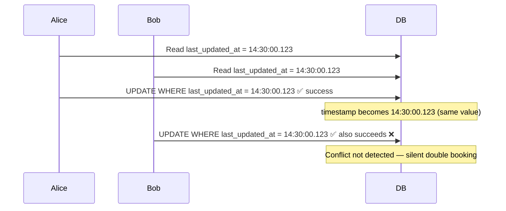
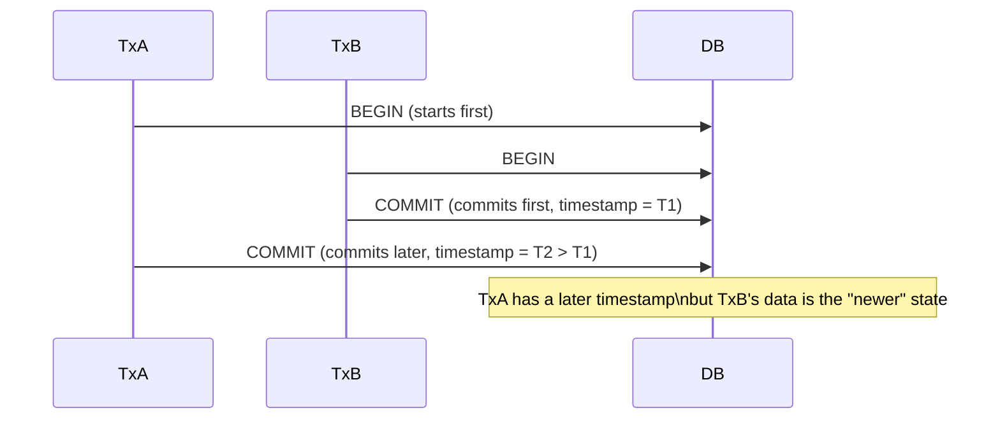

# Why Timestamps Are Unreliable for Optimistic Locking

> In [[10 Optimistic-Locking]] we mentioned that optimistic locking has two variants — version number and timestamp.
> This file explains why the timestamp variant is dangerous and should be avoided.

---

## The Core Problem

Timestamp locking relies on **time** as a correctness signal.

```sql
-- Timestamp variant
UPDATE room_inventory
SET available_count  = available_count - 1,
    last_updated_at  = NOW()
WHERE room_type_id   = 'RT007'
  AND date           = '2026-02-12'
  AND last_updated_at = '2026-02-01 14:30:00.123';  -- must match what we read
```

This looks reasonable. But time is a weak and unreliable signal. Here is why.

---

## Problem 1 — Two Updates in the Same Millisecond

Databases store timestamps with limited precision. If two updates happen within the same resolution window, they get the **same timestamp value** — and the conflict is never detected.

```
Update A commits at → 2026-02-01 14:30:00.123
Update B commits at → 2026-02-01 14:30:00.123  (same millisecond)
```



> [!important] This is not theoretical
> Under high load, multiple requests hitting within the same millisecond is common.
> The conflict goes completely undetected. No error is thrown. Data is silently corrupted.

With a version number this cannot happen — version 5 becomes 6, then 7. Two writes cannot both produce version 6.

---

## Problem 2 — Clock Drift in Distributed Systems

In a distributed system, your application runs on multiple servers. Each server has its own clock. Clocks drift — they are never perfectly in sync even with NTP.

```
Server A processes Alice's request → timestamp: 14:30:00.500
Server B processes Bob's request  → timestamp: 14:30:00.200  (Server B's clock is behind)
```

Bob's request was processed **after** Alice's, but it carries an **earlier timestamp** because Server B's clock is behind.

Now your locking logic breaks:
- Bob's earlier-timestamped write can overwrite Alice's later-timestamped write
- The ordering of updates becomes incorrect
- You have no way to know which write actually happened last

> [!note] Version numbers don't have this problem
> Version is a counter incremented by the database itself — not derived from any server's clock.
> It is always monotonically increasing and unaffected by which server processed the request.

---

## Problem 3 — Timezone and Conversion Bugs

Timestamps pass through many layers: application code → ORM → database driver → database. Each layer can silently change the value.

Common ways this goes wrong:

| Bug | What happens |
|---|---|
| UTC vs local time mismatch | App stores in local time, DB stores in UTC → timestamp comparison fails |
| Precision truncation | Java `Instant` has nanosecond precision, SQL `TIMESTAMP` stores microseconds — last digits get cut |
| ORM mapping issue | Hibernate reads back a timestamp with different precision than what was written |
| Serialization format | `2026-02-01T14:30:00Z` vs `2026-02-01 14:30:00` — string comparison fails |

All of these cause either:
- **False failures** — valid updates rejected because the timestamp doesn't match after conversion
- **Missed conflicts** — corrupt updates accepted because a precision bug makes two different timestamps look the same

Version integers pass through every layer as a plain integer. No conversion, no precision loss, no timezone.

---

## Problem 4 — Harder to Debug

When something goes wrong, version numbers are trivial to trace:

```
version = 5 → version = 6 → version = 7
```

You can look at any row and immediately understand the history.

With timestamps:

```
2026-02-01 14:30:00.123456
2026-02-01 14:30:00.123891
2026-02-01 14:30:00.124002
```

Difficult to compare manually. Difficult to reproduce in tests. Difficult to reason about under pressure during an incident.

---

## Problem 5 — Commit Order ≠ Timestamp Order

Transaction A starts before Transaction B, but B commits first.



Depending on implementation, the timestamp on commit may not reflect the true ordering of operations. Version numbers always reflect commit order — whoever increments last, wins.

---

## Problem 6 — Slower Index Performance

Integer comparison is faster than timestamp comparison at the database level:

```sql
-- Slower — timestamp comparison
WHERE last_updated_at = '2026-02-01 14:30:00.123456'

-- Faster — integer comparison
WHERE version = 5
```

- Integers are smaller in memory → better cache locality
- Integer indexes are more compact → faster scans
- At millions of rows and high QPS, this difference is measurable

---

## Summary

| Problem | Timestamp | Version Number |
|---|---|---|
| Two updates same millisecond | ❌ Conflict not detected | ✅ Always detected |
| Clock drift across servers | ❌ Ordering breaks | ✅ Unaffected |
| Timezone/precision bugs | ❌ Silent failures | ✅ No conversion needed |
| Debuggability | ❌ Hard to read | ✅ Simple integers |
| Commit order correctness | ❌ Not guaranteed | ✅ Always correct |
| Index performance | ❌ Slower | ✅ Faster |

---

> [!tip] The rule
> Never use timestamps for concurrency control.
> Use `version INT` — deterministic, fast, debuggable, and production-proven.
>
> Every serious ORM agrees: JPA `@Version`, Hibernate, CockroachDB, PostgreSQL's internal `xmin` — all use integer versioning, not timestamps.
