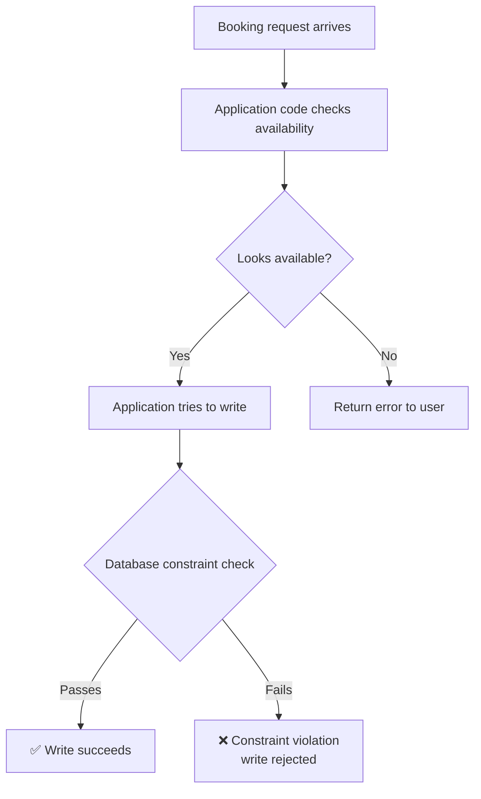
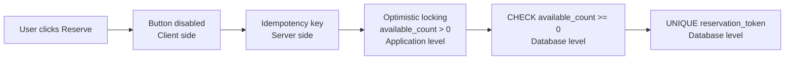

# Database Constraints — The Final Line of Defence

---

## The Core Idea

> [!important] Don't prevent invalid states in application code. Let the database **reject** them.
> Application code can have bugs, crash mid-transaction, or be bypassed entirely.
> A database constraint is enforced inside the storage engine — atomic, automatic, and impossible to bypass accidentally.

The database becomes the final authority on what data is allowed to exist.

---

## Why Constraints Are Stronger Than Application Logic



Even if the application code has a bug and lets an invalid write through, the constraint catches it at the database level. The write never lands.

> [!note] Constraints are checked inside the same atomic operation as the write
> There is no gap between "check" and "write" — they happen as one unit.
> This is why they are stronger than any application-level check, which always has a gap between reading the state and writing the new value.

---

## The 4 Constraints Used in Our System

---

### 1 — `CHECK` Constraint — Prevent Invalid Values

The most important constraint in our hotel system.

```sql
CONSTRAINT available_count_non_negative CHECK (available_count >= 0)
```

**What it prevents:**

If optimistic locking somehow allows two concurrent deductions from `available_count = 1`:

| Transaction | available_count before | Operation | available_count after |
|---|---|---|---|
| Alice | 1 | -1 | 0 |
| Bob | 0 | -1 | **-1** ← rejected ❌ |

Bob's write is rejected with a constraint violation. The count can never go below 0. Double booking is physically impossible at the database level.

> This is the last line of defence — even if every layer above fails, this holds.

---

### 2 — `UNIQUE` Constraint — Prevent Duplicates

Used on `reservation_token` in our reservations table:

```sql
reservation_token   VARCHAR(100)    UNIQUE
```

**What it prevents:**

If two concurrent requests with the same idempotency key somehow both pass the application-level check and try to insert a reservation simultaneously:

```sql
-- Both try to insert with the same token
INSERT INTO reservations (reservation_token, ...) VALUES ('tok_abc123', ...);
INSERT INTO reservations (reservation_token, ...) VALUES ('tok_abc123', ...);
```

The second insert is rejected with:
```
duplicate key value violates unique constraint "reservations_reservation_token_key"
```

Only one reservation with that token can ever exist.

Also used on `users.email`:

```sql
email   VARCHAR(255)    NOT NULL UNIQUE
```

A user cannot register twice with the same email — enforced at the database, not the application.

---

### 3 — `FOREIGN KEY` Constraint — Prevent Orphan Records

Every `reservation` references a valid `room_type`, `hotel`, and `user`:

```sql
hotel_id        VARCHAR(20) NOT NULL REFERENCES hotels(hotel_id),
room_type_id    VARCHAR(20) NOT NULL REFERENCES room_types(room_type_id),
user_id         VARCHAR(20) NOT NULL REFERENCES users(user_id)
```

**What it prevents:**

```sql
-- Try to create a reservation for a hotel that doesn't exist
INSERT INTO reservations (hotel_id, ...) VALUES ('H9999', ...);
-- ❌ ERROR: insert or update on table "reservations" violates foreign key constraint
-- Key (hotel_id)=(H9999) is not present in table "hotels"
```

You can never end up with a reservation pointing to a deleted or non-existent hotel. Referential integrity is guaranteed by the database, not by carefully written application code.

---

### 4 — `EXCLUSION` Constraint — Prevent Overlapping Date Ranges (PostgreSQL)

This is the most powerful constraint for booking systems. Instead of tracking `available_count`, you can prevent two bookings from overlapping on the same physical room entirely.

```sql
-- Requires the btree_gist extension
CREATE EXTENSION IF NOT EXISTS btree_gist;

ALTER TABLE reservations ADD CONSTRAINT no_overlapping_bookings
EXCLUDE USING gist (
    room_id    WITH =,
    daterange(check_in, check_out) WITH &&
);
```

**What it prevents:**

| reservation_id | room_id | check_in | check_out |
|---|---|---|---|
| RES001 | R101 | 2026-02-10 | 2026-02-13 |
| RES002 | R101 | 2026-02-12 | 2026-02-15 | ← ❌ rejected — overlaps with RES001 |

The `&&` operator means "overlaps". The constraint says: no two reservations can have the same `room_id` AND overlapping date ranges.

> [!note] We use `available_count` instead of EXCLUSION in our system
> EXCLUSION works on physical rooms (one row per reservation per specific room).
> We book room **types** — not specific rooms. The specific room is assigned at check-in.
> So EXCLUSION doesn't directly apply to our design, but it is the correct approach if you track individual room assignments.

---

## How Constraints Layer With Our Other Defences



Each layer handles what the previous one misses:

| Layer | Handles |
|---|---|
| Button disable | Accidental double clicks |
| Idempotency key | Network retries, page refresh |
| Optimistic locking | Concurrent bookings, race conditions |
| `CHECK` constraint | Anything that slips past optimistic locking |
| `UNIQUE` constraint | Duplicate reservation tokens |
| `FOREIGN KEY` | Orphan records, deleted references |

> [!tip] This is called **defence in depth**
> No single layer is trusted completely. Each layer assumes the one above it might fail.
> The database constraints at the bottom are the only ones that are truly unbypassable.

---

## Comparison

| Approach | Reliability | Complexity | Can be bypassed? |
|---|---|---|---|
| Application code check | Low | Low | Yes — bugs, crashes, concurrent gaps |
| Optimistic locking | High | Medium | Theoretically yes in extreme edge cases |
| Database constraint | **Highest** | **Lowest** | **No — enforced by storage engine** |

---

## When Constraints Are Not Enough

Constraints handle **static rules** — things that are always true regardless of context.

They cannot handle:

| Scenario | Why constraints don't help |
|---|---|
| 15-minute soft hold with expiry | Requires time-aware application logic |
| Business rules across multiple tables | e.g. "a user can't have more than 3 active bookings" — needs a query, not a constraint |
| Partial availability (some nights available, some not) | Requires per-date inventory logic |

For these, you need application logic. Constraints are the safety net underneath that logic — not a replacement for it.
