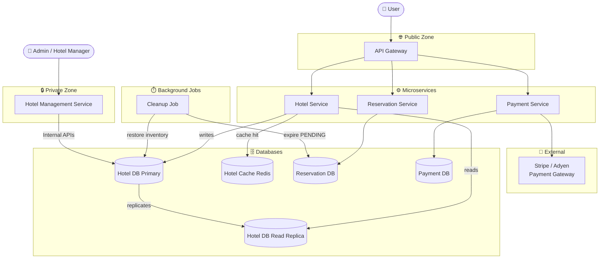
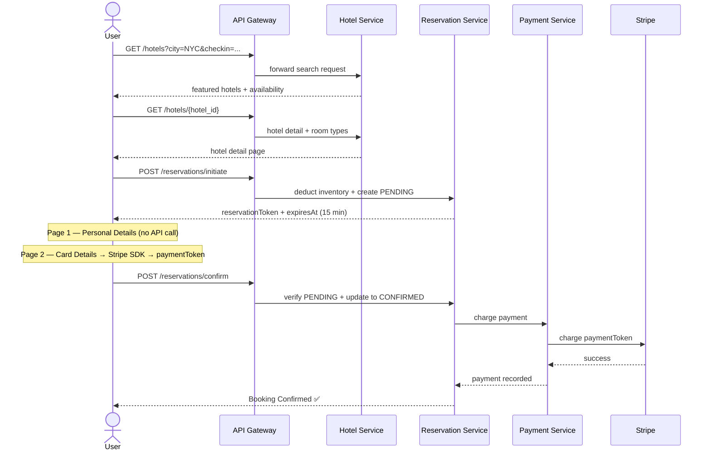
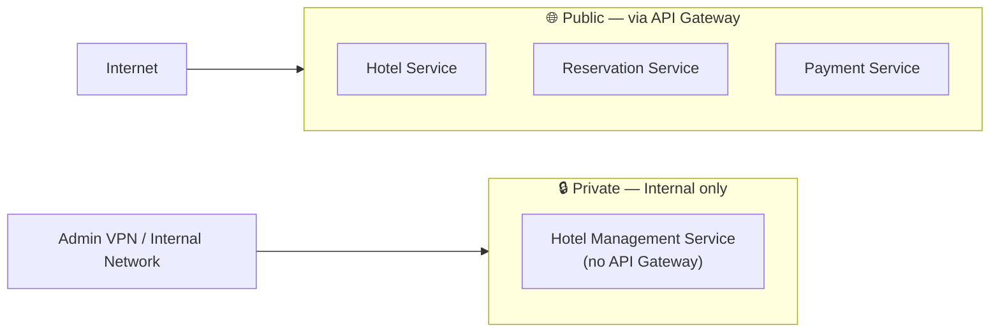

## High Level Design

---

## What Each Service Owns

| Service | Responsibility | Database |
|---|---|---|
| **Hotel Service** | Search, hotel detail, availability check | Hotel DB + Redis cache |
| **Reservation Service** | Initiate (PENDING), Confirm (CONFIRMED), Cancel, expiry | Reservation DB |
| **Payment Service** | Charge via Stripe, refund on cancellation/expiry | Payment DB |
| **Hotel Management Service** | Admin-only: add/edit hotels, room types, pricing | Hotel DB (via internal API) |

---

## Request Flow — Full Booking Journey

---

## Public vs Private Split

> [!note] Why separate public and private?
> Hotel managers adding rooms or updating prices should never go through the same public API that customers use.
> The Hotel Management Service is only reachable from an internal network — not exposed to the internet at all.

---

## Read vs Write Path

| Operation | Path | Why |
|---|---|---|
| Search hotels | → Read Replica | High volume, eventual consistency acceptable for metadata |
| Check availability | → Read Replica | High volume — stale by seconds is acceptable at browse time |
| Initiate reservation | → Primary | Must be consistent — deducts inventory |
| Confirm reservation | → Primary | Must be consistent — charges payment |
| Cancel reservation | → Primary | Must be consistent — restores inventory |
| Admin hotel updates | → Primary | Writes always go to primary |

---

## What We Decided NOT to Include (and Why)

| Component | Reason excluded |
|---|---|
| CDN | Hotel thumbnails are not high-frequency enough to justify it at this scale |
| Redis for availability | Availability must be strongly consistent — caching it risks double booking |
| Sharding | 30 QPS writes, 1.1M rooms — fits easily in a single PostgreSQL primary |
| Separate Rate Limiting Service | Rate limiting belongs in the API Gateway, not a downstream microservice |

---

## Key Design Decisions Recap

| Decision | What we chose | Why |
|---|---|---|
| Consistency vs Availability | Consistency | Double booking is worse than showing "sold out" incorrectly |
| Locking strategy | Optimistic (`AND available_count > 0`) | 30 QPS across 1.1M rooms — conflicts are rare, no need to hold locks |
| Last line of defence | `CHECK (available_count >= 0)` | Database physically rejects negative counts even if app logic fails |
| Idempotency | Client UUID in sessionStorage | Retries and refreshes never create duplicate reservations |
| Two-phase booking | PENDING → CONFIRMED | Holds inventory during payment without charging before confirmation |
| Book room type, not room | `room_inventory` tracks types | Specific room assigned at check-in — guest doesn't care which room |
| Denormalization | `hotel_id` in `room_inventory` | Avoids JOIN through `room_types` on every availability search |
