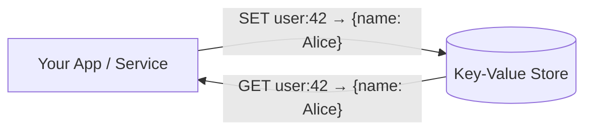
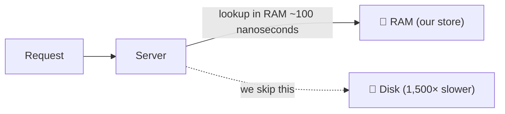

## What Are We Building?

A fast, in-memory storage system where you store and retrieve data using a **key → value** model.

Think of it like a giant dictionary — or a hashmap — that lives on a server and can answer thousands of requests per second. The closest real-world product is **Redis**.

---

## The Mental Model — Coat Check Counter

Imagine a coat-check counter at a restaurant.

- You hand over your coat → the **value**
- The attendant gives you a ticket number → the **key**
- Later, you show your ticket → you get your coat back instantly

That's it. A key-value store is exactly this:
- Store something under a name → **SET**
- Get it back by that name → **GET**
- Throw it away → **DEL**

No complicated queries. No filtering. No joins. Just three operations.

---

## Where Is This Used in the Real World?

A key-value store is never the main database of a product. It's the **fast layer** that sits in front of everything else.

| Use Case | What's stored | Example Key |
|---|---|---|
| **Session storage** | Who is logged in | `session:abc123` |
| **Caching** | DB query results so you don't re-query | `user:42:profile` |
| **Rate limiting** | How many requests a user made | `rate_limit:user:42` |
| **Feature flags** | Is dark mode on for this user? | `feature:dark_mode:user:42` |
| **Leaderboards** | Top scores | `leaderboard:game:chess` |
| **Config values** | System-wide settings | `config:max_upload_size` |

> [!info] Key insight
> Every time you've heard "we cache this in Redis" — that's a key-value store being used. Redis is the most popular key-value store in the world, and what we're designing here is a simplified version of it.

---

## Scope Decisions — What We're NOT Building

Before every system design, you clarify what's in and what's out. The interviewer gave us two important simplifications:

### No Durability (for now)

> **Durability** = if the server crashes and restarts, data is preserved.

We are **not** building that. If this store crashes, all data is lost. That's acceptable for a caching layer — the original data still lives in the real database.

| Storage | Survives crash? | Speed |
|---|---|---|
| **RAM (us)** | ❌ No | ~100 nanoseconds |
| **SSD (disk)** | ✅ Yes | ~150 microseconds (1,500× slower) |
| **HDD (spinning disk)** | ✅ Yes | ~10 milliseconds (100,000× slower) |

> [!tip] Why this matters for architecture
> Skipping durability means we skip **WAL (Write-Ahead Logs)**, **fsync** calls, and crash-recovery logic. This removes a huge chunk of complexity and is why we can achieve sub-millisecond performance.

### In-Memory Storage Only

All data lives in **RAM**, not on disk. This is the core reason for the speed target we'll set in the NFRs.

> [!warning] The trade-off
> In-memory means our **bottleneck is RAM size**, not disk speed. At 10 billion entries, we'll need more RAM than fits on one machine — which is the first architectural challenge we'll face.

---

## How This Connects to What You've Learned

| Concept you studied | How it shows up here |
|---|---|
| [[02-Latency]] | RAM access = nanoseconds → explains our <2ms latency target |
| [[03-Throughput]] | QPS = how many reads/writes per second we must handle |
| [[07-Percentiles]] | Latency targets are P99, not average |
| [[01-Scalability]] | 10B entries don't fit on one machine → need horizontal sharding |

