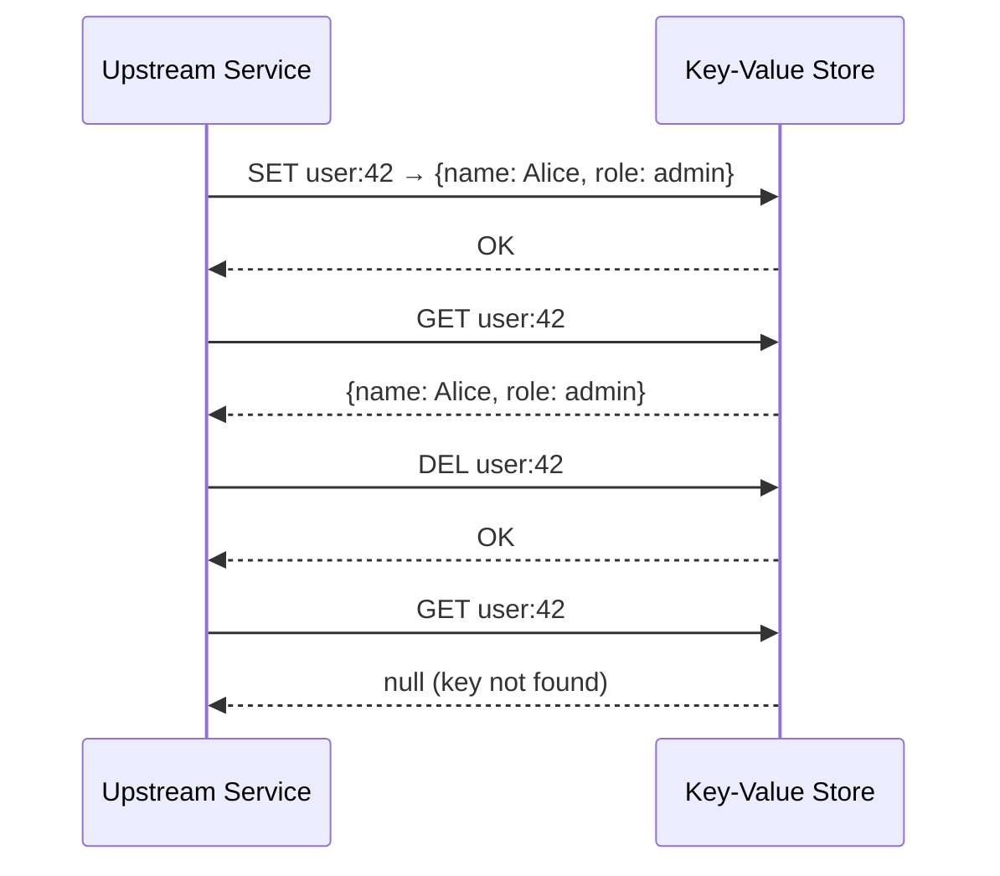
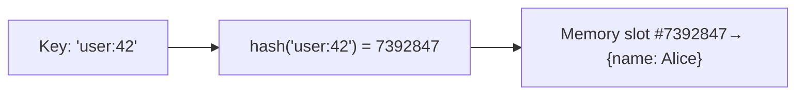
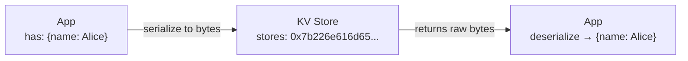

# Key-Value Store — Functional Requirements

> **Functional requirements** describe *what the system does* — the features and operations it must support.
> Think of these as the answers to: "What can a user/service do with this system?"

---

## The Three Core Operations

A key-value store is intentionally simple. It only needs three operations:

| Operation | What it does | Example |
|---|---|---|
| **SET** | Store a value under a key | `SET user:42 {"name":"Alice"}` |
| **GET** | Retrieve a value by its key | `GET user:42` → `{"name":"Alice"}` |
| **DEL** | Remove a key and its value | `DEL user:42` |

That's the entire API. Unlike a relational database, there are no joins, no filters, no sorting. You either know the key or you don't.

> [!info] What is an upstream service?
> A service that sits earlier in the request chain and calls *us* (the KV store).
> ```
> User → Feed Service → [ KV Store ] → Database
>              ↑                ↑
>          upstream            us
> ```
> The Feed Service calls the KV store to fetch a cached profile — so Feed Service is upstream, KV store is downstream of it.



---

## Keys — Strings Only

**Rule: Keys must always be strings.**

```
✅  "user:42"
✅  "session:abc123xyz"
✅  "rate_limit:user:42:2026-04-02"
✅  "feature_flag:dark_mode"

❌  42          (integer — not allowed)
❌  {id: 42}    (object — not allowed)
```

### Why Only Strings?

A key-value store uses a **hash function** internally to figure out *where* in memory to store a value. Hash functions work on strings naturally and consistently.



If you allowed objects as keys, you'd need to define what "equal" means for them — is `{id:42}` the same as `{id:42, extra:true}`? Strings avoid all of that ambiguity.

### Key Design Convention

In practice, keys follow a naming pattern so they're human-readable and don't accidentally collide:

```
{resource}:{id}:{attribute}

Examples:
  user:42:profile
  user:42:settings
  session:abc123
  rate_limit:user:42
  cache:feed:user:42
```

> [!tip] Interview tip
> When you say "keys are strings", a good interviewer might ask: "What's the max length of a key?"
> Typical answer: 512 bytes (like Redis). Long keys hurt performance because hashing them takes more time and they consume more memory.

---

## Values — Any Data Type

**Rule: Values can be anything.**

The store doesn't care what the value *means*. It just stores bytes and returns them. The caller decides how to interpret it.

| Value type | Example | Used for |
|---|---|---|
| **String** | `"Hello"`, `"{\"name\":\"Alice\"}"` | Simple values, JSON blobs |
| **Integer** | `42` | Counters, scores |
| **Float** | `3.14` | Prices, coordinates |
| **List** | `["post1", "post2", "post3"]` | Feeds, queues |
| **Hash/Map** | `{name: "Alice", age: 30}` | User profiles, config objects |
| **Set** | `{user1, user2, user3}` | Unique members, followers list |
| **Binary blob** | raw bytes | Images (unusual but possible) |

> [!info] What "any type" really means under the hood
> The store serializes everything to bytes before storing. When you `GET`, it returns those bytes. The client deserializes them back into the original type. The store itself is type-agnostic — it's just a fast byte store.



---

## What's Out of Scope (Functional)

To keep the design focused, the interviewer confirmed we do NOT need:

| Feature | Why excluded |
|---|---|
| **Key expiry / TTL** | Simplification — Redis supports `SET key value EX 60` (expire in 60s), we skip this |
| **Atomic transactions** | No `MULTI/EXEC` block support |
| **Pub/Sub messaging** | No event broadcasting |
| **Complex queries** | No range scans, no prefix search |
| **Authentication / ACLs** | Internal infrastructure system, assumed trusted network |

> [!info] In a real interview
> You might be asked to add TTL support. It's a common follow-up. The implementation involves a background thread that periodically scans and evicts expired keys, plus a sorted set (by expiry timestamp) to find them efficiently.

---

## Summary

```
Keys   → always strings, max ~512 bytes, follow resource:id:attr convention
Values → any serializable type (string, int, list, hash, set, blob)
Ops    → SET, GET, DEL (that's it for now)
```

The simplicity is intentional. The complexity of this system comes entirely from the **non-functional requirements** — doing these three operations at massive scale with low latency.

