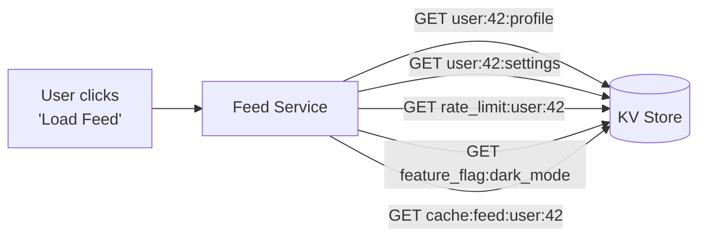

# Key-Value Store — Non-Functional Requirements

> **Non-functional requirements** describe *how well* the system must perform — not what it does, but how fast, how big, how reliable.
>
> At Google-level interviews, you are expected to **derive these yourself** from first principles. The interviewer won't hand them to you. This file walks through exactly how to think about each one.

---

## Overview

| Requirement | Target |
|---|---|
| **Scale** | 10 billion key-value entries |
| **Read QPS** | 100,000 – 1,000,000 per second |
| **Write QPS** | 50,000 – 100,000 per second |
| **Read latency** | < 2ms at P99 |
| **Write latency** | < 5ms at P99 |

---

## 1. Scale — 10 Billion Entries

### How We Arrive at This Number

Assume average entry sizes:
- Key: ~50 bytes (e.g., `"rate_limit:user:42:2026-04-02"`)
- Value: ~200 bytes (a small JSON blob)
- Overhead (pointers, hash table metadata): ~50 bytes
- **Total per entry: ~300 bytes**

```
10 billion entries × 300 bytes = ~3 TB of data
```

---

## 2. Read QPS — 100,000 to 1,000,000 per Second

### Why No MAU/DAU Here?

For user-facing products (Instagram, Google Maps), you estimate QPS from daily active users:
```
DAU × actions per day / 86,400 seconds = QPS
```

This store is **not user-facing**. No human directly queries it. Instead, *upstream services* (App Servers, Feed Services, Auth Services) do.

One user clicking "Load Feed" might trigger many KV reads:



**One user action = 5 KV reads** in this example. At 200,000 users/sec → **1M KV reads/sec**.

This is called **fan-out** — one request fans out into many internal calls. It's why internal infrastructure systems always have much higher QPS than the product's visible user count suggests.

### How We Arrive at 100k–1M

- This system is used by multiple independent flows simultaneously: sessions, caching, rate limiting, feature flags, config
- Each upstream service call may fan out into several KV reads
- We design for aggregate system capacity, not per-flow traffic
- **100k** is the sustained baseline; **1M** accounts for burst and retry amplification

---

## 3. Write QPS — 50,000 to 100,000 per Second

### How We Arrive at This Number

Writes are always fewer than reads in a caching/session system. A typical ratio is **1 write per 10–20 reads**:

```
If reads = 1M QPS
Writes at 10% = 100k write QPS  ✓ matches our target
```

This ratio makes intuitive sense:
- A session is written once on login, read on every page load (many reads per write)
- A cache entry is written once, read many times before it expires

### Why Writes Are More Expensive Than Reads

Even though there are fewer writes, each write does significantly more work than a read:

| READ | WRITE |
|---|---|
| 1. Hash the key → find memory address | 1. Hash the key → find memory address |
| 2. Return the value ✅ | 2. Allocate memory for the new value |
| | 3. Evict an old entry if memory is full |
| | 4. Rehash the table if load factor is too high |
| | 5. Acquire a lock (prevent two writes colliding on same key) |
| | 6. Write the value |
| | 7. Release the lock ✅ |

A read is done in 2 steps. A write takes 7. This is why writes become the capacity bottleneck before reads, even at lower QPS.

> [!info] This is why the write latency target (5ms) is higher than the read target (2ms)
> The extra steps — especially locking and eviction — add time. The 5ms budget reflects the real cost of those operations.

---

## 4. Latency Targets

### Why We Use Percentiles, Not Averages

> [!info] From your percentiles notes
> *"Averages lie. Percentiles tell the truth."*
>
> Example: 9 requests take 1ms, 1 request takes 500ms. Average = 59ms — but that represents nobody's actual experience. 90% of users got 1ms and 1 user got 500ms.

We always specify latency as a **percentile target**.

| Percentile | Meaning |
|---|---|
| **P50** | 50% of requests finish within this time — the typical experience |
| **P95** | 95% finish within this — only 5% are slower |
| **P99** | 99% finish within this — only 1% are slower |

At 1M reads/second, even 1% matters:
```
1,000,000 reads/sec × 1% = 10,000 slow reads every second
```

### Read Latency < 2ms (P99)

Where the time goes in a single read:

| Step | Time |
|---|---|
| Network round-trip (same datacenter) | ~0.5ms |
| Queue wait (request waiting for a free thread) | ~0.2ms |
| Hash lookup in RAM | ~0.001ms (nearly instant) |
| **Realistic total** | ~0.7ms |

We set the target at **2ms** to give headroom for the slower P99 tail (GC pauses, brief spikes in queue wait).

> [!info] From your latency notes
> RAM access = ~100 nanoseconds. SSD = ~150 microseconds (1,500× slower). This is exactly why in-memory storage is a requirement — disk would make the 2ms target physically impossible at this QPS.

### Write Latency < 5ms (P99)

Writes get a larger budget because they do more work:

| Step | Time |
|---|---|
| Lock acquisition | ~0.5–2ms (varies with contention) |
| Memory allocation | ~0.1ms |
| Possible eviction | ~0.5ms |
| Network overhead | ~0.5ms |
| **Realistic total** | ~1.6–3ms |

We set the target at **5ms** to give headroom for the P99 tail under contention.
