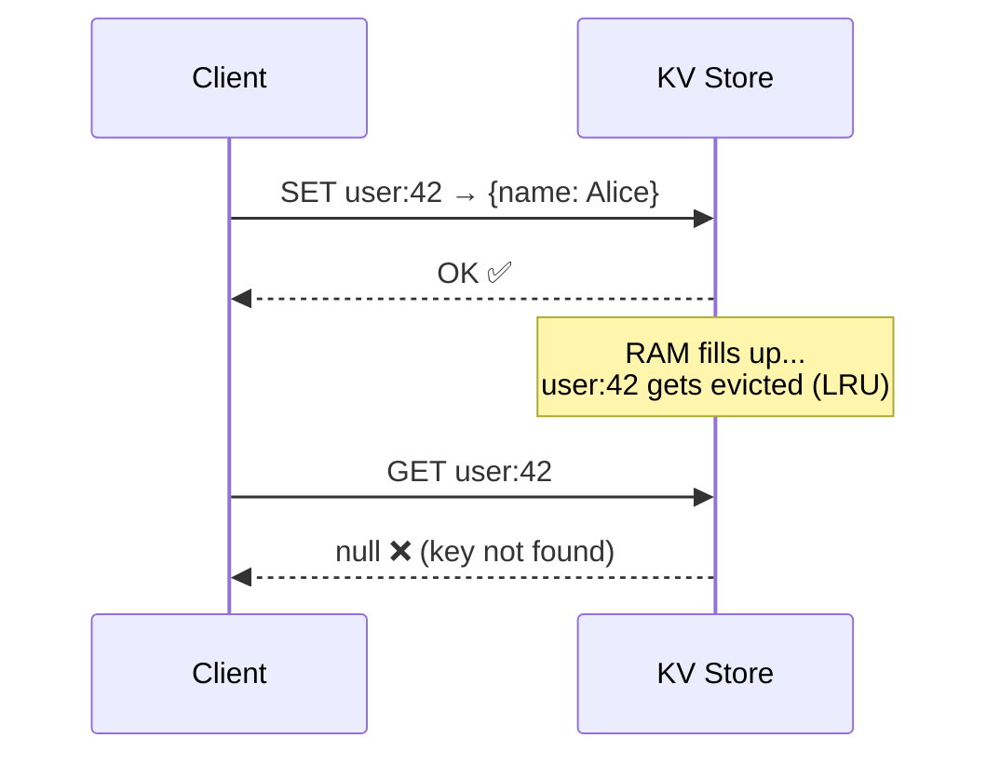

# Key-Value Store — Optimization Choices

> Before designing the system, we need to answer one fundamental question:
> **What are we willing to sacrifice — and what must we protect at all costs?**
>
> This decision shapes every architectural choice that follows.

---

## The CAP Theorem — A Quick Primer

Any distributed storage system can only fully guarantee **two out of these three** properties:

| Property | What it means in plain English |
|---|---|
| **C — Consistency** | Every read always returns the most recent write. No stale data, ever. |
| **A — Availability** | Every request gets a response — even if some nodes are down. |
| **P — Partition Tolerance** | The system keeps working even if network communication between nodes breaks. |

---

## Step 1 — Can We Even Avoid Partitioning?

Let's do the math to find out.

### Best-Case Estimate (strings only)

Assume the lightest possible entries — both key and value are short strings:
- Key: ~10 bytes (e.g., `"user:42"`)
- Value: ~40 bytes (e.g., `"Alice"`)
- **Total: ~50 bytes per entry**

```
10 billion entries × 50 bytes = 500,000,000,000 bytes = ~0.5 TB
```

### Realistic Estimate (JSON values)

If values are JSON objects (user profiles, config blobs):
- Key: ~50 bytes
- Value: ~200 bytes
- Overhead: ~50 bytes
- **Total: ~300 bytes per entry**

```
10 billion entries × 300 bytes = ~3 TB
```

### The Verdict

| Scenario | Data size | Fits on one machine? |
|---|---|---|
| Best case (strings) | ~0.5 TB | ❌ A typical server has 256 GB–1 TB RAM |
| Realistic (JSON) | ~3 TB | ❌ Definitely not |

**Even in the best case, the data does not fit on one machine.**

Since this is an **in-memory** store, we cannot overflow to disk — that would destroy our latency targets. We have no choice: **the data must be split across multiple machines (partitioned)**.

> **Conclusion: Partition Tolerance is non-negotiable. We must pick between C and A.**

---

## Step 2 — Can We Even Maintain Consistency?

Even if we wanted Consistency, there's a second problem: **eviction**.

### The Eviction Problem

Each machine only has a finite amount of RAM. When RAM fills up, the store must **evict** (delete) some entries to make room for new ones.

Common eviction policies:

| Policy | What gets evicted |
|---|---|
| **LRU** (Least Recently Used) | The entry that hasn't been read for the longest time |
| **LFU** (Least Frequently Used) | The entry accessed the fewest total times |
| **FIFO** (First In, First Out) | The oldest entry, regardless of usage |

### Why Eviction Breaks Consistency



The client wrote the data. The client expects to read it back. But it was evicted. **This is a consistency violation** — the read does not return the most recent write.

> A true Consistent system would never allow this. But in an in-memory store at this scale, eviction is unavoidable. So strong Consistency is off the table.

---

## Step 3 — The Decision

| Property | Can we guarantee it? | Reason |
|---|---|---|
| **Partition Tolerance** | ✅ Must have | Data doesn't fit on one machine |
| **Availability** | ✅ Optimise for | Reads should always return *something*, even if slightly stale |
| **Consistency** | ❌ Cannot fully guarantee | Eviction means a key written today may not exist tomorrow |

**We choose: AP — Available + Partition Tolerant**

This is the same choice made by **Redis**, **DynamoDB**, and **Cassandra**.

---

## Step 4 — Tunable Consistency

Dropping Consistency entirely would make the store unreliable. The nuanced answer is **tunable consistency** — let the caller decide how much consistency they need per request.

The idea: for a read or write, you specify how many nodes must agree before the operation succeeds.

```
R = number of nodes that must confirm a READ
W = number of nodes that must confirm a WRITE
N = total number of replicas holding this data
```

### The Trade-off Inside the Dial

> [!warning] Wait — if R+W>N gives strong consistency, doesn't that mean we have both C and A?
> No. This is the key insight.
>
> When you require more nodes to agree, **what happens if a node is down?**
> You can't reach the required quorum → the request **fails or blocks**.
> That's not Available anymore. You've traded Availability back for Consistency.

This is the CAP theorem playing out in real time:

```
R=1, W=1  →  always responds fast (Available) but may return stale data (not Consistent)
R=2, W=2  →  returns fresh data (Consistent) but fails if a node is down (not fully Available)
```

**You cannot have both at the same time. The dial just lets you choose where on the spectrum each operation sits.**

| Use case | R | W | N | Consistency | Availability |
|---|---|---|---|---|---|
| High-speed cache read | 1 | 1 | 3 | Eventual — may be stale | ✅ Always responds |
| Critical config value | 2 | 2 | 3 | Strong — all agree | ⚠️ Fails if 1 node is down |
| Write-heavy counter | 1 | 3 | 3 | Strong writes | ⚠️ Write fails if 1 node is down |

### What Tunable Consistency Does NOT Solve

R+W>N handles **stale data across replicas** — 
When a write comes in, it doesn't update all N replicas instantly. It might confirm after W nodes respond and update the rest in the background. So for a brief window, some replicas have the new value and some still have the old one:

```
WRITE: SET user:42 → {name: "Bob"}   (W=1, N=3)

  Replica 1 ✅  {name: "Bob"}   ← updated immediately
  Replica 2 ⏳  {name: "Alice"} ← still old value (sync in progress)
  Replica 3 ⏳  {name: "Alice"} ← still old value (sync in progress)
```

If a read hits Replica 2 right now, it gets `"Alice"` — the stale value. That's **stale data across replicas**.

**How R+W>N fixes this:** if R=2 and W=2 on N=3, then at least one replica that confirmed the write *must* overlap with the replicas you read from. You can't read from two replicas without hitting one that has the latest value.

```
Write confirmed on: Replica 1, Replica 2  (W=2)
Read from:          Replica 2, Replica 3  (R=2)
                              ↑
                    Replica 2 is in both sets → you always get the fresh value
```

But there is a second consistency problem that R+W>N cannot fix: **eviction**.

If a key was evicted from all replicas due to memory pressure, even R=N returns `null` — the data is simply gone. This is a consistency violation at a different layer, and no quorum setting can recover from it.

> [!info] This is why we say the system is AP **by default**
> - Most reads use R=1 → fast, occasionally stale → AP behaviour
> - Callers who need stronger guarantees can opt into R+W>N → they accept reduced availability for those calls
> - Eviction means true global consistency is never fully achievable regardless

> [!tip] Interview move
> Instead of saying "we sacrifice consistency", say:
> *"We default to eventual consistency for performance. For callers that need stronger guarantees, we expose tunable R and W parameters — same model as DynamoDB. But we're transparent that eviction means we can't guarantee a key written today will exist tomorrow, so true strong consistency is best-effort at this scale."*

---

## Summary

```
1. Data size (0.5TB–3TB) → doesn't fit in one machine → Partitioning is mandatory
2. Eviction is unavoidable → a written key may not exist on next read → Consistency is not fully achievable
3. Decision: AP by default — optimise for Availability + Partition Tolerance
4. Tunable consistency (R+W>N) lets callers opt into stronger consistency
   — but the cost is reduced Availability for those operations (CAP still holds)
5. Eviction is a separate problem tunable consistency cannot fix
```
