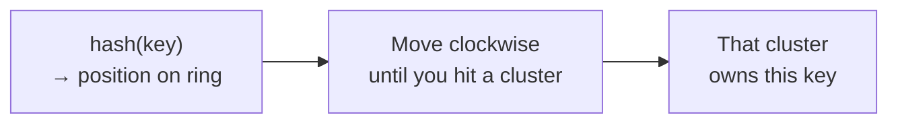
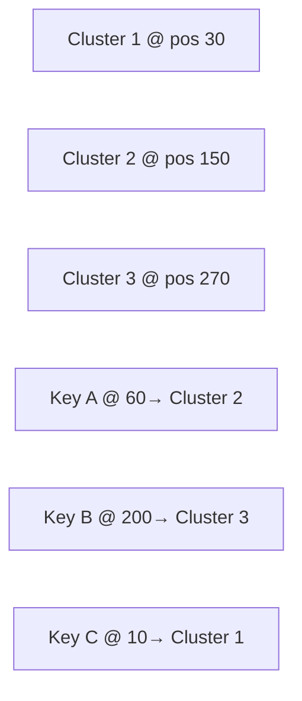

# Key-Value Store — Consistent Hashing

> **The problem we're solving:** With modulo hashing (`hash(key) % N`), removing one cluster forces nearly all keys to remap — causing a massive redistribution that overwhelms surviving clusters and triggers cascading failures.
>
> Consistent Hashing solves this by ensuring that when a cluster is added or removed, **only a small fraction of keys need to move**.

---

## Why Modulo Hashing Fails (Recap)

With 3 clusters and modulo hashing:

```
hash("user:42")    % 3 = 1  →  Cluster 1
hash("session:ab") % 3 = 2  →  Cluster 2
hash("config:x")   % 3 = 0  →  Cluster 3
```

Cluster 2 goes down. Now N = 2:

```
hash("user:42")    % 2 = 0  →  Cluster 1   (same ✅)
hash("session:ab") % 2 = 0  →  Cluster 1   (was Cluster 2, now gone ❌)
hash("config:x")   % 2 = 1  →  Cluster 3   (remapped — must move data 🔄)
```

When N changes, most keys remap. All that data must move at once. Surviving clusters — already at full load — get crushed.

---

## The Consistent Hashing Ring

Instead of `hash(key) % N`, consistent hashing uses a **ring** (also called a hash ring or continuum).

### How the Ring Works

1. Imagine all possible hash values arranged in a circle — from 0 to some large number (e.g., 0 to 2³²), wrapping around
2. Each **cluster** is placed at a position on the ring by hashing its name or ID
3. Each **key** is placed at a position on the ring by hashing the key
4. A key belongs to the **first cluster you encounter moving clockwise** from the key's position



### Concrete Example — 3 Clusters on the Ring

```
Ring positions (0 → 360 like a clock):

  Cluster 1  at position  30
  Cluster 2  at position  150
  Cluster 3  at position  270

  Key A  hashes to position  60  →  move clockwise →  hits Cluster 2  at 150  ✅
  Key B  hashes to position  200 →  move clockwise →  hits Cluster 3  at 270  ✅
  Key C  hashes to position  10  →  move clockwise →  hits Cluster 1  at 30   ✅
```



### What Happens When Cluster 1 Goes Down?

Only the keys that were between the **previous cluster** and **Cluster 1** need to move — and they all go to **Cluster 2** (the next clockwise).

Keys owned by Cluster 2 and Cluster 3 are completely unaffected.

```
Before (3 clusters):
  Key C @ 10  →  Cluster 1  (first clockwise from 10)

After Cluster 1 removed (2 clusters):
  Key C @ 10  →  Cluster 2  (now the first clockwise from 10)

Keys owned by Cluster 2 and Cluster 3: unchanged ✅
```

> **Why ~67% with modulo hashing?**
> With 3 clusters, keys land in slots 0, 1, 2 (via `hash % 3`).
> Remove one cluster → N becomes 2 → keys now land in slots 0, 1 (via `hash % 2`).
> Any key that was in slot 2 must move. Any key where `hash % 3 ≠ hash % 2` must also move.
> Work it out: only keys where `hash % 3 == hash % 2` stay put — that's when hash is even AND less than the new N. In practice about 1/3 of keys stay, **~2/3 (67%) must move**.
>
> **Why only ~33% with consistent hashing?**
> Each of the 3 clusters owns roughly 1/3 of the ring (360° ÷ 3 = 120° each).
> When Cluster 1 is removed, only the keys sitting in **Cluster 1's 120° slice** need to move.
> The other two slices — owned by Cluster 2 and Cluster 3 — are completely untouched.
> That's **1 out of 3 slices = ~33% of keys**.
>
> General rule: with N clusters, consistent hashing remaps **1/N** keys. Modulo hashing remaps **(N-1)/N** keys.

---

## Problem — Basic Consistent Hashing Still Causes Overload

Even on the ring, if clusters are placed at fixed positions, the removed cluster's entire load goes to **just one neighbour** — the next cluster clockwise.

![[02-Hashing-Failure.png]]

In the image above: Cluster 1 fails. All of its keys (Key C and others) move to Cluster 2. Cluster 2 now handles its own load **plus** Cluster 1's full load. It gets overwhelmed — and if it fails, everything cascades to Cluster 3.

**The problem:** one cluster absorbs all the redistributed load instead of it being spread evenly.

---

## The Fix — Virtual Nodes

Instead of placing each cluster at **one** position on the ring, place each cluster at **many** positions — called **virtual nodes**.

### How Virtual Nodes Work

Each physical cluster is given multiple identities on the ring using multiple hash functions:

```
Cluster 1:
  hash1("Cluster1") = position 30
  hash2("Cluster1") = position 140
  hash3("Cluster1") = position 250

Cluster 2:
  hash1("Cluster2") = position 80
  hash2("Cluster2") = position 190
  hash3("Cluster2") = position 320

Cluster 3:
  hash1("Cluster3") = position 110
  hash2("Cluster3") = position 220
  hash3("Cluster3") = position 10
```

The ring now looks like this — clusters interleaved across the whole ring:

![[03-Hashing-Success.png]]

Each coloured box (S1, S2, S3) is a virtual node. The same physical server appears at multiple points around the ring.

### What Happens When Cluster 1 Goes Down Now?

Cluster 1's virtual nodes were spread across the ring. When they're removed, their keys don't all go to one neighbour — they get picked up by **whichever cluster is next clockwise at each position**, which is spread across all surviving clusters.

```
Cluster 1's virtual node @ 30   →  next clockwise is Cluster 2 @ 80
Cluster 1's virtual node @ 140  →  next clockwise is Cluster 3 @ 220
Cluster 1's virtual node @ 250  →  next clockwise is Cluster 2 @ 320
```

Cluster 1's keys are now split between Cluster 2 and Cluster 3 — **each absorbs roughly half**, instead of one absorbing everything.

> More virtual nodes per cluster = more even distribution = lower risk of any single cluster getting overwhelmed.
>
> Redis, Cassandra, and DynamoDB all use this exact strategy.

---

## How Many Virtual Nodes?

| Virtual nodes per cluster | Distribution quality | Memory overhead |
|---|---|---|
| 1 (basic ring) | Poor — uneven, cascade risk | Minimal |
| ~150 | Good — used by Cassandra default | Low |
| ~1000+ | Excellent — very even | Moderate |

More virtual nodes = better balance, but slightly more memory for the router to track positions. In practice 150–200 is the sweet spot.

---

## The Mathematical Guarantee

The key property of consistent hashing:

> When a cluster is added or removed, only **1/N** of keys need to move — where N is the number of clusters.

With 10 clusters, removing one remaps only **10% of keys** instead of nearly all of them. Adding virtual nodes on top ensures that 10% is absorbed evenly across all 9 remaining clusters — each gets ~1.1% more load.

---

## Final Architecture

Putting it all together:

![[04-Final-Architecture.png]]

```
Client
  → Gateway        (auth, rate limiting)
  → Load Balancer  (consistent hashing ring → picks the right cluster)
  → Cluster 1      (App Server + Replicas, R+W>N for tunable consistency)
  → Cluster 2      (App Server + Replicas)
  → Cluster 3      (App Server + Replicas)
```

Each cluster:
- Holds a **partition** of the keyspace (different data)
- Has **multiple replicas** of that partition (same data, for availability)
- Uses **R+W>N** tunable consistency within the cluster

**The Load Balancer uses the consistent hashing ring to route each key to the correct cluster**. When a cluster is added or removed, only ~1/N keys remap — and virtual nodes ensure that remapping is spread evenly.

---

## Summary

| Problem | Solution |
|---|---|
| Modulo hashing remaps most keys when N changes | Consistent hashing ring — only 1/N keys move |
| One cluster absorbs all load from a failed neighbour | Virtual nodes — spread load evenly across all survivors |
| Single cluster can't hold all data | Partitioning — each cluster owns a slice of the ring |
| Cluster failure loses all its data | Replicas within each cluster + WAL for recovery |
