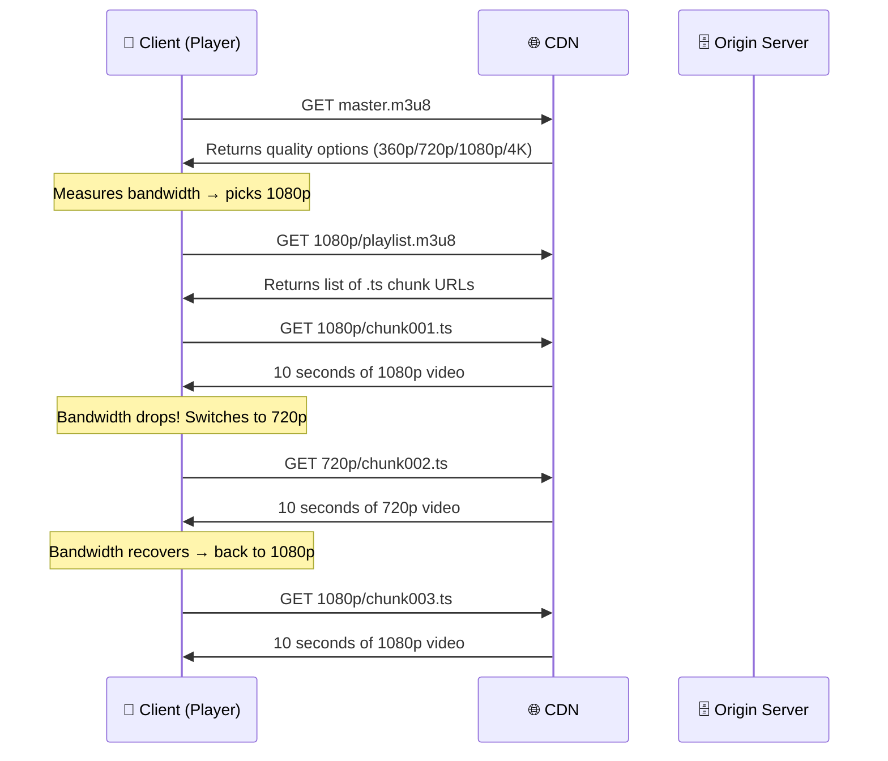
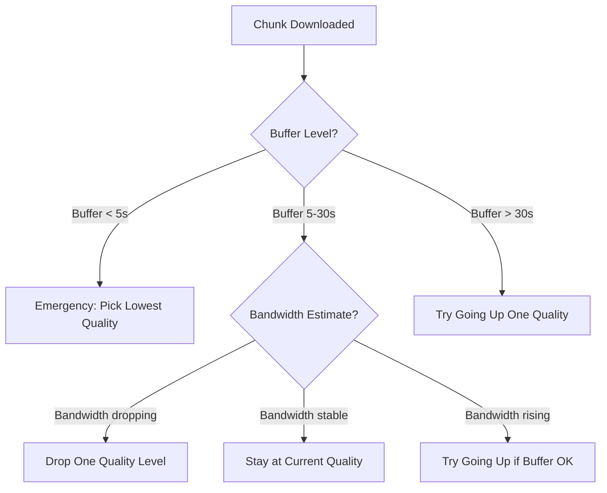
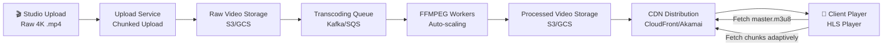

## The Four Problems We Need to Solve

Before diving in, let's understand what we're actually dealing with:

| #   | Problem                                        | Why it's hard                                               |
| --- | ---------------------------------------------- | ----------------------------------------------------------- |
| 1   | Users have different internet speeds           | A 4K stream needs 25 Mbps. 3G gives you ~1 Mbps.            |
| 2   | Movies are uploaded in ONE format (usually 4K) | We need to serve 360p, 480p, 720p, 1080p too                |
| 3   | Uploads are huge (can be 15–50 GB)             | Needs special handling — can't just do a normal file upload |
| 4   | It's a read-heavy system                       | Millions of people are streaming at the same time           |

---

## Step 1 — Understanding the Real Problem First

### Why Can't We Just Download the Whole Movie?

Imagine Netflix made you download the full movie before playing it. Here's what would happen:

```
You click "Play"
   ↓
System starts sending you a 15 GB file
   ↓
You wait... 5 minutes... 10 minutes...
   ↓
Finally you can watch (if you're still awake)
```

Problems with this approach:
1. **Massive wait time** before playback starts
2. **No adaptive quality** — if internet slows down halfway through, you're stuck
3. **Wastes bandwidth** — you download scenes you might skip
4. **Wastes storage** on the user's device

> [!important] The Core Insight
> The user doesn't need the **whole movie** to start watching. They only need the **next few seconds** of video at any given time.

---

## Step 2 — Chunk-Based Streaming (The Foundation)

The key idea: **split the video into tiny time-based chunks**.

```
Full Movie (2 hours)
       ↓
┌──────┬──────┬──────┬──────┬──────┬──────┐
│ 0-10s│10-20s│20-30s│30-40s│40-50s│ ...  │
│Chunk1│Chunk2│Chunk3│Chunk4│Chunk5│      │
└──────┴──────┴──────┴──────┴──────┴──────┘
```

Now instead of downloading the whole movie, the client downloads **one chunk at a time**. While you're watching Chunk 1, it quietly downloads Chunk 2 in the background.

> [!note] Why 10-second chunks?
> This is a deliberate engineering trade-off:
> - **Too small** (1–2s): Too many HTTP requests → high server overhead
> - **Too large** (30–60s): Takes too long to switch quality when bandwidth changes
> - **10s is the sweet spot** — used by Netflix, YouTube, and most major platforms

---

## Step 3 — Adaptive Bitrate Streaming (ABR)

Now combine chunk-based streaming with quality switching:

```
                 Internet Speed Changes
                         ↓
User's Speed:   [Fast]──────[Slow]────────[Fast again]
                  │            │                │
Chunks served:  [4K][4K][4K][1080p][1080p][720p][4K][4K]
```

The client watches your internet speed in real time. When it drops, the **next chunk** is requested at a lower quality. When it recovers, it goes back up. The viewer barely notices — maybe a tiny quality dip for a few seconds.

> [!tip] This is why Netflix says "Streaming in HD" or "Streaming in SD" — it's telling you what quality the ABR algorithm has currently selected.

---

## Step 4 — The HLS Protocol

All of this chunk-based adaptive streaming needs a **standardized protocol** so that any player (phone, TV, browser) can work with any server. The most widely used one is:

> **HLS — HTTP Live Streaming**
> Created by Apple in 2009. Used by Netflix, YouTube, Twitch, and nearly every major streaming platform.

There's also **MPEG-DASH** (used by YouTube and others) which works very similarly. We'll focus on HLS since it's the most common.

### How HLS Works — The File Structure

HLS uses a specific hierarchy of files to make adaptive streaming work:

```
master.m3u8  ← "The Menu" (tells client what quality options exist)
    │
    ├── 360p/playlist.m3u8   ← "360p Table of Contents"
    │       ├── chunk001.ts
    │       ├── chunk002.ts
    │       └── chunk003.ts ...
    │
    ├── 720p/playlist.m3u8   ← "720p Table of Contents"
    │       ├── chunk001.ts
    │       ├── chunk002.ts
    │       └── chunk003.ts ...
    │
    └── 4k/playlist.m3u8    ← "4K Table of Contents"
            ├── chunk001.ts
            ├── chunk002.ts
            └── chunk003.ts ...
```

Let's understand each piece:

---

### The `.ts` File — The Actual Video Chunk

`.ts` stands for **Transport Stream**. This is the actual video data — a 10-second clip of the movie at a specific resolution.

```
720p/chunk001.ts  →  Seconds 0–10 at 720p quality
720p/chunk002.ts  →  Seconds 10–20 at 720p quality
720p/chunk003.ts  →  Seconds 20–30 at 720p quality
```

> [!note] Why `.ts` and not `.mp4`?
> Transport Stream (`.ts`) was originally designed for broadcast TV. It's robust — if you lose some packets in the middle, the rest of the file is still playable. Regular `.mp4` can break entirely if you lose data in the middle.
>
> Modern systems sometimes use **fMP4** (fragmented MP4) instead, which is also chunk-friendly and is used in MPEG-DASH.

---

### The Media Playlist File (`.m3u8`) — The Table of Contents

Each resolution folder has its own `.m3u8` file. Think of it as a **table of contents for that resolution**.

Here's what a real `720p/playlist.m3u8` looks like:

```
#EXTM3U
#EXT-X-VERSION:3
#EXT-X-TARGETDURATION:10        ← each segment is ~10 seconds

#EXTINF:10.0,
chunk001.ts                     ← play this file (seconds 0–10)

#EXTINF:10.0,
chunk002.ts                     ← then this file (seconds 10–20)

#EXTINF:10.0,
chunk003.ts                     ← then this file (seconds 20–30)

#EXT-X-ENDLIST               ← end of video
```

The client reads this file and knows: "Oh, to watch 720p from second 0 to 10, I download `chunk001.ts`."

---

### The Master Playlist (`.m3u8`) — The Menu

The master playlist is the **top-level file**. It tells the client: "Here are all the quality options I support, and here's the bandwidth requirement for each."

Here's what a real `master.m3u8` looks like:

```
#EXTM3U

#EXT-X-STREAM-INF:BANDWIDTH=500000,RESOLUTION=640x360
360p/playlist.m3u8

#EXT-X-STREAM-INF:BANDWIDTH=2500000,RESOLUTION=1280x720
720p/playlist.m3u8

#EXT-X-STREAM-INF:BANDWIDTH=8000000,RESOLUTION=1920x1080
1080p/playlist.m3u8

#EXT-X-STREAM-INF:BANDWIDTH=25000000,RESOLUTION=3840x2160
4k/playlist.m3u8
```

> [!important] How the Client Uses This
> 1. Client downloads `master.m3u8` first (tiny file, < 1KB)
> 2. Client measures its current download speed
> 3. Client picks the highest quality whose `BANDWIDTH` it can support
> 4. Client downloads the corresponding `playlist.m3u8`
> 5. Client starts downloading `.ts` chunks from that playlist
> 6. After every chunk, it re-evaluates bandwidth and possibly switches quality

---

### The Full HLS Flow — Start to Finish



> [!tip] Notice that everything is just HTTP GET requests
> This is the genius of HLS — it uses plain HTTP. This means:
> - Works through firewalls (no special ports needed)
> - CDNs can cache `.ts` chunks just like any static file
> - Standard web infrastructure handles it

---

## Step 5 — Pre-Processing: Creating All Those Files

When a production house uploads a raw 4K movie, we need to **create all the different resolution versions and chunk them**. This is called **transcoding**.

### Enter FFMPEG

**FFMPEG** is an open-source tool that can:
- Convert video between formats
- Change resolution (4K → 1080p → 720p → etc.)
- Split video into 10-second `.ts` chunks
- Generate the `.m3u8` playlist files automatically

```
Raw Upload (4K .mp4, 50GB)
          ↓
       [FFMPEG]
          ↓
┌─────────────────────────────────────────────────┐
│  360p/  → chunk001.ts, chunk002.ts, playlist.m3u8│
│  720p/  → chunk001.ts, chunk002.ts, playlist.m3u8│
│  1080p/ → chunk001.ts, chunk002.ts, playlist.m3u8│
│  4k/    → chunk001.ts, chunk002.ts, playlist.m3u8│
│  master.m3u8                                     │
└─────────────────────────────────────────────────┘
```

A simplified FFMPEG command that generates HLS output at 720p:

```bash
ffmpeg -i input.mp4 \
  -vf scale=1280:720 \          # resize to 720p
  -hls_time 10 \                # 10 second chunks
  -hls_playlist_type vod \      # Video-on-Demand mode
  -hls_segment_filename "720p/chunk%03d.ts" \
  720p/playlist.m3u8
```

> [!note] This is a background job, not real-time
> When a movie is uploaded, FFMPEG runs as an **asynchronous background job**. The movie isn't available to stream until transcoding is complete. This is why Netflix/YouTube shows "Processing video..." after an upload.

---

## Step 6 — ABR Algorithms (How Does the Client Decide?)

This is where it gets interesting. How does the video player decide when to switch quality? There are two main strategies:

### Strategy 1: Bandwidth-Based ABR

The simplest approach — measure download speed and pick accordingly.

```
Measure speed of last chunk download:
  → took 2 seconds to download a 2.5 MB chunk
  → speed = 2.5MB / 2s = 1.25 MB/s = 10 Mbps
  → 10 Mbps > 8 Mbps threshold for 1080p
  → Pick 1080p for next chunk ✓
```

**Problem**: Network speed fluctuates rapidly. If you switch quality on every chunk, the video keeps jumping between 4K and 720p, which looks terrible.

### Strategy 2: Buffer-Based ABR (More Sophisticated)

Instead of reacting to current speed, watch the **playback buffer** (how much video is pre-downloaded and waiting to be played).

```
Buffer Level → Quality Decision
─────────────────────────────────
Buffer > 30s  →  Go up in quality (we're safe, can be greedy)
Buffer 15–30s →  Stay at current quality
Buffer 5–15s  →  Go down one quality level
Buffer < 5s   →  Drop to lowest quality immediately (danger zone!)
```

> [!important] This is what Netflix actually uses
> Netflix uses a variant called **BOLA (Buffer Occupancy based Lyapunov Algorithm)** which is buffer-based. The key insight: a full buffer means you have time to be greedy with quality; an empty buffer means survive at all costs.

### Strategy 3: Hybrid (What Most Modern Players Use)

Use bandwidth estimation AND buffer level together:



---

## Step 7 — Where Do the Files Actually Live?

With millions of users streaming simultaneously, you can't serve all those `.ts` chunks from one server. This is where **CDN (Content Delivery Network)** comes in.

```
                        [Origin Server]
                        master.m3u8
                        All .ts files
                              │
              ┌───────────────┼───────────────┐
              ↓               ↓               ↓
         [CDN Node       [CDN Node        [CDN Node
          New York]       London]          Tokyo]
              │               │               │
         US Users         EU Users        Asia Users
```

> [!important] Why CDN is critical for streaming
> - A `.ts` chunk for a popular movie is requested by **millions of users**
> - CDN caches these chunks at edge nodes worldwide
> - User in Tokyo gets chunks from a Tokyo CDN node (low latency) — not from a server in Virginia
> - The CDN absorbs ~95%+ of all traffic; your origin server handles the remaining cache misses

---

## Putting It All Together — The Complete Architecture



### The Two Flows:

**Upload Flow** (happens once per movie):
1. Studio uploads raw 4K file
2. File stored in raw storage (S3)
3. Transcoding job queued
4. FFMPEG workers transcode into 360p/720p/1080p/4K, split into 10s chunks
5. All `.ts` files + `.m3u8` files stored in processed storage
6. CDN pulls and caches these files

**Playback Flow** (happens billions of times):
1. Client fetches `master.m3u8` from CDN
2. Client picks quality based on bandwidth
3. Client fetches media `playlist.m3u8` for chosen quality
4. Client downloads `.ts` chunks one by one, adapting quality as bandwidth changes

---

## Summary: The Key Concepts

| Concept | What it is | One-line explanation |
|---------|-----------|---------------------|
| **ABR** | Adaptive Bitrate Streaming | Auto-switch video quality based on your internet |
| **HLS** | HTTP Live Streaming | The protocol that defines how ABR works over HTTP |
| **`.ts` file** | Transport Stream Segment | A 10-second chunk of video at one specific quality |
| **Media Playlist** | `playlist.m3u8` | Table of contents for one quality level's chunks |
| **Master Playlist** | `master.m3u8` | The menu — lists all available quality options |
| **FFMPEG** | Transcoding tool | Converts raw video into multiple resolutions + chunks |
| **CDN** | Content Delivery Network | Caches `.ts` chunks close to the user geographically |
| **Buffer-based ABR** | e.g. Netflix's BOLA | Decides quality based on how full the playback buffer is |

> [!tip] The Interview Insight
> At Google/Netflix system design interviews, the key thing interviewers want to hear is:
> 1. You understand the **master → media playlist → segment** hierarchy
> 2. You know that **CDN caches the segments** (not the origin server handles all traffic)
> 3. You understand **ABR is a client-side decision** — the server doesn't pick quality, the client does
> 4. You know **FFMPEG** runs as an **async background job** after upload — not in real-time

---

