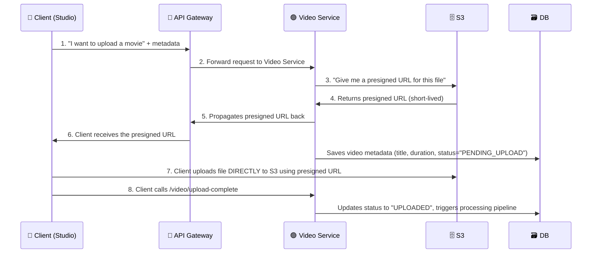
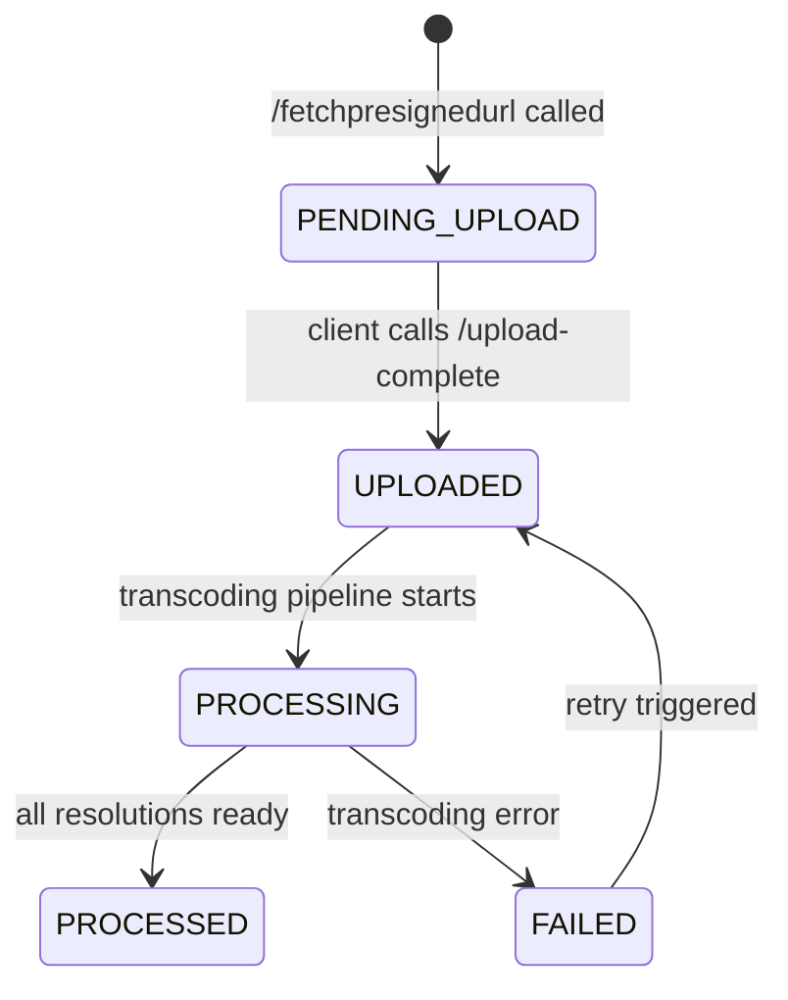

## Where Do We Store All These Files?

After video processing (from [[02-Adaptive-Streaming]]), we end up with hundreds of `.ts` chunk files and `.m3u8` playlist files per movie. We need a place to store them.

The answer is **S3** (or any blob storage like Google Cloud Storage). S3 is perfect here because:
- It's designed for massive files (no size limit per file)
- It supports a folder-like hierarchy — one bucket per movie, one folder per resolution
- It scales to billions of objects without any infrastructure management on our end

---

## Two Separate S3 Buckets — Why?

There's a critical design decision here that trips up a lot of candidates: we need **two separate S3 buckets**, not one.

| Bucket | Name | Purpose | Who accesses it |
|---|---|---|---|
| Raw uploads | `raw-uploads` | Stores the original file the studio uploaded | Studio (PUT only) |
| Processed videos | `processed-videos` | Stores transcoded `.ts` chunks + `.m3u8` playlists | CDN (GET only) |

> [!important] Why not put everything in one bucket?
> Separation of concerns — and security. The raw 50 GB original file is only needed during processing. Once we've transcoded it, it's dead weight. Having it in a separate bucket lets us:
> 1. Set different **access permissions** on each bucket
> 2. Apply **lifecycle rules** to auto-delete raw files after 30 days
> 3. Prevent the CDN from accidentally serving the unprocessed raw file to viewers

### IAM Bucket Policies

Each bucket has an IAM policy that strictly limits what operations are allowed:

```
raw-uploads bucket policy:
  → Allow: s3:PutObject   (studios can upload)
  → Deny:  s3:GetObject   (nobody reads from here except the transcoder)

processed-videos bucket policy:
  → Allow: s3:GetObject   (CDN can read/serve chunks)
  → Deny:  s3:PutObject   (only the transcoding pipeline can write here)
```

Think of it like two separate rooms in a warehouse. The receiving dock (raw-uploads) only has a loading door — things can come in but not go out publicly. The shipping dock (processed-videos) only has an outbound door — the CDN picks up packages from here.

### Lifecycle Rules — Automatic Cost Savings

Raw uploads are temporary. Once transcoding finishes, the original 50 GB file is never needed again. We configure an S3 **lifecycle rule** on the raw-uploads bucket:

```
raw-uploads lifecycle rule:
  → After 30 days: automatically delete all objects
```

This means we never pay for storing 50 GB originals indefinitely. We only pay for the processed chunks (which are much smaller per video because they're split across resolutions).

---

## S3 Object Key Design

S3 doesn't actually have folders — it has "keys" (file paths). But we design our key structure carefully so that all files belonging to one movie are grouped together.

```
raw-uploads/
└── {video_id}/
    └── original.mp4

processed-videos/
└── {video_id}/
    ├── master.m3u8
    ├── 360p/
    │   ├── playlist.m3u8
    │   ├── chunk001.ts
    │   └── chunk002.ts ...
    ├── 720p/
    │   ├── playlist.m3u8
    │   └── chunk001.ts ...
    └── 1080p/
        ├── playlist.m3u8
        └── chunk001.ts ...
```

**Concrete examples:**

| File | S3 Key |
|---|---|
| Raw upload | `raw-uploads/vid_abc123/original.mp4` |
| Master playlist | `processed-videos/vid_abc123/master.m3u8` |
| 720p playlist | `processed-videos/vid_abc123/720p/playlist.m3u8` |
| 720p chunk 1 | `processed-videos/vid_abc123/720p/chunk001.ts` |

> [!note] Why use `video_id` as the folder prefix?
> Two reasons:
> 1. **Avoids collisions** — Two different movies could both have a file named `chunk001.ts`. Using `video_id` as a namespace guarantees uniqueness.
> 2. **Easy cleanup** — If a movie is deleted or needs to be reprocessed, you can delete everything under `processed-videos/vid_abc123/` in one operation. No hunting for scattered files.

---

## The Upload Problem

Uploading a 15–50 GB movie is not trivial. Let's think through the options.

### Option 1: Upload Through the App Server (Bad)

```
Client ──(15GB)──► App Server ──(15GB)──► S3
```

**Problem: Double upload.**
- The same 15 GB file travels twice — once from client to server, then server to S3
- This wastes bandwidth, time, and server memory
- Your app server's disk fills up fast
- The app server becomes a bottleneck — one heavy upload can block other users

### Option 2: Upload Directly to S3 Using a Presigned URL (Good ✓)

What if the client could upload directly to S3, skipping the app server entirely? That's exactly what a **Presigned URL** enables.

> [!important] What is a Presigned URL?
> A presigned URL is a **temporary, pre-authorized URL** generated by S3 that allows anyone who has it to upload a specific file directly to S3 — without needing AWS credentials.
>
> Think of it like a **one-time entry pass** to a secure building. You get the pass from the front desk (your server), and then you walk directly into the building (S3) without going through the front desk again.
>
> Key properties:
> - Short-lived (expires in minutes/hours — typically 1 hour for large uploads)
> - Tied to a specific bucket + key (file path) + IAM role + expiry timestamp
> - No AWS credentials needed on the client side
> - The signature baked into the URL makes it tamper-proof — changing any part invalidates it

### Security of Presigned URLs

The URL isn't just a link — it contains a **cryptographic signature** computed over:
- The target bucket name
- The exact S3 object key (file path)
- The expiry timestamp
- The IAM role that generated it

This means:
- If someone intercepts or shares the URL, it becomes useless after the TTL expires (typically 1 hour)
- The URL only works for uploading to that exact file path — you can't use it to overwrite other files
- You cannot extend the expiry without generating a new URL from the server

> [!note] CORS Configuration
> For browser-based uploads (JavaScript calling S3 directly), the S3 bucket must have a **CORS configuration** that allows the upload origin. Without this, the browser blocks the cross-origin PUT request even with a valid presigned URL.
>
> ```json
> {
>   "CORSRules": [{
>     "AllowedOrigins": ["https://studio.netflix.com"],
>     "AllowedMethods": ["PUT"],
>     "AllowedHeaders": ["*"],
>     "MaxAgeSeconds": 3600
>   }]
> }
> ```

---

## The Upload Flow — Step by Step

Here's exactly what happens when a studio uploads a movie, mapped to the numbered steps in the diagram:



### Breaking Down Each Step

**Steps 1–2 — Client Sends Metadata, Not the File**
The client first tells the server: "I'm about to upload a movie called X, it's 2 hours long, here's the file size." It does NOT send the actual video yet. This is a tiny JSON request.

**Steps 3–4 — Server Gets a Presigned URL from S3**
The Video Service calls S3's API: "Generate a presigned URL for a file called `raw-uploads/vid_abc123/original.mp4`." S3 generates and returns this URL. The server also saves a new row to the DB with status `PENDING_UPLOAD`.

**Steps 5–6 — Server Passes URL Back to Client**
The Video Service passes the presigned URL through the API Gateway back to the client. The client now has permission to upload directly.

**Step 7 — Client Uploads Directly to S3**
The client uses the presigned URL to `PUT` the file straight to S3. The app server is completely out of this transfer. No double upload.

**Step 8 — Client Notifies Server the Upload is Done**
After the upload finishes, the client calls a completion endpoint. The server updates the video status to `UPLOADED` and kicks off the transcoding pipeline. (More on this below.)

---

## Upload Status State Machine

The database tracks each video through its full lifecycle. Think of it like tracking a package through a shipping system:



| State | Meaning |
|---|---|
| `PENDING_UPLOAD` | Presigned URL generated, waiting for studio to finish uploading |
| `UPLOADED` | Raw file is in S3, transcoding not started yet |
| `PROCESSING` | Transcoding pipeline is actively running |
| `PROCESSED` | All `.ts` chunks and `.m3u8` files are ready, movie is streamable |
| `FAILED` | Something went wrong during transcoding |

> [!important] Why track state?
> Without state tracking, you have no way to answer: "Has this movie been uploaded yet? Is it still transcoding? Is it ready to stream?" The state machine is also the trigger for the next step — when status flips to `UPLOADED`, the worker queue picks it up for transcoding.

---

## Multipart Upload — How Large Files Are Uploaded Reliably

A 50 GB file uploaded in one shot is fragile. If the internet drops for 1 second after uploading 49 GB, you start from zero. That's unacceptable.

S3 solves this with the **Multipart Upload API**. Here's how it works:

### Step 1 — CreateMultipartUpload

The client (or server on behalf of the client) calls:
```
POST /{bucket}/{key}?uploads
```
S3 responds with an `uploadId`. This is a session token that ties all the parts together.

### Step 2 — Upload Each Part

The file is split into chunks (minimum **5 MB per part**, maximum **10,000 parts**). Each part is uploaded independently:
```
PUT /{bucket}/{key}?partNumber=1&uploadId=abc123
PUT /{bucket}/{key}?partNumber=2&uploadId=abc123
...
```

Key properties:
- Parts can be uploaded **in parallel** — so a client with a fast connection can upload 4 parts simultaneously, making the upload 4x faster
- Each part returns an `ETag` (a checksum), which we collect
- If one part fails, only that part needs to be re-uploaded

### Step 3 — CompleteMultipartUpload

Once all parts are uploaded, the client calls:
```
POST /{bucket}/{key}?uploadId=abc123
Body: [ {PartNumber: 1, ETag: "..."}, {PartNumber: 2, ETag: "..."}, ... ]
```
S3 stitches all the parts together into a single object. From S3's perspective, it's now one file as if it was uploaded normally.

> [!tip] What if the presigned URL expires mid-upload?
> This is a common edge case. Presigned URLs have a TTL (e.g., 1 hour). If a studio's 50 GB upload takes 3 hours on a slow connection, the URL might expire halfway through.
>
> The fix: the client keeps the `uploadId`. When the presigned URL for a part expires, it requests a **new presigned URL for that same `uploadId`** from the server. S3 recognizes the same upload session and the client continues from the last successfully uploaded part — no data is lost.

---

## Idempotency — What if the Client Calls `/fetchpresignedurl` Twice?

Consider this scenario: the client sends a request to get a presigned URL, but the network is slow and the response never arrives. The client retries. Now the server generates two presigned URLs for the same video — creating duplicate DB rows and two S3 paths.

We prevent this using **`video_id` as an idempotency key**.

> [!important] Idempotency Rule
> When a client calls `POST /api/v1/video/fetchpresignedurl`, the server first checks: does a presigned URL already exist for this `video_id` that hasn't expired yet?
> - **If yes**: return the existing URL. Don't create a new DB row. Don't call S3 again.
> - **If no**: generate a new presigned URL, save to DB, return it.
>
> This means calling the endpoint 10 times is safe — you get the same result as calling it once.

The client passes a `video_id` it generates client-side (using a UUID or similar), so the same ID is sent on retries.

---

## Completion Callback — How Does the Server Know the Upload Finished?

After the client uploads directly to S3, the app server has no visibility into when the upload completed. We need to bridge that gap. There are two approaches:

### Option A — Client Calls `/video/upload-complete` (Simple)

```
Client → S3 (upload finishes)
Client → App Server: POST /video/upload-complete { video_id: "vid_abc123" }
App Server → DB: UPDATE status = "UPLOADED"
App Server → Job Queue: enqueue transcoding job
```

Simple and direct. The downside: if the client crashes right after the upload, it never sends the completion signal. The video stays in `PENDING_UPLOAD` forever.

### Option B — S3 Event Notification (Reliable)

```
Client → S3 (upload finishes)
S3 → SNS/SQS: "file raw-uploads/vid_abc123/original.mp4 was created"
Worker → DB: UPDATE status = "UPLOADED"
Worker → Job Queue: enqueue transcoding job
```

S3 can be configured to emit an event whenever a new object is created in the bucket. This event goes to SQS or SNS, which triggers a worker to update the DB and kick off transcoding.

> [!important] Which is better?
> **S3 Event Notification is more reliable.** The server learns about the upload through S3 itself — no dependency on the client sending a completion signal. Even if the client crashes mid-post, S3 already confirmed the file arrived. This is covered in detail in the next file.
>
> In practice, production systems often do **both**: the client sends the completion signal for faster response, and the S3 event acts as a fallback guarantee.

---

## API

**Fetch a presigned URL for uploading:**
```
POST /api/v1/video/fetchpresignedurl
Body: {
  video_id: "vid_abc123",       ← client-generated, used as idempotency key
  video_metadata: {
    title: "Inception",
    duration_seconds: 8880,
    size_bytes: 53687091200,
    format: "mp4"
  }
}

Response: {
  presigned_url: "https://raw-uploads.s3.amazonaws.com/vid_abc123/original.mp4?X-Amz-Signature=...",
  upload_id: "VXBsb2FkSWQx...",   ← multipart upload session ID
  expires_in: 3600
}
```

**Notify server that upload is complete:**
```
POST /api/v1/video/upload-complete
Body: { video_id: "vid_abc123" }

Response: { status: "UPLOADED", message: "Transcoding queued" }
```

---

![[Excalidraw/Drawing 2026-03-31 23.21.52.excalidraw]]
