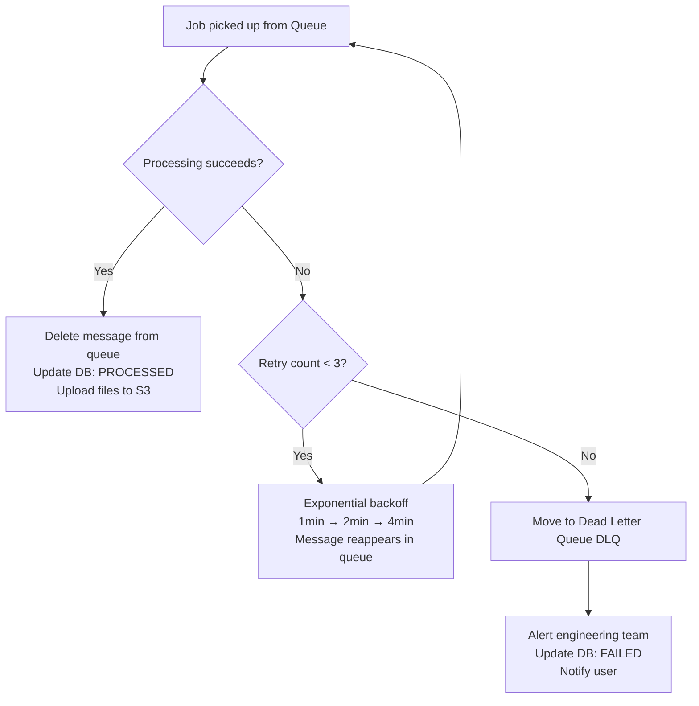
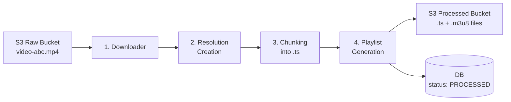
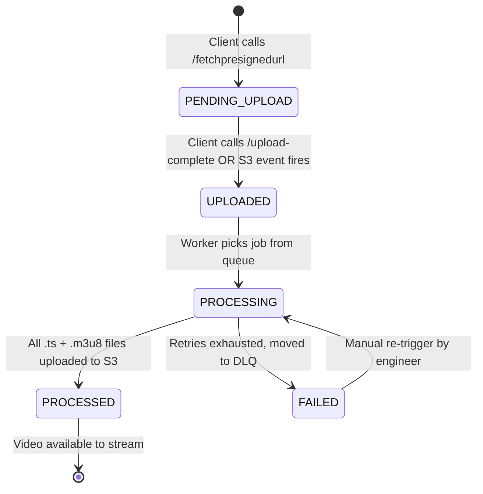

## Where We Left Off

In [[03-Storage-Problems]], the studio uploaded the raw 4K video directly to S3 using a presigned URL. The file is now sitting in the `raw-uploads` S3 bucket. Now what?

We need to:
1. Detect that the upload finished
2. Transcode the video into multiple resolutions
3. Split it into `.ts` chunks
4. Generate `.m3u8` playlist files
5. Store everything in the processed bucket

---

## Step 1 — Detecting the Upload: S3 Event Notifications

The first question: how does the system know the upload is complete?

**Bad approach — Polling:**
```
Every 5 seconds:
  "Is the video uploaded yet?" → No
  "Is the video uploaded yet?" → No
  "Is the video uploaded yet?" → Yes!
```
Wasteful. Thousands of unnecessary API calls for every upload.

**Good approach — S3 Event Notifications:**

> [!important] S3 Event Notifications
> S3 has a built-in feature: the moment a file lands in a bucket, S3 automatically **fires an event** to a target of your choice — no polling needed.
>
> It's like the difference between checking your mailbox every 5 minutes vs the postman ringing your doorbell when mail arrives. Same result, vastly more efficient.

---

## Step 2 — The Queue Between S3 and Workers

S3 fires the event, but it doesn't go directly to a processing worker. It lands in a **message queue** first.

```
Raw video lands in S3
        ↓
S3 fires "ObjectCreated" event
        ↓
Event lands in SQS Queue / Kafka Topic
        ↓
Processing Worker picks it up
```

**Why a queue and not direct delivery to workers?**

Imagine 50 movies are uploaded at the same time but you only have 10 workers. Without a queue, 40 events are lost. With a queue, all 50 events wait safely, and workers process them one by one as they become free.

> [!note] SQS vs Kafka — Which Queue to Use?

| | SQS | Kafka |
|---|-----|-------|
| **Model** | Each message consumed by one consumer | Message can be read by multiple consumer groups |
| **Use case** | One system processes the event | Multiple systems react to the same upload event |
| **Complexity** | Simple, managed by AWS | More complex, more powerful |
| **For our pipeline** | Fine if only video processing needs the event | Better if notification service, analytics, and video processing all need to react |

**In practice**: Use Kafka if multiple downstream systems (video processor, email notifier, analytics) all need to react to the same upload event. Use SQS if only the video processor cares.

### Visibility Timeout — Crash Recovery for Free

> [!important] How Visibility Timeout Works
> When a worker picks up a job from SQS, the message doesn't get deleted immediately. Instead it becomes **invisible** to other workers for a set duration (e.g., 30 minutes — enough time to transcode a movie).
>
> - If the worker **finishes successfully** → it explicitly deletes the message from the queue. Done.
> - If the worker **crashes** → it never deletes the message. After the visibility timeout expires, the message **reappears** in the queue and another worker picks it up automatically.
>
> This gives you **automatic crash recovery** with zero extra code.

```
Worker picks up job → message invisible for 30 min
        │
        ├── Worker finishes → deletes message ✓
        │
        └── Worker crashes → message reappears after 30 min → new worker picks it up ✓
```

---

## Step 3 — Worker Scaling Strategy

Transcoding is **CPU-bound** — FFMPEG maxes out CPU cores. This changes how you think about scaling.

> [!note] Scale on Queue Depth, Not Server CPU
> Don't scale based on the CPU of your app servers. Scale based on **how many jobs are waiting in the queue**.
>
> Rule: if queue depth > 10 jobs → add more workers. If queue depth = 0 → scale down.
>
> AWS CloudWatch metric: `ApproximateNumberOfMessagesVisible` on your SQS queue → trigger Auto Scaling Group.

**Use Spot/Preemptible Instances:**
Transcoding jobs can be retried if interrupted (they're idempotent — more on this below). This makes them perfect candidates for **spot instances** (AWS) or **preemptible VMs** (GCP) which are 60–80% cheaper than on-demand. If the instance gets reclaimed, the job reappears in the queue and another instance picks it up.

---

## Step 4 — Job Failure Handling: Retry + Dead Letter Queue

What if FFMPEG crashes halfway through transcoding? Or the worker runs out of disk space?



> [!note] What is a Dead Letter Queue (DLQ)?
> A DLQ is a separate queue where messages go after failing too many times. It acts as a holding area for broken jobs so they don't loop forever and alert the team that something needs manual investigation.
>
> Think of it as a "failed jobs inbox" that pages your on-call engineer.

**Exponential backoff** — wait progressively longer between retries:
- Attempt 1 fails → wait 1 minute
- Attempt 2 fails → wait 2 minutes
- Attempt 3 fails → wait 4 minutes → move to DLQ

This prevents a broken job from hammering resources continuously.

---

## Step 5 — Idempotency: What If a Job Runs Twice?

Scenario: Worker finishes transcoding, uploads files to S3, updates DB — then crashes before acknowledging the queue. The message reappears. Another worker picks it up and starts processing the same video again.

**Problem**: Duplicate processing wastes compute and might overwrite files mid-write.

**Solution: Idempotency check at the start of every job:**

```
Worker picks up job for video-id: abc123
    ↓
Check: does processed-videos/abc123/master.m3u8 already exist in S3?
    ↓
Yes → job already done → delete message from queue → exit early ✓
No  → proceed with transcoding
```

Also: set `processing_started_at` timestamp in DB when job begins. If another worker picks up the same job and sees a recent timestamp, it knows processing is already in progress and backs off.

---

## Step 6 — Inside the Processing Pipeline

Here's what actually happens inside the Video Processing System, step by step:



### Step 6.1 — Downloader

The worker streams the raw video from S3. For large files, it can pipe directly into FFMPEG without fully downloading to disk first — saving time and local storage.

```bash
# Stream from S3 directly into FFMPEG (no full local copy needed)
ffmpeg -i "s3://raw-uploads/video-abc/original.mp4" ...
```

### Step 6.2 — Resolution Creation (Transcoding)

This is the heavy lifting. FFMPEG decodes the original 4K video and re-encodes it at multiple lower resolutions and bitrates.

> [!note] What Does "Transcoding" Actually Mean?
> The original 4K file was encoded with a specific codec (e.g., ProRes, used in professional film). Consumer devices can't always play ProRes. Transcoding = decode the original → re-encode into a codec and resolution every device can play (H.264, H.265).
>
> It's like translating a book from Old English into Modern English — same content, new format everyone can understand.

**Codec choices matter a lot:**

| Codec | Compression | Compatibility | CPU to Encode | Used by |
|-------|------------|--------------|---------------|---------|
| **H.264 (AVC)** | Baseline | Every device (2008+) | Low | Universal fallback |
| **H.265 (HEVC)** | 50% better than H.264 | Modern devices (2015+) | High | Netflix 4K, Apple |
| **AV1** | 30% better than H.265 | Newest devices (2020+) | Very High | YouTube, Netflix |

Netflix encodes in **both H.264 and H.265**: older devices get H.264, newer ones get H.265 at the same visual quality but half the file size. This saves massive bandwidth at Netflix's scale.

**All the quality levels FFMPEG generates:**

```
Input: 4K ProRes (50GB)
          ↓ FFMPEG
Output:
  360p  H.264  500 Kbps    ← very slow connections, mobile data
  480p  H.264  1 Mbps
  720p  H.264  2.5 Mbps    ← standard HD
  720p  H.265  1.5 Mbps    ← same quality, smaller file
  1080p H.264  8 Mbps      ← full HD
  1080p H.265  4 Mbps
  4K    H.265  15 Mbps     ← premium
```

### Step 6.3 — Chunking into `.ts` Files

Each resolution's video is split into 10-second `.ts` segments.

> [!important] Keyframe Alignment — The Hidden Requirement
> Here's a detail most engineers miss: chunks **must always start on a keyframe**.
>
> **What's a keyframe?** Video compression works by storing one complete frame (keyframe) and then only storing the *differences* from that frame for subsequent frames. If a chunk starts in the middle of this difference chain, the player can't decode it — it needs the reference keyframe.
>
> **Why it matters for ABR**: When the player switches from 720p to 1080p mid-stream, it needs to start the new quality chunk at a clean keyframe. If chunks aren't keyframe-aligned across resolutions, the switch causes a glitch or freeze.
>
> FFMPEG handles this automatically when you use `-hls_time 10` — it aligns chunk boundaries to the nearest keyframe.

### Step 6.4 — Playlist Generation

FFMPEG automatically generates:
- One `playlist.m3u8` per resolution (lists all `.ts` chunks for that quality)
- One `master.m3u8` (lists all quality options + bandwidth thresholds)

These are tiny text files (< 1KB each). They're the "table of contents" the client downloads first before fetching any actual video data. See [[02-Adaptive-Streaming]] for the full file format breakdown.

---

## Step 7 — Audio Tracks and Captions

Video is only half the story. A production-quality pipeline also processes:

**Multiple audio tracks:**
- Different languages (English, Hindi, Spanish, French...)
- Different quality levels (stereo 128 Kbps, 5.1 surround 384 Kbps)
- Audio tracks are stored as separate `.ts` files and referenced in `master.m3u8`

```
# master.m3u8 audio track entry
#EXT-X-MEDIA:TYPE=AUDIO,GROUP-ID="audio",LANGUAGE="en",NAME="English",URI="en/audio.m3u8"
#EXT-X-MEDIA:TYPE=AUDIO,GROUP-ID="audio",LANGUAGE="hi",NAME="Hindi",URI="hi/audio.m3u8"
```

**Closed captions / subtitles:**
- Generated as `.vtt` (WebVTT) or `.srt` files
- Also referenced in `master.m3u8`
- Required for accessibility compliance (ADA in the US)

```
#EXT-X-MEDIA:TYPE=SUBTITLES,GROUP-ID="subs",LANGUAGE="en",URI="en/subtitles.m3u8"
```

---

## Step 8 — Thumbnail Generation

As part of the pipeline, FFMPEG also extracts frames at regular intervals:

```bash
# Extract one frame every 10 seconds as JPEG
ffmpeg -i input.mp4 -vf fps=1/10 thumbnails/thumb%04d.jpg
```

These are used for:
- **Movie poster** — the cover image on the browse page
- **Hover preview** — the animated GIF-like preview when you hover over a title on Netflix (called "scene preview" internally)
- **Seek bar preview** — the tiny thumbnail that appears when you drag the seek bar

All stored in S3 under `processed-videos/{video_id}/thumbnails/`.

---

## Step 9 — Video Status State Machine

The DB tracks the video through its entire lifecycle. This status is what the frontend polls to know when a video is ready:



| State | Meaning | What triggered it |
|-------|---------|------------------|
| `PENDING_UPLOAD` | Presigned URL issued, upload not done | Client called `/fetchpresignedurl` |
| `UPLOADED` | Raw file in S3, not processed yet | S3 event notification received |
| `PROCESSING` | Worker actively transcoding | Worker picked up queue message |
| `PROCESSED` | All chunks ready, video is streamable | Worker finished and updated DB |
| `FAILED` | Processing failed after retries | DLQ triggered |

---

## Complete Pipeline Summary

```
S3 raw-uploads bucket
        ↓  (S3 ObjectCreated event)
SQS / Kafka Queue
        ↓  (worker polls queue)
FFMPEG Worker (auto-scaling, spot instances)
    ├── Idempotency check (already processed?)
    ├── Download raw video from S3
    ├── Transcode → 360p / 720p / 1080p / 4K (H.264 + H.265)
    ├── Chunk into 10s .ts files (keyframe-aligned)
    ├── Generate playlist.m3u8 + master.m3u8
    ├── Process audio tracks (multi-language)
    ├── Generate subtitle .vtt files
    ├── Extract thumbnails
    └── Upload everything to S3 processed bucket
        ↓
DB updated: status = PROCESSED
        ↓
CDN pulls/gets pushed the processed files
        ↓
Video is now streamable
```

> [!important] Interview Insight — What Interviewers Want to Hear
> 1. **Event-driven, not polling** — S3 event → queue → worker. Never say "poll S3 every few seconds."
> 2. **Queue buffers spikes** — without a queue, a burst of uploads overwhelms workers. The queue decouples upload rate from processing rate.
> 3. **Visibility timeout = crash recovery** — this is the SQS mechanism that makes the pipeline self-healing without any extra code.
> 4. **Keyframe alignment** — this detail shows you understand why seamless ABR quality switching requires more than just splitting the video at arbitrary timestamps.
> 5. **Codec trade-offs** — mentioning H.264 vs H.265 vs AV1 with their compression/compatibility trade-offs shows real production depth.

![[Excalidraw/Drawing 2026-03-31 23.22.59.excalidraw]]
