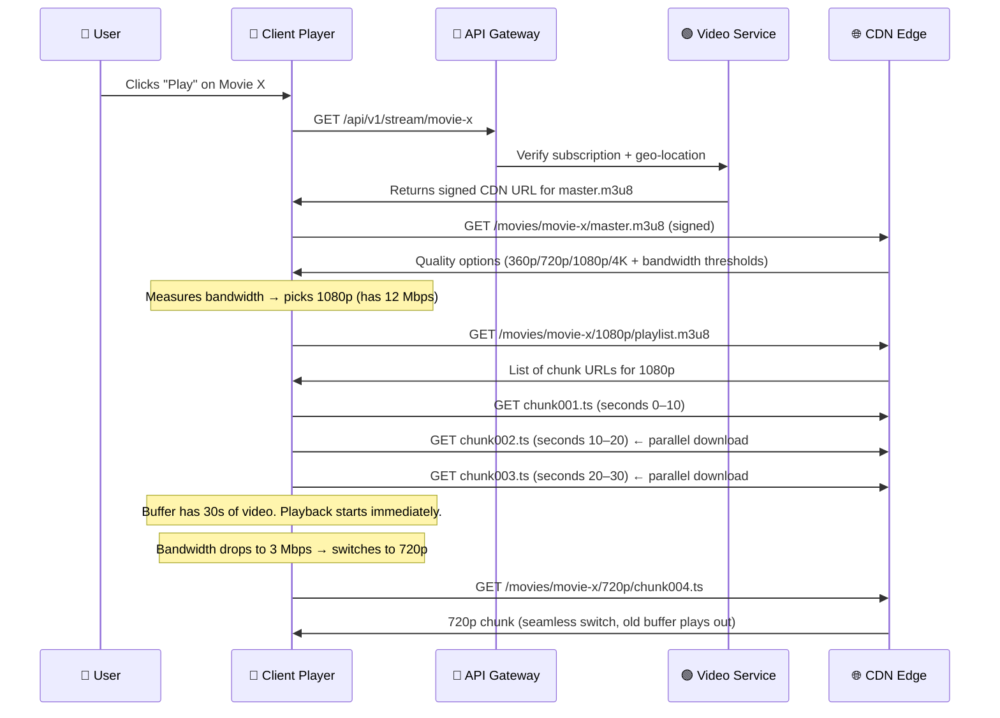
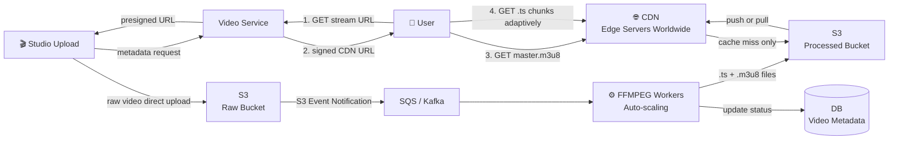

## The Problem: S3 Alone Isn't Enough

After video processing, all `.ts` chunks and `.m3u8` files are sitting in S3. Now millions of users want to stream simultaneously. Let's think about what happens if we serve directly from S3.

S3 is in one region — say `us-east-1` (Virginia). A user in Tokyo requesting a `.ts` chunk from Virginia gets:
- ~150–200ms round-trip latency just for the network hop
- Every single chunk request travels across the Pacific Ocean
- A 2-hour movie = 720 chunks = the ocean crossed 720 times

That's unwatchable buffering.

### Why S3 Cross-Region Replication Isn't the Answer

You might think: "Just replicate S3 to every region!" Problems with this:
- S3 replication has **~15 minute lag** — freshly processed chunks might not be in the replicated region yet
- S3 is **object storage** — optimized for durability, not for serving millions of concurrent low-latency HTTP requests
- No intelligent routing — you'd need custom logic to figure out which regional S3 to send each user to
- Cost explodes — you're storing every file N times across N regions

---

## CDN — The Right Tool for This Job

> [!important] What is a CDN?
> **CDN = Content Delivery Network**
>
> A global network of **edge servers** placed physically close to users worldwide. When a user requests a `.ts` chunk, they get it from the nearest edge server — not from your S3 bucket thousands of miles away.
>
> Think of it like this: Instead of one pizza shop in New York serving the entire country, you open pizza shops in every city. People in LA get pizza from the LA shop (5 minutes), not from New York (5 hours). Same pizza, dramatically faster.

```
Without CDN:
User in Tokyo ──────────────────────────► S3 in Virginia (200ms latency)

With CDN:
User in Tokyo ──► CDN Edge in Tokyo (5ms latency)
                  CDN only goes to S3 on the very first request, then caches
```

---

## How CDN Routing Works — Anycast

When you request a CDN URL, how does the internet know which of the hundreds of edge servers to send you to?

> [!note] Anycast Routing
> CDNs use **Anycast**: multiple edge servers around the world share the **same IP address**. The internet's BGP (Border Gateway Protocol) routing automatically directs your request to whichever server with that IP is geographically closest.
>
> **Analogy**: Like dialing a toll-free number (1-800-NETFLIX). The same number exists everywhere, but your call gets routed to the nearest call center automatically. You don't pick which one — the network does it for you.

You don't configure "send Tokyo users to this server" — Anycast handles it automatically at the network routing level.

---

## Cache-Control Headers — The Critical Detail

This is where many engineers get it wrong. Not all files should be cached the same way.

> [!important] Different Files, Different TTL Strategy

| File Type | Does it ever change? | Cache-Control | TTL |
|-----------|---------------------|---------------|-----|
| `.ts` segment (VOD) | Never — immutable once created | `max-age=31536000, immutable` | 1 year |
| `master.m3u8` (VOD) | Never after processing | `max-age=31536000` | 1 year |
| `playlist.m3u8` (VOD) | Never after processing | `max-age=31536000` | 1 year |
| `playlist.m3u8` (LIVE) | Every 2–6 seconds (new segments appended) | `max-age=2` | 2 seconds |

**Why does this matter so much?**

`.ts` files are **immutable** — `chunk001.ts` for a given movie at 720p will never change. You can safely tell CDN edges to cache it for a year:
- 99%+ of requests served from CDN cache
- Your S3 origin almost never gets hit after the first viewer warms the cache
- Cost drops dramatically

For **live streaming**, the `playlist.m3u8` is being updated every few seconds (new `.ts` segments are appended as the stream progresses). If CDN caches it for 30 seconds, viewers fall 30 seconds behind live. So TTL = 2 seconds.

Getting this wrong means either:
- **TTL too long on live playlist** → viewers stuck watching 30s+ delayed "live" stream
- **TTL too short on VOD segments** → constant S3 origin hits, massive cost, high latency

---

## CDN Invalidation — When Cache Goes Stale

CDN caches are set-and-forget for most content. But sometimes you need to forcibly clear the cache:

**When you need it:**
- Content removed (DMCA takedown — the movie must stop being accessible immediately)
- Re-transcoding after a quality issue was discovered post-publish
- Metadata correction on a `.m3u8` file

**How it works (CloudFront):**
- Call `CreateInvalidation` API with path pattern: `/movies/movie-abc/*`
- Takes **5–15 minutes** to propagate to all edge nodes globally
- Costs money per invalidation path (after first 1,000/month free)

> [!tip] Better Approach: Versioned URL Paths
> Instead of invalidating, design URLs with a version prefix from the start:
> ```
> /processed/v1/movie-abc/720p/chunk001.ts  ← old version cached on CDN
> /processed/v2/movie-abc/720p/chunk001.ts  ← new version, fresh CDN cache
> ```
> When content changes, update the version in the URL. Old files expire naturally, no invalidation cost, no 15-minute propagation delay.
>
> This is the approach recommended by major CDN providers for immutable content.

---

## Signed CDN URLs — DRM and Geo-Restriction

Not everyone should be able to stream every piece of content:
- A movie licensed only in the US shouldn't be watchable in the UK
- Only paying subscribers should access content
- A streaming session should expire after a few hours

> [!note] How CloudFront Signed URLs Work
> 1. User clicks Play → your backend checks: does this user have access? Are they in the right country?
> 2. If yes, backend generates a **signed CDN URL** — contains an expiry timestamp + cryptographic signature
> 3. Client uses that signed URL to fetch `.ts` chunks from CDN
> 4. **CDN edge validates the signature on every request** — rejects expired or tampered URLs without ever hitting S3
>
> This is different from S3 presigned URLs. CDN signed URLs are validated at the **edge node** (milliseconds away from the user), not at S3 (potentially 200ms away).

```
Unsigned URL (public):
https://cdn.example.com/movies/movie-abc/720p/chunk001.ts
→ Anyone with this URL can stream for free. Bad.

Signed URL (protected):
https://cdn.example.com/movies/movie-abc/720p/chunk001.ts
  ?Expires=1743500000
  &Signature=abc123xyz...
  &Key-Pair-Id=APKAJXYZ
→ Only works until the expiry. CDN blocks it after. Good.
```

---

## Push CDN vs Pull CDN

| Strategy | How it works | Best for |
|----------|-------------|----------|
| **Pull CDN** | CDN fetches from S3 on first user request, caches after | Long-tail content (old movies, rare titles) |
| **Push CDN** | You proactively upload files to CDN before any user requests | New releases with guaranteed massive Day-1 traffic |

Netflix uses **Push CDN for new releases**. Before a new season of a popular show drops, Netflix pre-positions all `.ts` chunks on edge servers worldwide. When 50 million users hit play simultaneously, every CDN edge already has the chunks cached — zero origin hits.

> [!tip] Netflix Open Connect
> Netflix went further and built their own CDN called **Open Connect**. They place their own servers **physically inside ISP data centers** worldwide. When you stream Netflix, the data comes from hardware inside your internet provider's building.
>
> Benefits: sub-10ms latency for most users, zero transit costs between Netflix and ISPs, complete control over caching policy.
>
> [How Netflix works with ISPs](https://about.netflix.com/en/news/how-netflix-works-with-isps-around-the-globe-to-deliver-a-great-viewing-experience)

---

## CDN as a Fault-Tolerance Layer

CDN is a **cache in front of S3**, not a replacement. S3 remains the source of truth.

```
Normal (cache hit):    User → CDN Edge ✓  (fast, cheap)
Cache miss:            User → CDN Edge → S3  (CDN fetches and caches for next user)
CDN regional outage:   User → S3 directly  (slower but works)
S3 brief outage:       User → CDN Edge ✓  (CDN cache still serving from memory)
Both down:             ✗ (extremely rare, S3 has 99.999999999% durability)
```

CDN and S3 protect each other. This is resilience by design — not just performance.

---

## The Playback Flow — End to End

Let's trace exactly what happens from the moment a user clicks "Play":



### Why Quality Switches Feel Seamless — The 30-Second Buffer

The player doesn't wait until the current chunk finishes before downloading the next one. It maintains a **30-second pre-loaded buffer** ahead of playback position.

```
Playback timeline:
│ Already watched │ Currently watching │ Pre-buffered (30s) │ Not downloaded yet │
└─────────────────┴────────────────────┴────────────────────┴────────────────────┘
                                        ↑
                              New chunks downloaded here
                              (quality can change here)

When bandwidth drops from 4K → 720p:
- The 30s of already-buffered 4K plays out smoothly
- New 720p chunks silently load in the background
- User only notices a quality dip if bandwidth stays low for >30 seconds
- In practice, it almost always recovers before the buffer drains
```

This is why you rarely notice ABR quality switches on Netflix — the buffer absorbs the transition.

---

## Complete End-to-End Architecture



---

## Summary: Key Design Decisions

| Decision | What we chose | Why | What breaks without it |
|----------|--------------|-----|------------------------|
| Serve via CDN | CloudFront / Open Connect | Low latency globally | 200ms+ latency, constant buffering internationally |
| `.ts` cache TTL | 1 year (immutable) | Segments never change | Constant S3 origin hits, 10× higher cost |
| Live playlist TTL | 2 seconds | Updates every few seconds | Viewers fall 30s+ behind live |
| Push CDN for launches | Pre-position chunks | Absorb Day-1 spike | Cache misses overwhelm S3 origin at launch |
| Signed CDN URLs | CloudFront signed URLs | Geo-restriction + subscriber auth | Anyone with URL streams for free |
| 30s playback buffer | Client-side pre-buffer | Hides ABR quality switches | Visible quality flicker on every bandwidth change |
| S3 as origin fallback | Always behind CDN | Resilience if CDN fails | Full outage if CDN goes down |
| Versioned URL paths | `/v2/movie-x/...` | Avoid expensive CDN invalidations | Content removal takes 15min, costs extra |

---

> [!important] Interview Insight — What Google/Netflix Interviewers Want to Hear
> 1. **CDN is not optional** — never say "serve `.ts` files from S3 directly." CDN is a hard requirement for global streaming at scale.
> 2. **Cache TTL distinction** — know that VOD segments are immutable (1-year TTL) but live playlists need 2s TTL. This shows operational depth beyond the basics.
> 3. **Push CDN for new releases** — mentioning pre-positioning content before a launch shows you think about traffic spikes, not just steady state.
> 4. **Signed URLs for access control** — content protection at the CDN edge (not just at the API layer) shows security awareness.
> 5. **Buffer preloading** — explaining why a 30s buffer makes quality switches seamless shows you understand the full client-side picture, not just servers.


![[Excalidraw/Drawing 2026-03-31 21.40.33.excalidraw]]
