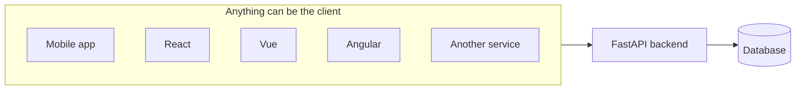
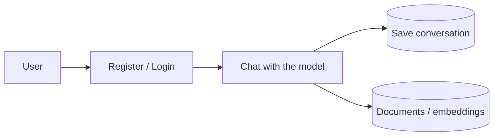

Python gives you three realistic choices.

---

## The three choices

| Framework | What it is |
|---|---|
| **Flask** | The one most people try first. Minimal, quick to start with. |
| **Django** | Very popular, very complete. Has been around a long time. |
| **FastAPI** | The newer one. Pure backend. |

All three are genuinely good. None of them is a mistake. But they are not interchangeable, and the difference is about **what comes bundled**.

### Django's completeness is also its cost

Django hands you a great deal out of the box — an admin interface, a prescribed project layout, its own opinion about how the pieces fit together. If you want exactly the application Django expects you to build, this is a gift.

If you want a backend that speaks JSON to whatever client shows up, most of it is weight you carry and never use. And the opinions are not optional — you build Django's way or you fight it.

> [!question]- I know Spring Boot but never touched Django — what does this actually mean in those terms?
> Spring Boot's "batteries included" is **opt-in**. Add `spring-boot-starter-web` and you get a REST-capable app and nothing else. Want a database? Add `spring-boot-starter-data-jpa`. Want auth? Add `spring-boot-starter-security`. Each piece is a deliberate choice — and a project with only `starter-web` ends up close to what FastAPI gives you by default.
>
> Django doesn't work that way. A fresh project switches several things on whether you asked for them or not:
>
> | Django default | What it actually is |
> |---|---|
> | **Admin interface** | A full auto-generated CRUD dashboard — create/read/update/delete screens — built automatically from your database models. Nobody gets this for free in Spring Boot; you'd write it yourself or bolt on a separate tool. |
> | **Templating engine** | Server-rendered HTML pages, because Django's original design assumption is that Django itself renders the webpage — not that some separate frontend calls it for JSON. |
> | **A prescribed app structure** | `manage.py`, apps each with their own `models.py` / `views.py` / `urls.py` / `admin.py` — an actual folder shape Django generates and expects, not annotation-driven like `@RestController`. |
> | **Django REST Framework** | A *separate* add-on library, not core Django — because plain Django is oriented around HTML pages, not JSON APIs. Wanting "backend that speaks JSON to React" already means installing something to bend Django toward that shape. |
>
> Translated: "Django hands you a great deal out of the box" is like Spring Boot shipping `starter-web` + `spring-data-jpa` + Thymeleaf + an auto-generated admin CRUD dashboard for every `@Entity`, all switched on by default. "FastAPI gives you just the backend" is like starting a Spring Boot project with only `starter-web` — controllers in, JSON out, nothing else running.
>
> "You build Django's way or you fight it" is the real crux: Django's admin panel and ORM are tightly coupled to Django's own model classes and conventions, so stepping outside that shape means working against the grain — not simply skipping a starter the way Spring Boot allows.

### FastAPI takes the opposite position

It gives you **just the backend**. Nothing else. No admin interface, no prescribed shape, no bundled front end.

That sounds like less, and it is. That is the point.

---

## What "pure backend" buys you

Because FastAPI produces only an API, whatever consumes that API is entirely your choice:

The backend does not know or care what is on the other end. Swap React for a mobile app later and the backend is untouched. This is why "less bundled" is freedom rather than deprivation.

---

## Why FastAPI specifically

- **It handles scale.** Not a prototyping toy you outgrow.
- **It sits comfortably next to AI work.** Take a request, hand data to a model, get something back, shape it, return it. That is the shape of most AI products, and FastAPI does not fight it — which is why it has become the default for data-science people who need to ship something.
- **It is not a lesser framework.** Express in Node, Spring Boot in Java, Rails in Ruby, the PHP frameworks — FastAPI belongs in that group. Each has its own trade-offs, but FastAPI is not the junior member. Full feature set, real documentation, everything a complete framework is expected to have. That is where the popularity comes from.

You can be a full backend developer with FastAPI alone.

---

## "Fast" is conditional

This is the claim everything else rests on, so it is worth stating precisely.

FastAPI genuinely is fast. It is extremely performant. And yet people write slow FastAPI applications constantly, then conclude that the framework was oversold.

The framework is not what went wrong.

> [!important] FastAPI has a large number of moving parts that you never see. Because you never see them, you never think about them — and code written without thinking about them turns into a **non-performant production application built on a performant framework**.

The same feature, written two ways, can differ enormously in throughput. The only thing separating the two versions is whether the person writing it knew what was happening underneath.

Which means learning the syntax is not the goal. Understanding *what the code is doing and why* is the goal, because that is the only thing that reliably produces the fast version.

It also means FastAPI cannot be learned in isolation. It rests on other components, and those components are where the performance actually lives.

---

## An AI product is still a backend

Worth saying plainly, because "I'm building an LLM application" does not exempt you from ordinary backend work.

Any chat product needs:

- **Registration** — users have to exist before they can log in
- **Login** — some authentication mechanism
- **Persistence** — conversations have to be saved somewhere
- **Storage for retrieval** — a RAG application still has user data to keep

And a database underneath all of it — MySQL, Postgres, MongoDB, Pinecone, depending on what is being stored.

None of that is AI work. All of it is backend work. It is the part that turns a model into a product, and it is the part that does not get taught alongside the model.
