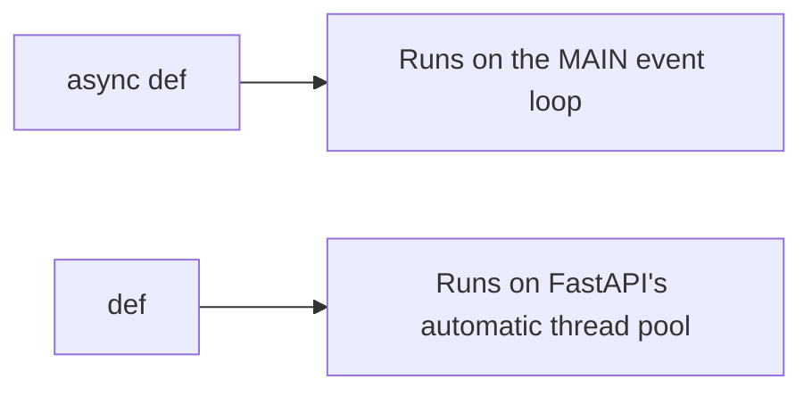

This is the single biggest performance lever in the entire framework, and it's routinely gotten backwards. The common beginner instinct is "mark everything `async`, it's the fast one" — that instinct is wrong, and following it is one of the most common causes of a slow FastAPI application.

### The actual rule

| Situation | Use |
|---|---|
| Calling an **async** library — `httpx`, `aiohttp`, an async DB driver, async Redis | `async def` |
| Calling a **sync** library — `requests`, `pymongo` | `def` |
| CPU-bound work (heavy computation) | `def` |
| Reading/writing files | `def` |
| **Not sure** | `def` |

The practical giveaway: an `async def` function should have an `await` somewhere inside it, because it's calling something that supports being awaited. If there's no `await` in the body, that's usually a signal the function shouldn't be `async def` in the first place.

When genuinely unsure which category a library falls into, the safe default is `def`, not `async def`.

### Why the choice matters mechanically

- **`async def` runs directly on the main event loop** — the single thread juggling every concurrent request, exactly as traced in the WSGI/ASGI note.
- **`def` runs in a thread pool that FastAPI manages automatically.** The main event loop hands the work off and stays free to keep juggling other requests while that thread pool handles this one on the side.

That second point is easy to miss: plain `def` isn't the "unoptimized" choice — FastAPI already knows how to offload it safely, precisely so a synchronous, blocking piece of code doesn't have to run on the one thread everything else depends on.

> [!important] Writing `async def` and then calling **synchronous** code inside it — a `requests.get(...)` call, a blocking DB driver — blocks the entire event loop. Not just that one request: 
> since the whole application's concurrency depends on one thread staying free to juggle everyone, one blocking call inside an `async def` stalls every other in-flight request too. This is a well-documented, well-known failure mode in the FastAPI community specifically because it's the opposite of what people expect: marking something `async` was supposed to make it faster, and instead it makes the whole app worse than if it had just been left as plain `def`.

### The rule in one line

`async def` only when there's a genuine `await` on an async-native library. Everything else — sync libraries, CPU-bound work, file I/O, or plain uncertainty — stays as `def`, and FastAPI's own thread pool takes care of keeping it from blocking anyone else.
