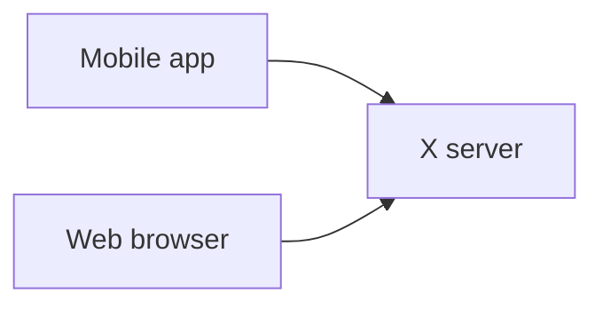
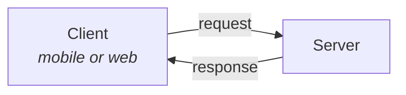
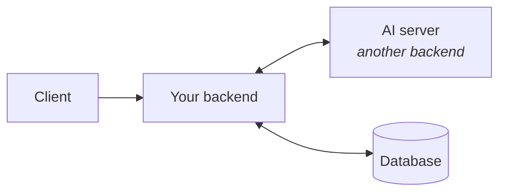
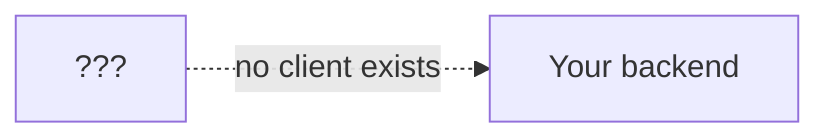
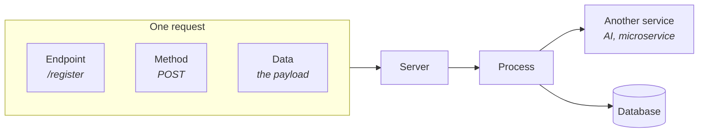

Take X — the site formerly called Twitter.

You can reach it from a phone app or from a browser. Two completely different interfaces. But neither of them **is** X. Both are just windows onto the same thing sitting behind them: **the X server**.

### What a server actually is

Nothing mysterious. **A server is a computer that is always on and always running.** It might live on AWS or Google Cloud, which means it is literally just someone else's computer that they keep switched on for you.

That is the whole definition.

---

## The request–response cycle

The mobile app sends a **request** to the server. The server does something and sends back a **response**.

Every action you take is one of these. Register an account. Log in. Post something. Reply. Repost. Each is a request going out, and a response coming back — either the data you asked for, or an error explaining why you cannot have it.

**That server, in its entirety, is the backend.** The two words mean the same thing.

---

## What the backend is for

The backend has one job: **process data.**

Everything else is a variation on that. Processing can take several steps, and one of those steps might be calling out to something else entirely.

If you are doing AI work, you may have a separate **AI server** — itself just another backend. Your server's job becomes: take the request, send some data over to the AI server, get something back. That is still data processing. Nothing new has happened conceptually.

### The database connection

The other essential piece. Your server talks to a database — reading values, adding values, updating them.

The database can be almost anything: MongoDB, Cassandra, MySQL, Postgres, even SQLite.

> [!note] FastAPI has strong ORM support, which matters more than it sounds. An **ORM** lets you write database code once against an abstraction rather than against a specific database. Migrating SQLite → Postgres → MySQL then costs you very little code change, because all three are treated as nearly the same thing. NoSQL support is good too — MongoDB included.

So the backend, stated plainly: it stores your information, processes your information, and retrieves your information from the database. That is the entire job.

---

## The kinds of request you can send

A client does not just **send a request** — it declares what **kind** of request it is sending. The common ones:

| Method | Intent |
|---|---|
| **GET** | I want to retrieve some data. |
| **POST** | I want to add new data. |
| **PUT** | I want to replace existing data. |
| **PATCH** | I want to change part of existing data. |
| **DELETE** | I want to remove something. |

GET and POST are self-explanatory from their names — get something, post something. DELETE too: delete a tweet, delete an account.

> [!question]- PUT and PATCH both update things. What is the actual difference?
> It comes down to **how much** of the record you are touching.
>
> Picture the stored information as a dictionary — a set of key–value pairs.
>
> - **PUT** replaces the whole dictionary. You send a complete new version, and it overwrites what was there.
> - **PATCH** changes only some of the keys. Everything you did not mention stays as it was.
>
> So if a user has ten profile fields and you only want to change their display name, PATCH sends one field. PUT would require you to send all ten — and anything you forgot to include gets wiped.

---

## The response: a status code plus data

For every request, the server is responsible for answering. And the answer has two parts.

**Part one — the status code.** A number saying what happened. This is the **HTTP response code**.

Say the request was **create an account.** Two things can happen: it worked, or it did not. The status code is how the server says which.

| Code | Meaning | Whose fault |
|---|---|---|
| **200** | Success — everything went fine | — |
| **404** | Not found — no such thing at that address | Client error |
| **500** | Internal server error — the server tried and something broke inside it | Server error |

A `500` is worth reading carefully, because the obvious guess is wrong. It does **not** mean the server is down or unreachable: the server received the request, ran your code, hit an unhandled exception, and deliberately answered with a `500` to say so. A server that is genuinely not responding produces no status code at all — the connection just fails, or a proxy in front of it answers with a `502` or `504` on its behalf.

You do not need to memorise the full list. Knowing the shape of it is enough — the 200s mean success, the 400s mean the client asked for something wrong, the 500s mean the server broke.

**Part two — the data.** The response also carries content: the requested information, or a success message, or failure details. Something has to be shown to the user on the other end, and this is where it comes from.

We are learning the **server**. Not the web frontend, not the mobile app.

Which raises an immediate practical problem.

The server only ever responds — it never initiates. It sits there waiting for requests. But if we are not building a web page or a mobile app, then nothing exists to **send** those requests. We would write a backend and have no way to run it.

### The fix: a web request client

A **web request client** is a piece of software whose entire purpose is to send HTTP requests by hand. It stands in for the frontend you have not built.

You point it at your server, choose a method, attach some data, and fire. Exactly what a real app would do — just driven by you instead of a user.

| Client | Notes |
|---|---|
| **Postman** | The most popular. Somewhat bloated, but it does the job well. |
| **Insomnia** | Was popular previously. |
| **Requestly** | Popular currently. |
| **Web Request Kit** | Built in Rust. Fast, not bloated, no login required. `webrequestkit.com` |
| **Thunder Client** | Editor-integrated. |
| **curl** | Command line. Perfectly valid — you just need **something**. |

They all work the same way and their interfaces closely resemble each other, so the choice barely matters. Pick one.

---

## Endpoints

The last piece. A server is not one destination — it is many.

Go to X and you might land on `/register` to create an account, or `/login` to sign in. Those paths are **endpoints**: named entry points on the server, each one doing a different job and expecting a different set of data.

So a complete request is three things put together:

You choose where it goes, what kind of request it is, and what data rides along with it. The server processes it, possibly calls out to another service, possibly writes to the database, and responds.

---

## Where FastAPI sits in all this

The server is a machine that stays running. The **software running on that machine** is what you write — and that software is powered by FastAPI.

FastAPI serves the endpoints. When a request arrives for `/register` or `/login`, it works out on its own which piece of your code should handle it, hands the data over, and sends back whatever your code returns.

That is the whole backend.

