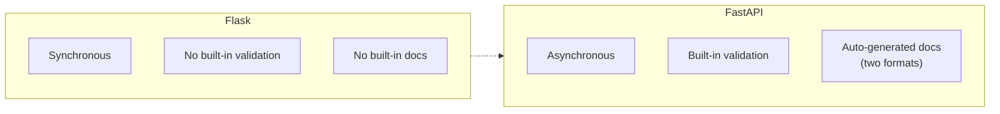
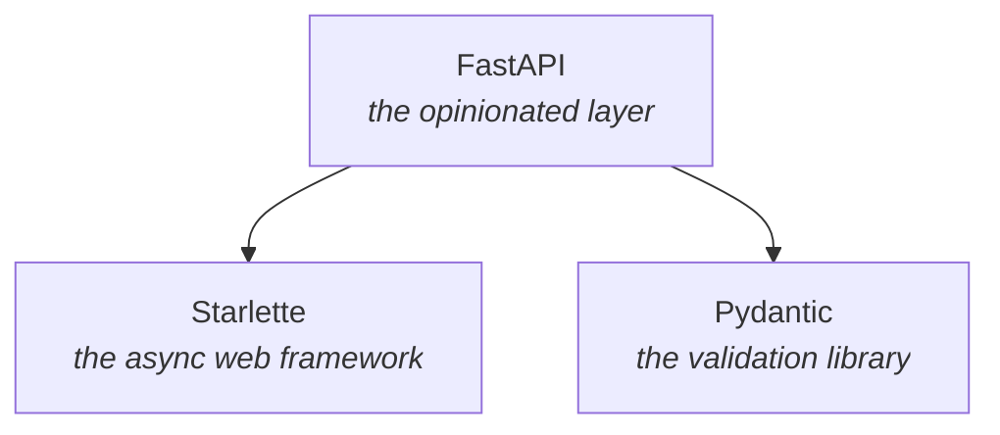
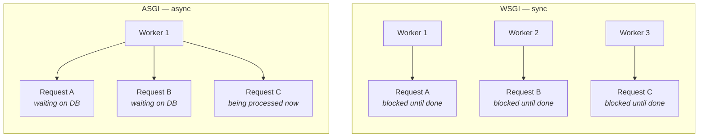

FastAPI's own documentation states the claim directly: it is a modern, fast, high-performance web framework — **on par with Node.js and Go.**

That claim needs handling with care, because it's the sort an interviewer will test. On raw throughput benchmarks FastAPI does **not** match Go — Go frameworks sit well above it, and the gap is large, not marginal. What is genuinely true is that FastAPI is **fast for Python**: it's near the top of the Python field, and it moves Python from clearly-too-slow into the same conversation as the others. What is also true, and matters far more in practice, is that the framework is almost never the bottleneck — a database query, an external API call, or a model inference dominates a real request's time so completely that the framework's own overhead barely registers. The honest version of the claim is **fast enough that your own code and your dependencies are what decide your latency**, and that is exactly what the rest of this note is about.

The framework was built by Sebastián Ramírez, who goes by **tiangolo**. The documentation lives at `fastapi.tiangolo.com`.

---

## A story to make fast concrete

A useful, if fictitious, comparison: a food-delivery platform processing around **2 million orders a day** — the kind of scale a successful Indian startup routinely handles.

Say the very first order-processing microservice was built on **Flask**. Nothing wrong with Flask as a framework, but it comes with three specific limitations:

| Limitation | What it means |
|---|---|
| **Synchronous** | Handles one job at a time — no async operations. |
| **No built-in validation** | Nothing checks that the incoming data is shaped correctly — is the email actually an email, did the password field even arrive. |
| **No built-in docs** | Nobody else on the team — frontend included — has a reliable way to see what data an endpoint expects or returns. |

Missing documentation is a bigger problem than it sounds. Every new engineer, and every frontend developer integrating against your API, needs to know the contract. Without it, that knowledge lives in people's heads.

Now picture the same service rebuilt on **FastAPI**. All three limitations flip:

* Async means one order being processed does not block another from starting. 
* Validation is handled for you. 
* Documentation is generated automatically from code you were already going to write, rather than maintained separately by hand.

> [!important] Stacked together, these three differences change more than raw request throughput — they change how fast a team can build. The point to carry forward is the direction, not a multiplier: validation you don't hand-write, docs you don't hand-maintain, and concurrency you don't hand-manage are three whole categories of work removed. Any specific number attached to that (the lecture offers **3x**) is a figure with nothing measured behind it, so it isn't worth repeating in an interview — the three named mechanisms are, because each one can be pointed at in code.

None of this makes FastAPI a silver bullet. Every framework has trade-offs. But the gap in this comparison is real.

---

## What FastAPI is actually built on

FastAPI is not a monolith. It is a fairly thin, **opinionated layer** on top of two other libraries, and neither piece is optional — take either away and FastAPI is not FastAPI anymore.

### Starlette — the engine

Starlette handles everything that touches the HTTP layer itself:

- **Routing** — deciding whether a request should go to `/register`, `/login`, or somewhere else
- **Middleware** — code that runs on every request in between, e.g. checking whether the user is authenticated
- **WebSockets** — supported directly
- **Background tasks** — while one order takes longer to process, another can proceed without waiting
- **Startup/shutdown events, test client, CORS, GZip, static files** — the standard web-framework toolkit

Starlette's own site describes itself as **a lightweight ASGI framework, ideal for building async web services.** It can be used raw, without FastAPI at all — FastAPI simply adds a large set of conveniences on top of it.

### Pydantic — the safety layer

Pydantic's entire job is **data validation**. Is the incoming field actually shaped like an email address? Did the request send both an email and a password, or only one? Is there extra data that was not asked for?

This is the most widely used data-validation library in the ecosystem, and understanding it well matters beyond FastAPI itself.

> [!note] The framing worth keeping: **Starlette is the engine that does the heavy HTTP lifting. Pydantic is the safety layer that validates data. FastAPI is the opinionated layer that ties both together** and adds automatic documentation on top.

### Why opinionated is a feature

A framework with no opinions lets you do anything you like — which also means no guarantee of performance and no guarantee you are following good practice. An opinionated framework narrows the paths available, and in doing so, pushes you toward the ones that hold up in production.

### Documentation, automatically

FastAPI generates OpenAPI documentation from the code itself, in two formats — **Swagger** and **Redoc**. You write a modest amount extra to make the docs good, but the generation itself is automatic. This is one of the three categories of removed work named earlier — the docs you never hand-maintain.

---

## WSGI vs. ASGI

These two acronyms come up constantly around Python web frameworks, and skipping past them is exactly how someone ends up knowing FastAPI is fast without knowing **why**.

> **WSGI — Web Server Gateway Interface.** Synchronous. **One request per worker.**

A worker picks up a request and stays occupied with it until it finishes — even while it is just waiting on a slow database write or a file read. That worker cannot do anything else in the meantime. This is what Flask and Django **traditionally** run on.

> **ASGI — Asynchronous Server Gateway Interface.** **Many requests per worker.**

A **single worker** can hold **several requests in flight**. While one **request** is waiting on the database or an external API, the worker switches to another request instead of sitting idle. This is what FastAPI and Starlette run on — and, more recently, Django Channels as well (not Django itself, but its async-capable extension).

> [!question]- Why does this actually matter for how many servers I need?
> Because it changes what **handling 1,000 concurrent requests** costs.
>
> Under WSGI, one worker equals one in-flight request. To handle 1,000 concurrent requests, you need roughly 1,000 concurrent workers — which means more RAM, more CPU, more machines.
>
> Under ASGI, a single worker can hold many requests at once, switching to another the moment the current one is waiting on something (a database call, an external API, a file). A handful of workers can cover the same 1,000 concurrent requests that WSGI needed a thousand workers for.
>
> The saving comes specifically from **waiting time**. Most of a request's lifetime in a typical backend is spent waiting on I/O — the database, another service — not doing CPU work. WSGI wastes that waiting time by blocking the whole worker on it. ASGI reclaims it.

A real-world analogy that lands better than the acronyms: WSGI is **one delivery partner per order** — they pick up one order, deliver it, and only then can take the next. ASGI is **one delivery partner picking up multiple orders**, intelligently juggling drop-offs along a route.

> [!question]- I know Java — is Starlette FastAPI's Tomcat?
> No. The Tomcat slot is filled by **uvicorn**, not Starlette. The Java stack splits into four layers, and the Python stack splits the same way:
>
> | Java | Python | Job |
> |---|---|---|
> | Tomcat / Jetty / Undertow | **uvicorn** / Hypercorn / Granian | owns the socket, parses HTTP, drives the request loop |
> | Servlet API | **ASGI** (async) / WSGI (sync) | the spec that lets you swap the server without touching the app |
> | Spring Web MVC — `DispatcherServlet`, filters, handler mapping | **Starlette** — routing, middleware, request/response, websockets | maps a path to your function |
> | Spring Boot + Bean Validation + springdoc | **FastAPI** — validation, dependency injection, auto OpenAPI | the opinionated layer on top |
>
> The test that settles it is **who binds to port 8000** — uvicorn does. Delete Starlette entirely, write a bare ASGI callable `async def app(scope, receive, send)`, and uvicorn will serve it perfectly well — the same way a raw servlet runs on Tomcat with no Spring anywhere.
>
> The structural fact underneath: in `fastapi/applications.py` the class is declared `class FastAPI(Starlette)`. FastAPI does not sit beside Starlette, and it does not get deployed **into** it — FastAPI **is** a Starlette app with extras bolted on. Nobody ever subclasses Tomcat.
>
> One real difference worth holding onto: Tomcat is thread-per-request off a pool, uvicorn is a single-threaded event loop per worker process. Same slot in the stack, opposite concurrency model — which is exactly why a blocking call inside a FastAPI `async def` stalls every other request, while the same blocking call in Spring only ties up one thread out of the pool.

---

Understanding Starlette, Pydantic, ASGI, and WSGI is not optional background reading — it is close to the actual definition of understanding Python web development. Skipping it is how **FastAPI is fast** turns into a slogan instead of something you can reason about.

Worth spending a little time in the documentation directly after this — not a deep read, just enough to have seen it firsthand.
