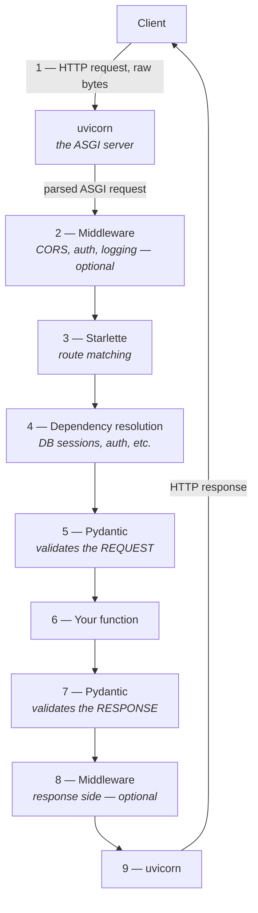
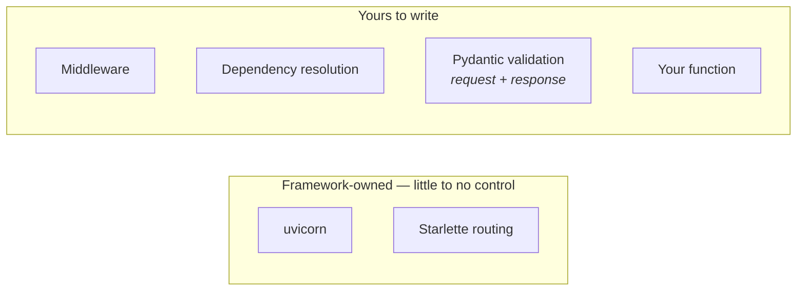

A couple more routes first, to have something concrete to trace through.

```python
@app.get("/orders")
def list_orders():
    return {
        "orders": [
            {"id": 1, "item": "Butter Chicken", "status": "delivered"},
            {"id": 2, "item": "Masala Dosa", "status": "preparing"},
            {"id": 3, "item": "Paneer Tikka", "status": "delivered"},
        ]
    }


@app.get("/order/status")
def get_order_status():
    return {
        "orders_today": 340_233,
        "top_city": "Bengaluru",
    }
```

Two things worth a note in passing:

- **`340_233`** — the underscore inside a numeric literal is a Python readability convention. It's exactly the number `340233`; the underscore is discarded by the interpreter and just makes long numbers easier for a human to parse at a glance.
- **This is dummy data.** In a real handler, `/order/status` would be querying the database rather than returning a hardcoded dictionary — the shape of the response is the point here, not the values.

Hitting `/orders` returns the list. Hitting `/order/status` returns a completely different payload. Which raises the actual question worth answering: **how does FastAPI know which function to run for which URL?** That single question is the door into the whole request lifecycle.

---

## The full journey of a single request

What looks, from the outside, like **I hit a URL and got JSON back** is actually nine distinct stages. Worth slowing down on this once, because every stage after this note gets built by writing code that plugs into one specific link in this chain.



### 1 — The request arrives as raw bytes

A client sends an HTTP request — GET, POST, whatever the method. It's received first by **uvicorn**, the ASGI server. At this point **it is not JSON**, not a Python object, not anything structured — just **raw bytes** coming in over a socket.

Before handing anything onward, uvicorn **parses** those raw bytes — the HTTP method, path, and headers — into a structured dictionary called the **ASGI** **scope**. That parsed scope, not the raw bytes, is what everything downstream works with.

### 2 — Middleware (optional)

The request does **not** go straight to route matching from here. It passes through **middleware** first — code that runs on every request before anything else looks at it. Typical jobs for a middleware layer: checking CORS (is this request coming from an allowed origin/port), authentication, logging. Not every app has middleware configured, but when it exists, this is where it sits.

> [!important] Middleware runs **before** the route is matched, not after. The middleware layer wraps the router — so a middleware sees the request while FastAPI still has no idea which function will handle it, or whether any function will at all. 
> A request for a path that no route defines still passes through every middleware on its way to the 404. That ordering is exactly what makes middleware the right place for anything that must apply to the **whole application without exception** — logging every request including the ones that miss, rejecting a bad origin before any handler is chosen, timing the full request. Anything that needs to know **which** route was picked belongs at stage 4 as a dependency, not here.

### 3 — Starlette matches the route

Now the route gets chosen. Starlette's job here is **route matching**: look at `scope["path"]`, and work out which function is supposed to handle it. This is the actual answer to **how did it know `/order/status` should run `get_order_status`?** — Starlette read the already-parsed path, matched it against the routes registered via `@app.get(...)` decorators, and picked the right one.

### 4 — Dependency resolution

Still not the function. Next comes **dependency injection** — or more precisely, **dependency resolution**. Some routes need things prepared before they can run: a database session, an authenticated user, some shared piece of setup. FastAPI resolves whatever the route has declared it depends on at this stage, before the function body ever executes.

> [!note] This gets its own dedicated treatment later — for now, the position in the pipeline is what matters: after middleware, before the function.

### 5 — Pydantic validates the request

Only now does data validation happen. Whatever shape the request is expected to be — an email and a password, say, not an email and something else, not a username instead — **Pydantic** checks that the incoming data actually matches. This is separate from and later than the routing step; **matching the URL and validating the payload are two different jobs done by two different components**.

### 6 — Your function finally runs

After all five prior stages, the request reaches the code you actually wrote. This is the only stage where your logic lives — everything before it is FastAPI doing preparatory work, and everything after it is FastAPI doing cleanup and packaging.

### 7 — Pydantic validates the response

Once your function returns, the trip back out starts — and it goes through Pydantic again, this time validating the **response**. The data your function hands back may need to be serialized into a particular format or checked against an expected shape before it's allowed to leave.

### 8 — Middleware, response side (optional)

Response-side middleware can run here — further transforming the response, security checks, whatever the app needs. This is not a second, separate piece of code: it is the **same** middleware from stage 2, resuming after the part of it that awaited the rest of the app. **A middleware is one function wrapped around everything inside it, so it necessarily gets a turn on the way in and a turn on the way out** — which is what makes it the natural place to time a request or attach a header to every response.

### 9 — uvicorn sends it back

Finally, the response goes to uvicorn, and uvicorn is what actually sends the HTTP response back to the client. Your code never talks to the client directly — it always goes through uvicorn on both ends.

By this point the response is still a structured Python object — a status code, headers, a body — not yet anything resembling HTTP. **uvicorn serializes it back into raw bytes**: the status line (`HTTP/1.1 200 OK`), the header lines, a blank line, then the body, and writes exactly that onto the socket. This is the mirror image of stage 1, in reverse.

```
Client → raw bytes → uvicorn parses → structured request  → middleware / Starlette / dependencies / Pydantic / your function
your function → structured response → uvicorn serializes → raw bytes → Client
```

> [!note] uvicorn is the only piece in this entire chain that ever touches a literal socket or raw bytes, on either end. Everything between stage 1 and stage 9 — middleware, routing, dependency resolution, both Pydantic passes, your function — works purely with parsed Python objects, and never needs to know what HTTP looks like on the wire.

---

## Who controls which stage



| Stage | How much control you have |
|---|---|
| uvicorn (receiving / sending) | Essentially none — this is the ASGI server doing its job |
| Middleware | Full — entirely optional, entirely written by you when present |
| Starlette route matching | Indirect — you shape it by how you write your `@app.get(...)` paths, but the matching mechanism itself isn't yours to touch |
| Dependency resolution | Full — you declare what a route depends on |
| Pydantic validation (both directions) | Full, though mostly automatic — driven by your type hints unless you customize it |
| Your function | Completely yours |

> [!question]- Why does validation happen twice — once for the request, once for the response? Isn't the response just whatever the function returns?
> Because **whatever the function returns** is not automatically guaranteed to be **correct or safe to send**.
>
> The request-side validation exists to protect your function — by the time your code runs, the data has already been confirmed to match the expected shape, so the function doesn't need defensive checks scattered through it.
>
> The response-side validation exists for the opposite direction: to make sure whatever your function hands back actually matches what the API promised to return, and to serialize it into the correct format before it leaves. If a function accidentally returns an extra field, or the wrong type, this is the stage that would catch or reshape that — rather than an inconsistent response silently reaching the client.
>
> Two different jobs, two different directions, same tool doing both.

