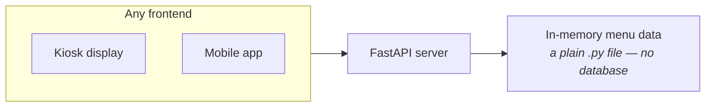

Everything up to this point has been foundation. This is the first project built on top of it — small enough to finish with just what's already been covered, which is the whole point of starting here.

---

## The client briefing

Before any code: what is actually being asked for, and why it looks the way it does.

A (fictitious) Chai Point shop in Bengaluru wants a **read-only menu**, served through an API, so their kiosk display and their mobile app can both fetch the current menu without either of them talking to a database directly.

Two requirements are doing all the work here:

- **Multiple frontends, one source of truth.** The menu needs to show up on a kiosk display **and** a mobile app **and** possibly a website later. An API is the natural fit precisely because it doesn't care what's consuming it — kiosk, mobile, web, or anything else that speaks HTTP. This is the same **pure backend, any client** point from the very first note in this series, now showing up as an actual business reason rather than an abstract argument.
- **No database.** A deliberate constraint, not a missing feature. The data lives in memory instead.

> [!note] Reading a client brief like this is itself a skill worth naming. The requirement isn't **build me an API** — it's two sentences describing a business situation, and the API is the inferred solution. Everything that follows here is derived from those two sentences, not handed down as a spec.

---

## The architecture

The **in-memory menu data** piece is intentionally unglamorous: a plain Python file holding the menu as a data structure. The FastAPI server reads it once, keeps it in memory, and serves it back out as JSON on request. No database connection, no query, no ORM — the constraint from the brief translated directly into the simplest thing that satisfies it.

---

## The planned routes

| Route | What it returns |
|---|---|
| `GET /menu` | The full menu — every item |
| `GET /menu?category=chai` | Only items in the given category |
| `GET /menu/{id}` | A single item, looked up by its id |

> [!important] The category filter is a **query parameter**, not a path segment — `/menu?category=chai`, not `/menu/category=chai`. This matters because a path segment like `{id}` has to be declared in the route itself and is meant for identifying **which resource**, while a query parameter is for **optional, declaration-free** modifiers like a filter. Category filtering is exactly the query-parameter case — it's optional, it doesn't identify a specific resource, and the route works fine without it.

So of the three routes, two are really the same route wearing different clothes: `GET /menu` with no query params returns everything, and `GET /menu?category=chai` is the same handler with a filter applied. `GET /menu/{id}` is genuinely different — a path parameter identifying one specific item.

---

## What this project is actually teaching

The scope is deliberately bounded to what's needed for exactly this brief — nothing extra bolted on for the sake of coverage:

- Building and running a FastAPI app with uvicorn, for real this time rather than as isolated syntax examples
- **Path parameters** (`/menu/{id}`) vs. **query parameters** (`/menu?category=chai`) — applied, not just defined
- A **Pydantic response model** — declaring the **shape** every response is guaranteed to have, for consistency across all three routes
- **Raising `HTTPException`** for error handling — what happens when a requested `id` doesn't exist

Each of these was touched on in the abstract in earlier notes; this project is where they get used for a reason instead of as a syntax demo.
