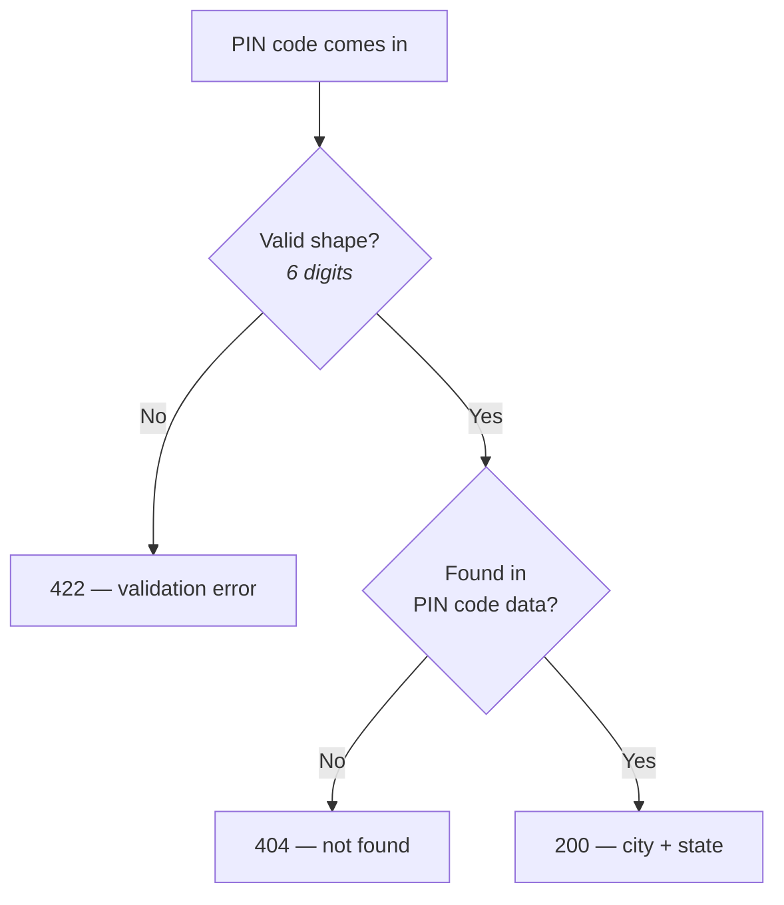

A second project, a second brief. The setup — venv, `requirements.txt`, a bare `main.py` with a title/description and a root route, running it with `uvicorn --reload` — is identical to project 1's and already covered in the Foundations notes. What's actually new starts here.

---

## The client briefing

A D2C (direct-to-consumer) brand — the kind of company selling straight to customers online, t-shirts and the like — wants their checkout form to **auto-fill city and state from a PIN code**. Type in a 6-digit PIN code, the rest of the address fills itself in. A familiar pattern from real checkout forms, now being built from the backend side.

The actual value being delivered: **less friction, fewer typos** in an address form — a customer typing 6 digits correctly is a much smaller ask than typing a city and state name correctly by hand.

As before, the boundary matters: this project builds the **server**, not the checkout form itself. The frontend calling it is out of scope.

---

## The flow

Two separate failure modes, worth keeping distinct:

- **Malformed input** (not 6 digits, contains letters, wrong length) → `422`. This is caught before any lookup happens at all — the data doesn't even need to be checked against anything to know it's invalid.
- **Well-formed but unsupported** (a real-looking 6-digit code that just isn't in the dataset) → `404`. This one *is* a lookup failure — the shape was fine, the value just isn't covered.

Same distinction as `/menu/{item_id}` in the previous project (a badly-typed id vs. a well-typed id that doesn't exist) — just applied to a different kind of input.

Like project 1, "database" here means a file, not an actual database — same constraint, same reasoning as before.

---

## What's actually new this time

The previous project's list — path params, query params, a Pydantic response model, raising `HTTPException` — is done. This project's four new pieces, in the order they'll show up:

1. **Pydantic `field_validator`** — custom validation logic beyond a plain type annotation. A type hint alone can say "this must be a string"; a field validator is what enforces something more specific, like "and it must be exactly 6 digits."
2. **Custom exception classes and exception handlers** — moving past `raise HTTPException(...)` inline, toward defining an app's own exception types and a handler that controls how they get turned into a response. Flagged explicitly as something that looks like overkill in a small project but is genuinely how production FastAPI applications are structured.
3. **`POST` with a JSON body** — everything so far has been `GET`, reading data via path or query parameters. This is the first route accepting **structured data sent in the request body** rather than in the URL.
4. **Clean error response patterns** — a consistent shape for what an error response actually contains, applied deliberately rather than improvised per-route.

> [!note] The reasoning given for #4 is worth keeping: writing (or reviewing) code with an explicit sense of "this is the pattern I want" matters even more once AI tools are doing a lot of the typing — an AI generates whatever it's asked for, not necessarily the pattern that's actually wanted, unless that pattern is specified.
