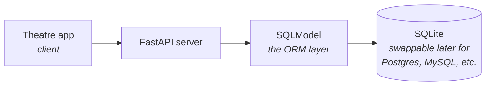

A third project, and a real jump in scope — the first one backed by an actual database instead of an in-memory file. Setup (venv, interpreter selection) is identical to the previous two projects and already covered in Foundations; nothing new there.

---

## The client briefing

Rang Manch — a (fictitious) Pune-based theatre booking startup — needs a **review API**: audiences rate and review shows, the API powers the review section of Rang Manch's own app plus an average-rating display.

Two scope boundaries worth being precise about, since both shape everything downstream:

- **This is one component, not a full application.** Rang Manch's app presumably already exists somewhere — this project builds only the review-serving piece behind it, the same "backend only, frontend out of scope" boundary as the previous two projects.
- **Full CRUD, not just reads.** Every project so far has been GET-heavy — this is the first one genuinely creating, updating, and deleting data, not just serving fixed or looked-up records.

---

## Why a real database now

The first two projects deliberately avoided one — a fixed constraint from those specific clients. This client has no such constraint, and the shape of the requirement makes an in-memory file impractical anyway: reviews get **created and deleted** by users over time, not defined once by whoever wrote the code. A file-based dictionary that only existed for the lifetime of one running process was fine when the data was static; it stops making sense the moment users are the ones changing it.

The key architectural point: an **ORM** (Object-Relational Mapper) sits between the application code and the actual database. Code written against the ORM stays almost identical regardless of which real database is running underneath — swapping SQLite for Postgres later is a small, contained change, not a rewrite. That's the specific promise of the intermediary layer, and it's why the diagram draws SQLModel as its own distinct box rather than folding it into "the database."

---

## The planned routes

| Method | Route | Purpose |
|---|---|---|
| `POST` | `/reviews` | Create a new review |
| `GET` | `/reviews` | List reviews, with pagination |
| `PATCH` | `/reviews/{id}` | Update an existing review |
| `DELETE` | `/reviews/{id}` | Delete a review |
| — | *average rating per play* | Confirmed as a requirement; exact endpoint shape comes in a later video |

This is the first project to use all four CRUD-relevant verbs together — `GET` and `POST` have shown up before individually, but `PATCH` and `DELETE` are both new in practice, not just named.

---

## What's new this project

A denser preview than the earlier two, matching how much heavier this brief is:

- **SQLModel** — combines SQLAlchemy (the actual database toolkit) and Pydantic (validation) into a single class definition. One class instead of two: the same object doubles as the database table's shape *and* the request/response validation shape.
- **SQLite as a genuinely production-capable database** — a zero-config, single-file database, not merely a prototyping stand-in. Worth holding this claim with some nuance rather than absolutely: SQLite's concurrency model differs from a client-server database like Postgres (it's fundamentally single-writer), which makes it an excellent fit for plenty of real production workloads and a poor fit for others — the honest version of "don't dismiss it" is "know what its actual constraints are," not "it's always the right choice." Companies like Turso build genuinely production-grade infrastructure on top of it at scale.
- **FastAPI lifespan events** — code that runs on application startup and shutdown, the mechanism this project uses to set up the database when the app boots.
- **Session dependency injection** — a concrete, real implementation of the "hand the route a database session" example first described only hypothetically back in the request-lifecycle note's dependency-resolution stage.
- **Pagination via `skip`/`limit`** — sometimes called `offset`/`limit` elsewhere; same underlying idea under two different naming conventions, for cutting a long result list into pages.
- **Aggregation queries** — calculating the average rating at the database level, rather than pulling every review back and averaging it in Python.

Everything on this list gets built, not just described — starting from the next video.
