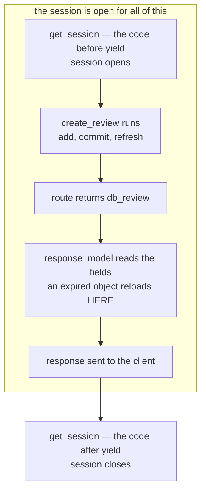

The first route that writes. Everything before this read from fixed or in-memory data; this one takes a validated request body and turns it into a permanent row. It is also the first route to leave `main.py`.

```python
# routes/reviews.py
from fastapi import APIRouter, Depends
from sqlmodel import Session

from models import ReviewTable, ReviewCreate, ReviewRead
from database import get_session

router = APIRouter(prefix="/reviews", tags=["reviews"])


@router.post("/", response_model=ReviewRead)
def create_review(review: ReviewCreate, session: Session = Depends(get_session)):
    db_review = ReviewTable(**review.model_dump())
    session.add(db_review)
    session.commit()
    session.refresh(db_review)
    return db_review
```

```python
# main.py
from routes.reviews import router as reviews_router

app.include_router(reviews_router)
```

The route is declared as `"/"`, but the router's `prefix="/reviews"` makes the real path `/reviews`. Five lines in the function body, and every piece built so far is doing something in them: the table model and its schemas, the session dependency, and the router mounting pattern.

---

## Turning the incoming schema into a row

```python
db_review = ReviewTable(**review.model_dump())
```

`review` arrives as a `ReviewCreate` — the input-validation shape, holding only the four fields a caller is allowed to submit. What has to go into the database is a `ReviewTable`, a different class, carrying two fields the create schema deliberately excludes: `id` and `created_at`.

**`review.model_dump()`** converts the validated object back into a plain **Python dictionary**, one entry per field. **`**`** then unpacks that dictionary as **keyword arguments**, so `ReviewTable(**review.model_dump())` is the same as writing `ReviewTable(play_name=..., reviewer_name=..., rating=..., comment=...)` by hand.

> [!note] This one-liner works **because** of how the schemas were designed, not by luck. The fields the two classes have in common carry matching names and matching types, so they fill in directly. The two fields `ReviewTable` has that `ReviewCreate` doesn't — `id` and `created_at` — are simply absent from the dictionary, and because both were given defaults on the table model (`Field(default=None, primary_key=True)` and `Field(default_factory=datetime.now)`), their absence is not an error. They fall back to those defaults. The several-schema pattern and this single line of unpacking were designed to fit together.

---

## The three lines that save it

```python
    session.add(db_review)
    session.commit()
    session.refresh(db_review)
```

Three calls, three different jobs. Taking them one at a time.

### `session.add(db_review)`

Before this line, `db_review` is an ordinary Python object sitting in memory. The database has no idea it exists — nothing has been sent anywhere.

`add` does **not** save it. It hands the object to the session and says: watch this one. A session is a workspace that tracks objects, so from this point on it is tracking this one, and knows there is a new row it will have to write **eventually**. Still no SQL, still no row in the database. If the process died right here, nothing would have happened.

Think of a shopping basket. Putting an item in the basket does not buy it — it just means the shop knows you are carrying it, and it will be included when you go to the till.

That is the whole of `add`: **registration, not writing.**

> [!important] `session.add()` is not optional bookkeeping — it is the only thing that gives the session any knowledge this object exists. Skipping it and calling `session.commit()` anyway does genuinely nothing: `commit()` only processes objects the session is actually tracking, and an object that was never added was never tracked. No error, no row, `id` stays `None` forever — the object simply isn't part of what gets committed.

### `session.commit()`

This is the trip to the till. Everything the session has been tracking gets written for real.

Concretely, for this one object: the session works out that something it is tracking has no row yet, produces `INSERT INTO reviewtable (play_name, reviewer_name, rating, comment, created_at) VALUES (?, ?, ?, ?, ?)`, sends it with the values, and the database writes the row.

Two things are true after this line that were not true before it. **The row exists** — before, there was none. And **the database has assigned the `id`**. Nobody in Python chose it: `ReviewTable` declares `id` as `Optional[int]` defaulting to `None` precisely because the value is not Python's to pick. The database takes the next number as it writes the row and hands it back, so `db_review.id` was `None` before this line and is a real number after it.

> [!note] Only `id` comes back from the database. `created_at` was already filled in **before `add` was ever called** — `Field(default_factory=datetime.now)` runs at the moment `ReviewTable(...)` is constructed, so the value exists while the object is still a plain Python object with no connection to anything. Building one and printing both fields shows `id = None` and a real timestamp side by side. The two are easy to lump together as things the client doesn't send, but only one of them is genuinely the database's.

> [!question]- How does it know which fields to fetch back, and what if `created_at` had no Python default?
> The rule is simpler than it looks: **SQLAlchemy knows which columns it sent values for, and whatever it did not send is the database's to fill — so those are the ones it goes back for.**
>
> This `INSERT` carries five of the six columns. Four came from the request, and `created_at` was computed in Python before `add` ever ran. Only `id` is missing from the statement, so `id` is the only thing there is to fetch.
>
> Which raises the obvious follow-up: what if `created_at` had no Python default? Three situations, and they behave differently.
>
> **No default at all** — `created_at: datetime` and nothing more. Python has no value, so it sends nothing, and the column is `NOT NULL` with no `DEFAULT` in the table definition. The insert fails with an `IntegrityError`. Nothing gets fetched, because nothing was written.
>
> **A database-side default** — declared as a `server_default`, which writes the default into the table definition itself:
>
> ```
> CREATE TABLE review (
> 	id INTEGER NOT NULL, 
> 	play_name VARCHAR NOT NULL, 
> 	created_at DATETIME DEFAULT CURRENT_TIMESTAMP, 
> 	PRIMARY KEY (id)
> )
> ```
>
> ```
> before anything:  id = None | created_at = None
> after commit:     id = 1    | created_at = 2026-08-19 11:04:42
> ```
>
> Now `created_at` behaves exactly as `id` does — absent from the `INSERT`, filled by the database, fetched back afterwards. Two columns come back instead of one, and SQLAlchemy worked that out from the same rule: it did not send either of them.
>
> **A Python-side default** — what this project actually has. Computed at construction, sent with the insert, nothing to fetch.
>
> One detail in those numbers is worth keeping. The Python-default version of this same row produced `16:29:49`, and the database-default version produced `11:04:42` — five and a half hours earlier. Not a bug: `datetime.now()` returns **local** time, while SQLite's `CURRENT_TIMESTAMP` returns **UTC**. Moving a default from Python into the database silently changes the timezone of every row, with no warning anywhere. Which is a fair argument for the `default_factory` version this project uses — the value is produced in code you can see, rather than by whichever database happens to be underneath.

**And `commit` is two steps fused together**, which is worth knowing because they can be separated:

- **flush** — generate the SQL and send it. The `INSERT` actually runs, the database answers, and the `id` comes back.
- **commit** — make it permanent.

Calling `session.flush()` on its own runs the `INSERT` and assigns the `id`, and everything looks finished — and then `session.rollback()` erases all of it as though it never happened. The SQL ran, the database replied, and none of it survived, because nothing finalised it.

The shopping analogy holds up through this: flush is the cashier scanning your items, commit is paying. Walk out between the two and you leave with nothing.

> [!note]- The names SQLAlchemy gives these three moments
> The states above have real names, worth knowing because SQLAlchemy's own errors and documentation use them.
>
> | State | Meaning |
> |---|---|
> | **transient** | Just created. The session doesn't know this object exists. |
> | **pending** | Added to the session, waiting for the next flush to actually be inserted. |
> | **persistent** | Flushed or committed — has a real row and a real `id`. |
>
> Checked directly on a real object:
>
> ```
> just created, before add():
>   transient = True  | pending = False  | persistent = False
>
> after session.add(), before flush/commit:
>   transient = False | pending = True   | persistent = False
>
> after session.commit():
>   transient = False | pending = False  | persistent = True
> ```


---

## Why `refresh()`, if `commit()` already assigned the `id`?

Start with a question that has a surprising answer. You built the object yourself and set `play_name` by hand. Then:

```python
session.add(db_review)
session.commit()

print(db_review.play_name)
```

It prints `Hamlet` — and it costs a database query.

Inspecting the object's attribute storage immediately after the commit shows it is **empty**. Not stale, not partially filled: `{}`. Every value is gone, including `play_name` which was never the database's business, and including the `id` the database had just assigned.

Then reading one attribute makes a `SELECT` fire, fetching **every** column of that row back at once:

```
SELECT reviewtable.id, reviewtable.play_name, reviewtable.reviewer_name,
       reviewtable.rating, reviewtable.comment, reviewtable.created_at
FROM reviewtable WHERE reviewtable.id = ?
```

and afterwards the object holds all six again.

### Why SQLAlchemy throws the values away

A commit ends the transaction. The instant it ends, anything the object was holding might be out of date — another transaction could have changed that row, a trigger could have rewritten a column. Rather than hand back values it can no longer vouch for, SQLAlchemy **expires** them: discards them and marks the object as needing a fresh read. The next attribute access quietly performs that read.

> [!important] The object still looks like an ordinary Python object, and it is not one any more. Touching a field on it can go to the database. That is the single most surprising property of an ORM-managed object, and it is the thing that explains everything `refresh` does.

### What happens if the `refresh()` line is deleted

The route returns the object:

```python
    return db_review          # an empty shell, everything expired
```

FastAPI now has to turn that into JSON, and `response_model=ReviewRead` says which fields go in. So it **reads** `db_review.id`, `db_review.play_name`, and the rest — and that reading is attribute access, the exact thing that triggers the hidden `SELECT`. The reload happens anyway, a moment later and invisibly, and the JSON comes out correct.

The only thing that could break this is the **session being closed** by then, **since a closed session cannot run a query**. It is not — the traced ordering in `06-Engine-And-Session` puts the cleanup after the response:



Step D is the one that matters. Serialising reads attributes, so if the object is still expired, that read is what triggers the reload — and it happens two steps before the session closes, with room to spare.

So the net effect is the same query and the same JSON, whether or not `refresh()` was written.

### Then why write it

Two reasons, of very different weight.

> The first is **readability**: the line makes the reload visible. Without it, anyone reading this route has to already know about **expire-on-commit** to understand why the response isn't full of nulls.

> The second is that **it stops being optional** the moment the object **outlives the session**. That never happens in the route as written, **because serialisation runs inside the session's lifetime**. It happens the first time somebody restructures this code, and the restructurings that cause it are all completely ordinary.

**Extracting a helper that owns its own session.** A natural move as a project grows:

```python
def create_review(data: ReviewCreate) -> ReviewTable:
    with Session(engine) as session:
        row = ReviewTable(**data.model_dump())
        session.add(row)
        session.commit()
        return row              # the session closes here, on the way out
```

The object leaving that function is the empty shell from the previous section, and the `with` block has just taken away the only session that could refill it. **Whoever called this function now holds an object whose values are unreachable**. Touching any field raises `DetachedInstanceError` — **the instance is not bound to a session**, so the attribute refresh cannot run. Not a stale value, not a `None`: an exception.

Adding `session.refresh(row)` before that `return` fixes it, because the values get pulled back while the session is still alive. The object then leaves the function holding plain Python values and needs nothing further.

**Caching what that helper returns.** Now build on it:

```python
_recent: dict[str, ReviewTable] = {}

def create_and_cache(data: ReviewCreate) -> ReviewTable:
    row = create_review(data)          # the helper above, without its refresh
    _recent[data.play_name] = row      # key comes from the INPUT, not from the row
    return row
```

Trace this in two parts, because they happen in different requests.

**When the review is created**, `data.play_name` is a plain string off the request body — reading it touches no database. So the row goes into the dictionary without anything ever reading one of **its** attributes, and nothing raises. The shell object is stored silently, and the request that created it succeeds normally.

**Twenty minutes and two hundred requests later**, something entirely unrelated reads from the cache:

```python
cached = _recent["Hamlet"]
return cached.play_name        # raises DetachedInstanceError
```

Now it fails. That is the first time anyone has touched an attribute on this object since its session died.

Which is why this failure is worse than the first one. The traceback points **here** — at a read endpoint that never created anything, never opened a session, and has no `refresh` anywhere near it. It looks like the bug is in the code being stared at. It isn't: the bug is a missing line in a **write** helper that ran twenty minutes ago in a different request, and the traceback contains no mention of it at all.

Storing a detached object does not fail. It **defers**.

> [!important] With `refresh`, the object in the cache is inert data: no session, no queries, no expiry, works for as long as the process lives. That is the whole value of the call. In the route as written it changes nothing, and it is there so the first person to move this object somewhere else does not have to discover any of the above the hard way.

---
