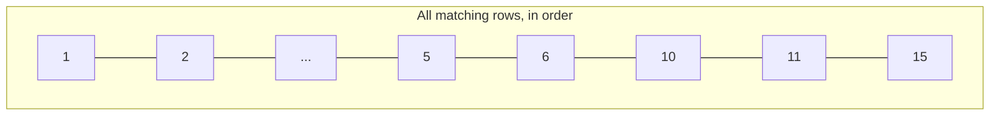

The second review route — listing reviews, with optional filtering and pagination. New SQLModel query-building mechanics, plus a genuinely new concept: cutting a long result list into pages.

---

## `skip`/`offset` and `limit` — the actual idea

Picture the full set of matching rows as a numbered line:



**`limit`** is simply **how many rows to return in one response** — ask for `limit=5` and you get five rows, no matter where you start.

**`skip`** (also called **`offset`** — two names for the identical idea) is **how many rows to skip over before starting to collect.** `skip=0, limit=5` returns rows 1–5. Asking for the **next** page means moving `skip` forward by exactly the size of the previous page: `skip=5, limit=5` returns rows 6–10, `skip=10, limit=5` returns rows 11–15, and so on. Pagination is nothing more than sliding this `skip` value forward by `limit` each time.

---

## The route

```python
from sqlmodel import select

@router.get("/", response_model=list[ReviewRead])
def list_reviews(
    play_name: str | None = Query(default=None, description="Filter by play name"),
    skip: int = Query(default=0, ge=0, description="Number of reviews to skip"),
    limit: int = Query(default=10, ge=1, le=50, description="Max reviews to return"),
    session: Session = Depends(get_session),
):
    query = select(ReviewTable)

    if play_name:
        query = query.where(ReviewTable.play_name == play_name)

    query = query.offset(skip).limit(limit)

    reviews = session.exec(query).all()
    return reviews
```

Same path as the create route (`"/"`, resolving to `/reviews`), different verb — `GET` alongside the existing `POST` on the identical URL is completely normal; the verb is what tells FastAPI which handler applies, not the path alone.

`response_model=list[ReviewRead]` — the first list-shaped response model in this project. Each item in the returned list gets validated and shaped against `ReviewRead` individually, the same way `response_model=ReviewRead` worked for a single object.

Three query parameters, all declared the way query parameters were established earlier: `Query(default=..., description=...)`, with `play_name` allowed to be absent (`default=None`) and `skip`/`limit` given real numeric constraints — `skip` can't be negative (`ge=0`), and `limit` is held between `1` and `50` (`ge=1, le=50`) specifically so a caller can't request an unreasonably large page and put unnecessary load on the database in one request.

---

## Building the query as a series of reassignments

```python
query = select(ReviewTable)

if play_name:
    query = query.where(ReviewTable.play_name == play_name)

query = query.offset(skip).limit(limit)
```

`select(ReviewTable)` builds a query object representing **everything in the reviews table** — nothing has run against the database yet, this is just a description of a query.

> [!important] `.where(...)`, `.offset(...)`, and `.limit(...)` each return a **new** query object rather than modifying the existing one in place. That's why every line here is written as `query = query.where(...)` — reassigning the variable — rather than just calling `query.where(...)` and expecting the original `query` to have changed. Forgetting the reassignment is a real, silent mistake: the call still runs without error, it just produces a new query object that's immediately discarded, leaving `query` completely unaffected.

**Why `if play_name:` wraps the `.where(...)` call and nothing else:** filtering by play name is optional — a caller might want every review, not one play's reviews. Building the base query unconditionally and only conditionally narrowing it with `.where(...)` is what makes both cases possible from one function, rather than needing two entirely separate query-building paths.

**`ReviewTable.play_name == play_name`** looks like an ordinary Python equality check, but it isn't evaluating to `True` or `False` here. `ReviewTable.play_name` is a special SQLAlchemy-managed attribute, and its `==` operator is overridden to build a **SQL comparison expression** instead of comparing values immediately — the actual `WHERE play_name = ...` clause gets constructed from writing what looks like ordinary Python. This is the same **write Python, get SQL** promise from the ORM note, showing up directly in the comparison operator itself.

---

## Running the query

```python
reviews = session.exec(query).all()
```

`session.exec(...)` is SQLModel's own method for running a built query — distinct from raw SQLAlchemy's `session.execute(...)`, which returns row-tuples that need to be unwrapped. `session.exec(...)` already hands back the actual model instances directly. `.all()` collects every matching result into a list — the alternative would be fetching one at a time, which pagination's `limit` already makes unnecessary here.

The whole route, restated in one line: build a query for **every review,** optionally narrow it to one play, cut it down to one page's worth starting from `skip`, run it, return the list.

---

## The gap this route has: no `ORDER BY`

Worth naming plainly rather than leaving it to be discovered later, because it's the classic pagination bug and it does not announce itself.

`select(ReviewTable).offset(skip).limit(limit)` says **skip 3, give me 3** — but never says **in what order**. SQL makes no guarantee about the order of rows returned from a query without an explicit `ORDER BY`; the database is free to hand them back however it finds them fastest. `skip`/`limit` are then slicing a sequence that was never promised to be stable between one request and the next.

```python
query = query.order_by(ReviewTable.id).offset(skip).limit(limit)
```

That one addition is the fix — pick any column that gives a total, unchanging order, and `id` is the obvious one here.

> [!warning] The failure mode is specifically nasty because the broken version **looks correct in testing.** On a small SQLite table that's only ever been inserted into, rows come back in insertion order every time — which is exactly why the screenshots below show clean, correct pages. Nothing about that is guaranteed. Once rows start being deleted, or the table grows enough for the planner to choose an index scan, or the database is swapped for Postgres, the same two requests can return the same review twice across two pages, or skip one entirely. The test that passed proves nothing; the guarantee was never there to begin with.

The code above is left as written, matching what's actually in `routes/reviews.py` — the fix is a one-line change to make deliberately, not a correction to pretend was always there.

---

## Tested live, success and failure

Seeded 7 reviews (3 Hamlet, 2 Macbeth, 2 Othello) and tested through Swagger.

![[AI-Engineering/00-Fast-API/Images/reviews-list-pagination-success.jpg]]

`GET /reviews/?skip=3&limit=3` — page two. Hamlet occupied ids `1`–`3`, so skipping the first 3 correctly lands on `id: 4`, the first Macbeth review — confirming `skip` genuinely moves the starting point forward rather than just limiting the count.

### The `limit=100` failure — caught twice, two different ways

![[AI-Engineering/00-Fast-API/Images/reviews-list-swagger-client-block.jpg]]

Trying `limit=100` through Swagger's **Try it out** form never even reaches the server — Swagger reads the `maximum: 50` constraint directly from the OpenAPI schema (generated from `Query(..., le=50)`) and blocks the request client-side, before **Execute** does anything. The `curl` example shown underneath still reflects the previous, valid request — proof the new one was never actually sent.

![[AI-Engineering/00-Fast-API/Images/reviews-list-limit-422.jpg]]

Hitting the same URL directly (`GET /reviews/?limit=100`, bypassing Swagger's form entirely — the same trick as testing any `GET` route straight from the address bar) reaches the real server, which produces the actual validation response: `422`, `"type": "less_than_equal"`, `"msg": "Input should be less than or equal to 50"`. This is FastAPI's own automatic validation — the exact same pipeline responsible for every other `422` seen in earlier projects, triggered here by `Query(le=50)` instead of a Pydantic field validator, before `list_reviews`'s own code ever runs.
