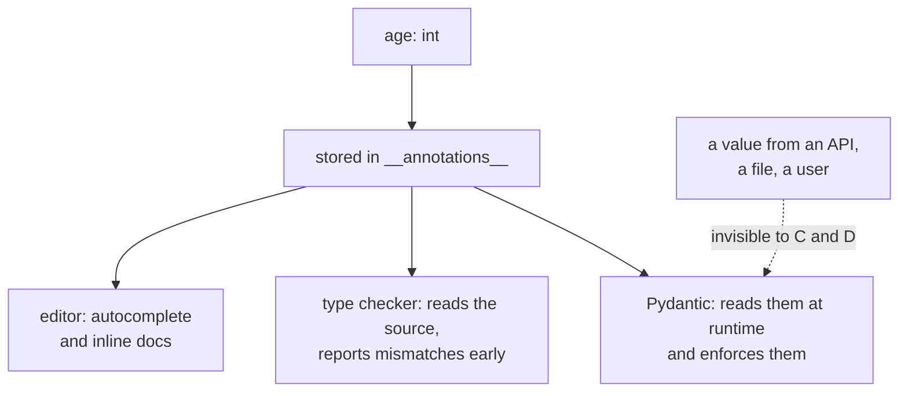

#python #type-hints #typing #validation #python-utils


Three terms that get used as if they meant the same thing, and don't. They all involve types, but they happen at different times, are performed by different things, and one of them is not enforcement at all.

- **Type hinting** — writing down what you expect. Happens as you type. Enforces nothing.
- **Type checking** — a separate tool reading those hints and complaining, *before* the code runs.
- **Data validation** — code that actually inspects values *while* running, and can stop the program.

Getting these straight is worth doing once, because almost every confusion about Pydantic and FastAPI traces back to blurring the first and third.

## The example

```python
def create_user(first_name, last_name, age):
    email = f'{first_name}.{last_name}@email.com'
    return {
        'first_name': first_name,
        'last_name': last_name,
        'age': age,
        'email': email,
    }
```

Nothing here says what those parameters should be. A reader has to infer it from the body, and an editor can't help you at all.

## 1. Type hinting

Annotations go after a colon on each parameter, and after `->` for the return:

```python
def create_user(first_name: str, last_name: str,age: int) -> dict:
    email = f'{first_name}.{last_name}@email.com'
    return {...}
```

Variables can carry them too:

```python
user: dict = create_user('John', 'Smith', 38)
```

**That last one is a trade-off rather than a free win** — it states the type at the point you read it, but now there are two places to update if the function's return type changes. Annotating obvious assignments (`email: str = f'...'`) mostly adds noise; function parameters and return types are where hints earn their keep.

The payoff is real but indirect: the function documents itself, and your editor can autocomplete on `age` knowing it's an `int`.

> [!important] **Python does not enforce annotations. At all.** This is the single fact everything else rests on, so it's worth seeing rather than being told:
> ```python
> user = create_user('John', 'Smith', '38')
> print(user['age'])                 # 38
> print(type(user['age']).__name__)  # str
> ```
> No error, no warning. And it isn't a near-miss that Python tolerates — the hints can be violated completely:
> ```python
> create_user(1, 2, [1, 2, 3])
> # {'first_name': 1, 'last_name': 2,
> #  'age': [1, 2, 3], 'email': '1.2@email.com'}
> ```
> A list where an `int` was declared, and the function runs to completion.

### Where the hints go

The hints aren't discarded. They're stored — and knowing exactly *where* is what makes the next two sections make sense.

Start with the fact underneath: **a function is an object.** `def` doesn't create some special interpreter construct; it builds a value sitting in memory, the same way `[1, 2]` does, and points a name at it. Because it's an ordinary object, things can be attached to it:

```python
print(create_user)              # <function create_user at 0x102b70cc0>
print(type(create_user))        # <class 'function'>
print(create_user.__name__)     # create_user

create_user.owner = 'laxya'     # attach anything you like
print(create_user.owner)        # laxya
```

`__annotations__` is one more attribute hanging off that object, no different in kind from `__name__`:

```python
print(create_user.__annotations__)
# {'first_name': <class 'str'>, 'last_name': <class 'str'>,
#  'age': <class 'int'>, 'return': <class 'dict'>}
```

Parameter names become the keys; the return annotation gets the special key `'return'`.

### What `<class 'str'>` actually is

Not a description of the parameter, and not the word "str". It is **the `str` class itself** — the same object you call when you write `str(38)`:

```python
a = create_user.__annotations__

print(a['first_name'] is str)   # True   ← the same object, not a copy
print(a['first_name'](38))      # '38'   ← so it can be called
```

`str` is a name pointing at a class object, exactly as `Employee` is a name pointing at a class object once you've written `class Employee:`. `<class 'str'>` is simply how Python prints such an object — the same convention as `<function create_user at 0x...>` above.

### Python files it away without looking at it

Here is the complete behaviour: **whatever you write after the colon, Python evaluates it and files the result under that parameter's name. Then it stops.** There is no step that asks whether the thing you wrote is a sensible type.

```python
def nonsense(x: 'banana', y: 12345) -> ['not', 'a', 'type']:
    return x

print(nonsense.__annotations__)
# {'x': 'banana', 'y': 12345, 'return': ['not', 'a', 'type']}

print(nonsense(999, 'whatever'))   # 999
```

`'banana'` is not a type. `12345` is not a type. Python filed all three and the function runs normally. Write `x: 2 + 2` and the dictionary will hold `4`.

So `x: str` and `y: 'banana'` sit side by side in one dictionary holding two entirely different kinds of value — a class and a string — and Python distinguishes them not at all.

> [!important] The difference between `str` and `'banana'` is not a difference **Python** knows about. It matters only to whoever reads that dictionary afterwards — and Python is not one of those readers.

### The dictionary is built, not stored

One more property, and the next section turns on it: `__annotations__` exists **only while your program is running.**

The file on your disk holds nothing but characters:

```
d   e   f       c   r   e   a   t   e   _   u   s   e   r   (
f   i   r   s   t   _   n   a   m   e   :       s   t   r   )
```

No dictionary, no `<class 'str'>` — a colon, a space, and three letters. The dict is *manufactured* from those letters when the `def` line executes, and discarded when the process exits. Run the same file three times and you get three different dictionaries at three different addresses in memory.

And `def` genuinely is an instruction that runs, not a declaration the interpreter reads ahead:

```python
def outer():
    def inner(x: str) -> bool:
        return True
    return inner
```

Until `outer()` is actually called, that inner `def` never executes — so no function object is created and no annotations dictionary is created, even though the annotation sits there in the source in plain sight.

So: annotations are **metadata**, meaning data *about* your code rather than data your code uses. `__annotations__` is where that metadata lives at runtime. It is not, as it's tempting to assume, the one channel every tool reads — the next section is a tool that never touches it.

## 2. Type checking

A static type checker is a separate program that reads your source — without running it — and reports where the values flowing through don't match the declared types. `mypy` is the reference implementation; `pyright` is what VS Code's Pylance runs; there are newer ones.

Given the bad call above, a checker reports something of this form:

```
error: Argument 3 to "create_user" has incompatible
type "str"; expected "int"
```

Two things about this are easy to miss and both matter.

**It requires hints to have anything to say.** On the unannotated version at the top of this note, a checker has no basis for an opinion. Hints and checking are separate steps — writing hints doesn't check them, and there's no checking without hints.

**It does not stop the code from running.** The error appears in your editor or terminal; `python script.py` runs exactly as before. Static analysis is advice delivered early, not a gate.

> [!warning] **A checker can only reason about what it can see in the source.** It knows `create_user('John', 'Smith', '38')` is wrong because the literal `'38'` is right there.
>  It has no idea what arrives from an HTTP request, a JSON file, a database row, or `input()` — those values don't exist until runtime. Every claim a static checker makes stops at the program's boundary, which is precisely where bad data comes from.

## 3. Data validation

That boundary is what validation is for: checking actual values, at runtime, with the ability to reject them.

It has nothing to do with type hints in principle — it long predates them, and the manual version is just code:

```python
def create_user(first_name, last_name, age):
    if not isinstance(first_name, str):
        raise TypeError('first_name must be a str')
    if not isinstance(last_name, str):
        raise TypeError('last_name must be a str')
    if not isinstance(age, int):
        raise TypeError('age must be an int')
    ...
```

```python
create_user('John', 'Smith', '38')
# TypeError: age must be an int
```

That genuinely stops the program. It's also nine lines of boilerplate for three parameters, repeated in every function that takes external input, and the error messages are whatever you remembered to write.

Since the hints already say what the types should be, a library can read them and do this for you. Pydantic's `validate_call` is one decorator:

```python
from pydantic import validate_call

@validate_call
def create_user(first_name: str, last_name: str,
                age: int) -> dict:
    email = f'{first_name}.{last_name}@email.com'
    return {...}
```

```python
create_user('John', 'Smith', 'thirty-eight')
```

```
1. validation error for create_user

2. Input should be a valid integer, unable to parse string as an integer [type=int_parsing, input_value='thirty-eight', input_type=str]
```

Which parameter failed, what was expected, what actually arrived, and a machine-readable error code — none of it hand-written.

> [!info] **Validation is not the same as type-matching, and Pydantic's default behaviour makes that obvious.** The string `'38'` is *accepted* and converted:
> ```python
> user = create_user('John', 'Smith', '38')
> print(type(user['age']).__name__)   # int
> ```
> That's coercion, and it's usually what you want at a boundary — an HTTP query string or a CSV cell is text, and `'38'` plainly means the number. When it isn't what you want, strict mode turns it off:
> ```python
> from pydantic import ConfigDict
>
> @validate_call(config=ConfigDict(strict=True))
> def create_user(age: int) -> int:
>     return age
> ```
> ```python
> create_user('38')
> # Input should be a valid integer
> # [type=int_type, input_value='38', input_type=str]
> ```

Validation also reaches past types entirely, into values. `-5` is a perfectly good `int`, so a type checker has no complaint about it and never will — but whether it's a plausible *age* is a question about the value, and only answerable once a value exists. Ranges, formats, non-empty strings: that whole category belongs to validation alone, and how it's expressed is `09-Pydantic`'s subject.

> [!warning] `@validate_call` validates **arguments**, not the return value, despite the `-> dict` annotation sitting right there:
> ```python
> @validate_call
> def f(x: int) -> str:
>     return x * 2
>
> print(repr(f(5)))   # 10  ← an int, annotated str
> ```
> Opt in explicitly if you want it checked:
> ```python
> @validate_call(validate_return=True)
> def f(x: int) -> str:
>     return x * 2
>
> f(5)
> # ValidationError: Input should be a valid string
> # [type=string_type, input_value=10, input_type=int]
> ```

## Side by side

| | When | Who does it | Can it stop you? |
|---|---|---|---|
| Type hinting | as you write | nobody — it's metadata | no |
| Type checking | before running | an external tool (mypy, pyright) | no — it warns |
| Data validation | while running | your code, or a library | **yes** — raises |



## What to actually use

**Hints: yes, moving forward.** They cost nothing at runtime and pay for themselves in editor support alone. Adding them to an existing codebase is incremental — annotate the function you're already touching, leave the rest, commit. There is no need for an overhaul.

**A checker: yes, wired into your editor.** The value is the feedback loop — a mismatch flagged as you type is enormously cheaper than one found by a test, or by production.

**Validation: only at boundaries.** This is the one people overdo. Where data comes from outside the program — API payloads, request bodies, config files, environment variables, user input — validate it, because that's where a static checker is blind and where bad data actually enters. Where you're calling your own function with a literal you can see three lines above, validation is overhead protecting you from a mistake the checker already caught.

The rule of thumb worth keeping: **hints describe intent, checkers verify the code you wrote, validation guards the data you didn't write.** They aren't alternatives, and needing one doesn't mean needing all three.
