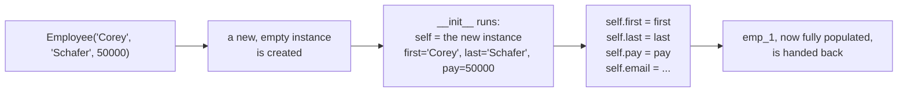
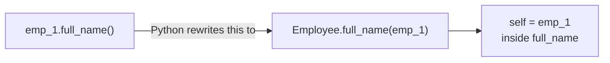

#python #oop #classes #python-utils


A function bundles logic. A class bundles logic *and* data that belong together — so instead of separate variables and functions that all secretly refer to "one employee," you get a single thing that carries its own data and its own actions. The data on a class is called an **attribute**; a function that belongs to a class is called a **method**.

## A class is a blueprint, not a thing

Defining a class creates nothing you can use yet — just a template:

```python
class Employee:
    pass
```

`pass` is Python's "nothing goes here yet" — a class or function body can't be empty syntactically, so `pass` fills it.

Each time you call the class, you get a distinct object called an **instance**:

```python
emp_1 = Employee()
emp_2 = Employee()

print(emp_1)   # <__main__.Employee object at 0x102c6dd30>
print(emp_2)   # <__main__.Employee object at 0x102c1b250>
```

Different addresses — two separate objects, both built from the same blueprint. This is the distinction worth being precise about early: `Employee` is the class; `emp_1` and `emp_2` are instances *of* that class.

## The manual way — and why it doesn't scale

An instance can be handed attributes directly, one at a time:

```python
emp_1.first = 'Corey'
emp_1.last = 'Schafer'
emp_1.email = 'Corey.Schafer@company.com'
emp_1.pay = 50000

emp_2.first = 'Test'
emp_2.last = 'User'
emp_2.email = 'Test.User@company.com'
emp_2.pay = 60000
```

This works — `emp_1.email` prints exactly what you'd expect. But look at what it costs: four lines per employee, every one of them copy-pasted and hand-edited, and nothing stops you from mistyping `emp_2` as `emp_1` on line five and silently overwriting the first employee's data instead of setting up the second. That's not a hypothetical — it's the single easiest mistake to make with this pattern, precisely because the four lines all look alike.

The class isn't earning its keep yet. All it did here was give two unrelated bags of attributes a shared type.

## `__init__` — set attributes at creation time

`__init__` is a method that **runs automatically the moment an instance is created**. Define it, and the four manual lines above collapse into passing arguments to the class itself:

```python
class Employee:
    def __init__(self, first, last, pay):
        self.first = first
        self.last = last
        self.pay = pay
        self.email = f'{first}.{last}@company.com'
```

```python
emp_1 = Employee('Corey', 'Schafer', 50000)
emp_2 = Employee('Test', 'User', 60000)

print(emp_1.email)   # Corey.Schafer@company.com
print(emp_2.email)   # Test.User@company.com
```

Same result as the manual version, but the four assignments now live in **one place**, run **once per instance, automatically**, and can't be forgotten or mistyped per-employee the way the copy-pasted version could.

## `self` — the piece that makes this work

`__init__` isn't called directly, and its first parameter isn't something you pass. When you write `Employee('Corey', 'Schafer', 50000)`, Python:

1. creates a new, empty instance,
2. calls `__init__` on it, automatically passing that new instance in as the **first** argument,
3. and only then lines up `'Corey'`, `'Schafer'`, `50000` against the *remaining* parameters.

That automatically-supplied first argument is conventionally named `self` — nothing forces the name, but every Python codebase you'll ever read uses it, so deviating buys you nothing but confusion.



So `self.first = first` inside `__init__` is doing exactly what `emp_1.first = 'Corey'` did by hand earlier — `self` *is* the instance being built, under a generic name, because `__init__` is written once and has to work for every future instance, not just `emp_1`.

## Methods — attributes are data, methods are actions

An attribute answers "what does this employee *have*." A method answers "what can this employee *do*." Add one to compute the full name instead of writing the same string-join everywhere it's needed:

```python
class Employee:
    def __init__(self, first, last, pay):
        self.first = first
        self.last = last
        self.pay = pay
        self.email = f'{first}.{last}@company.com'

    def full_name(self):
        return f'{self.first} {self.last}'
```

```python
print(emp_1.full_name())   # Corey Schafer
```

Two things stand out immediately once you compare this to `__init__`:

- **Every method takes `self` as its first parameter**, the same automatic instance-passing as before. Inside `full_name`, `self.first` and `self.last` mean *this particular employee's* first and last name — which is exactly why the method works correctly no matter which instance calls it.
- **The parentheses are load-bearing.** `emp_1.full_name` (no parentheses) is the method itself — Python shows it as `<bound method Employee.full_name of <...>>`, the same "this is an object, not a result" distinction that runs through everything before decorators in this vault. `emp_1.full_name()` is the call, and only the call produces the string.

### The mistake this section exists to prevent

Leave `self` off a method definition:

```python
def full_name():          # forgot self
    return f'{self.first} {self.last}'
```

```python
emp_1.full_name()
```

```
TypeError: Employee.full_name() takes 0 positional
arguments but 1 was given
```

That error is genuinely confusing on first read — the call *looks* like it passes nothing. But it doesn't pass nothing: calling a method **through an instance** (`emp_1.full_name()`) always sends `emp_1` in as the first argument, whether or not the method's definition asked for it. The method here declared zero parameters, and one arrived anyway. Put `self` back and the mismatch disappears.

## What `instance.method()` is actually short for

`emp_1.full_name()` can also be written by going through the class directly, passing the instance in by hand:

```python
Employee.full_name(emp_1)   # Corey Schafer — identical result
```

These two calls are not merely similar — the first is *syntactic sugar* for the second. `emp_1.full_name()` is Python automatically rewriting itself into `Employee.full_name(emp_1)` at call time: find `full_name` on the class, and pass the instance you called it from as `self`. Calling through the class only feels different because you're doing manually what `.method()` syntax does invisibly.



This detail earns its place here — not because you'll write `Employee.full_name(emp_1)` in real code, but because inheritance later depends on knowing that a method call is always, underneath, *the class's function, with the instance supplied as the first argument*.
