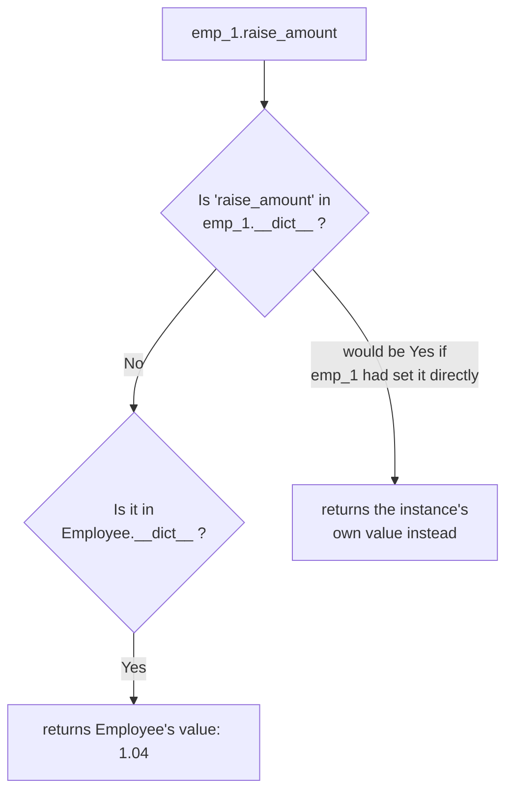

#python #oop #classes #python-utils


Every attribute in the last note lived on `self` — set inside `__init__`, different for every instance. That covers data that genuinely varies per employee: name, pay, email. Some data doesn't vary at all — it belongs to the **class**, not to any one instance of it.

## Hardcode it first, then see why that's wrong

Say the company gives an annual raise, and the raise percentage is the same for every employee. A first pass might bury the number directly inside the method that uses it:

```python
class Employee:
    def __init__(self, first, last, pay):
        self.first = first
        self.last = last
        self.pay = pay
        self.email = f'{first}.{last}@company.com'

    def apply_raise(self):
        self.pay = int(self.pay * 1.04)
```

```python
emp_1 = Employee('Corey', 'Schafer', 50000)
emp_1.apply_raise()
print(emp_1.pay)   # 52000
```

It works. But `1.04` is now trapped inside `apply_raise`, invisible from anywhere else. Two real problems fall out of that: there's no way to **read** the current raise percentage (`emp_1.raise_amount` doesn't exist), and if the number ever changes, you're hunting through every method that happens to reference it — with no guarantee you'll find every copy.

## Pulling it out as a class variable

A class variable is declared directly in the class body, not inside any method:

```python
class Employee:
    raise_amount = 1.04

    def __init__(self, first, last, pay):
        self.first = first
        self.last = last
        self.pay = pay
        self.email = f'{first}.{last}@company.com'

    def apply_raise(self):
        self.pay = int(self.pay * self.raise_amount)
```

Now the number has one home, and it's readable from three places:

```python
print(emp_1.raise_amount)      # 1.04 — through an instance
print(Employee.raise_amount)   # 1.04 — through the class
print(emp_2.raise_amount)      # 1.04 — through a different instance
```

> [!warning] Just writing `raise_amount` bare inside `apply_raise` (no `self.` or `Employee.` in front) raises `NameError: name 'raise_amount' is not defined`. A class variable isn't a name floating in scope — it's an attribute that lives on the class object, and like any attribute it has to be reached through something: the class itself, or an instance.

## Why an instance can read a variable it doesn't own

`emp_1.raise_amount` working is the detail worth stopping on, since `emp_1` never set that attribute — only `Employee` did. The rule underneath it:

> [!info] Looking up `instance.attribute` checks the **instance's own namespace first**. Only if it isn't found there does Python fall back to checking the **class**. `raise_amount` isn't in `emp_1`'s namespace, so the lookup falls through to `Employee`'s — which is where it lives.

You can see this directly. `emp_1.__dict__` is the instance's own private namespace — exactly what it holds, nothing inherited:

```python
print(emp_1.__dict__)
# {'first': 'Corey', 'last': 'Schafer', 'pay': 50000, 'email': '...'}
```

No `raise_amount` in there at all. It only shows up in the class's own namespace:

```python
print('raise_amount' in Employee.__dict__)   # True
```



### What `__dict__` actually holds

It's tempting to read `emp_1.__dict__` as **everything about this employee** — every attribute **and** every method. It isn't. It holds **only what this one instance personally owns**, which means the things assigned to `self` inside `__init__`, and nothing else:

```python
print('full_name'    in emp_1.__dict__)   # False
print('raise_amount' in emp_1.__dict__)   # False
```

The method and the class variable are both missing, because neither belongs to the instance. They live on the class:

```python
print([k for k in Employee.__dict__
       if not k.startswith('__')])
# ['raise_amount', 'full_name']
```

So `emp_1.full_name()` and `emp_1.raise_amount` both work by exactly the same fallthrough this section just described — miss on the instance, find it on the class. Methods aren't a special case; they're class attributes that happen to be functions.

It's a live namespace rather than a snapshot, too. Attach something after the fact and it appears:

```python
emp_1.nickname = 'Coz'
print(emp_1.__dict__)
# {'first': 'Corey', ..., 'nickname': 'Coz'}
```

If what you actually want is **everything reachable through the instance** — its own attributes plus everything it inherits from the class — that's a different tool, `dir()`:

```python
print([n for n in dir(emp_1)
       if not n.startswith('_')])
# ['email', 'first', 'full_name', 'last',
#  'nickname', 'pay', 'raise_amount']
```

| | Shows |
|---|---|
| `emp_1.__dict__` | what this instance owns — a real, editable dict |
| `Employee.__dict__` | what the class owns: class variables and methods |
| `dir(emp_1)` | every name reachable through it, wherever it lives |

That first row is why `__dict__` is the right tool for this section specifically. `dir()` merges the two namespaces and so can never tell you **where** a name came from — but the whole question of shadowing, coming up next, is precisely a question about where a value lives.

## Setting it through the class vs. through an instance — these are not the same operation

```python
Employee.raise_amount = 1.05
print(emp_1.raise_amount, emp_2.raise_amount)   # 1.05 1.05
```

Setting it on the class changes what **every** instance sees, because they were never storing their own copy — they were all falling through to the one shared value.

```python
emp_1.raise_amount = 1.06
print(emp_1.raise_amount, emp_2.raise_amount)   # 1.06 1.05
```

This one surprises people. Assigning `emp_1.raise_amount = 1.06` does **not** reach into the class and change the shared value — it **creates a brand-new attribute inside `emp_1`'s own namespace**, which now shadows the class variable for that instance only:

```python
print(emp_1.__dict__)
# {..., 'raise_amount': 1.06}   ← now present, wasn't before
```

`emp_1` now finds `raise_amount` at step one of the lookup (its own `__dict__`) and never falls through to the class. `emp_2` never got its own copy, so it still falls through and sees the class's `1.05`.

> [!important] Reading and writing through an instance are asymmetric. **Reading** `instance.attr` transparently falls through to the class if the instance doesn't have its own copy. **Writing** `instance.attr = value` never edits the class — it unconditionally creates or overwrites an attribute on that one instance, permanently breaking its connection to the shared value from then on.

That asymmetry is exactly why `apply_raise` uses `self.raise_amount` rather than `Employee.raise_amount`: writing it as `self.` means a single instance's raise percentage **can** be overridden later (`emp_1.raise_amount = 1.10`) without disturbing anyone else, and — as a bonus this note only names, without covering — it also means a subclass can override the constant for every instance of **its** type. `Employee.raise_amount` inside the method would ignore both possibilities and always use the one shared number no matter what.

## A class variable with no reason to ever be per-instance

The raise amount is a case where overriding per-instance is a genuine, if rare, use case. Contrast that with counting how many employees exist in total — there's no meaningful sense in which one instance should see a different count than another, so this one should never be written through `self`:

```python
class Employee:
    num_of_employees = 0
    raise_amount = 1.04

    def __init__(self, first, last, pay):
        self.first = first
        self.last = last
        self.pay = pay
        self.email = f'{first}.{last}@company.com'
        Employee.num_of_employees += 1
```

`__init__` runs exactly once per instance created, which makes it the natural place to increment a running total:

```python
print(Employee.num_of_employees)   # 0

emp_1 = Employee('Corey', 'Schafer', 50000)
emp_2 = Employee('Test', 'User', 60000)

print(Employee.num_of_employees)   # 2
```

`Employee.num_of_employees += 1` is written through the class name deliberately. Had it been `self.num_of_employees += 1`, the read side would still fall through to the class (finding `0`), but the **write** would create a fresh instance attribute — same shadowing trap as the raise example — and the class's true count would never move past `0` no matter how many employees were created.

> [!tip] The choice between `self.attr` and `ClassName.attr` inside a method isn't stylistic. It's a decision about whether this particular piece of data is allowed to vary per instance (`self.` — the raise) or must stay identical for the whole class no matter what any instance does (`ClassName.` — the count).
