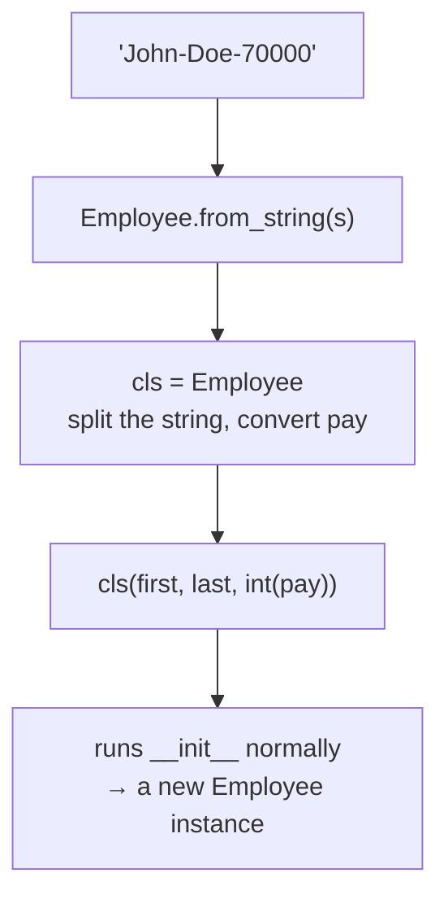

#python #oop #classes #python-utils


A regular method automatically receives the instance as its first argument — that's `self`. Two decorators change **what** gets automatically passed instead: `@classmethod` swaps it for the class, and `@staticmethod` passes nothing at all.

## `@classmethod` — receives the class instead of an instance

```python
class Employee:
    raise_amount = 1.04

    def __init__(self, first, last, pay):
        self.first = first
        self.last = last
        self.pay = pay
        self.email = f'{first}.{last}@company.com'

    @classmethod
    def set_raise_amount(cls, amount):
        cls.raise_amount = amount
```

`cls` plays the same role for a classmethod that `self` plays for a regular method — a name supplied automatically, not something the caller passes. It's called `cls` rather than `self` purely by convention, and it **has** to avoid the literal word `class`, since that's a reserved keyword in Python (it's what starts a class definition in the first place).

```python
emp_1 = Employee('Corey', 'Schafer', 50000)
emp_2 = Employee('Test', 'User', 60000)

Employee.set_raise_amount(1.05)

print(Employee.raise_amount)   # 1.05
print(emp_1.raise_amount)      # 1.05
print(emp_2.raise_amount)      # 1.05
```

`Employee.set_raise_amount(1.05)` runs `cls.raise_amount = amount` with `cls` bound to `Employee` — which is exactly the same operation as writing `Employee.raise_amount = 1.05` by hand. The classmethod doesn't do anything a direct assignment couldn't; it gives that assignment a name and a place to live.

> [!info] A classmethod can technically be called from an instance too — `emp_1.set_raise_amount(1.10)` works, and it still updates the **class** variable, changing it for every instance. It works because Python still resolves `cls` to `Employee`, not to `emp_1` — an instance is only ever used to **find** the class it belongs to. It's legal, rarely useful, and rarely seen in practice; call classmethods through the class name.

## The main use: an alternative constructor

The single most common reason to reach for `@classmethod` isn't the case above — it's building a **second way to construct an object** out of data that doesn't come in the shape `__init__` expects.

Say employee data sometimes arrives as one hyphen-separated string instead of three separate values:

```python
emp_str_1 = 'John-Doe-70000'
```

Without help, every caller has to parse it themselves before they can build an `Employee`:

```python
first, last, pay = emp_str_1.split('-')
new_emp = Employee(first, last, pay)
```

That's a chore to repeat everywhere this string format shows up, and every call site has to know the parsing logic. Move the parsing into the class itself as a classmethod:

```python
class Employee:
    ...
    @classmethod
    def from_string(cls, employee_string):
        first, last, pay = employee_string.split('-')
        return cls(first, last, int(pay))
```

```python
new_emp = Employee.from_string('John-Doe-70000')
print(new_emp.email)   # John.Doe@company.com
print(new_emp.pay)     # 70000
```

The line `return cls(first, last, int(pay))` is the whole idea. `cls` is `Employee`, so this is `Employee(first, last, int(pay))` — it runs `__init__` exactly as if you'd called the class directly, just with values that came from parsing a string instead of being typed in by hand.



> [!warning] **`int(pay)` is not optional, and leaving it out produces a bug that hides.** `split('-')` returns strings — **every** piece, including the pay. Without the conversion, `new_emp.pay` is the string `'70000'`, which prints indistinguishably from the number and passes every casual check. It only breaks later, somewhere else entirely:
> ```python
> new_emp.apply_raise()
> # TypeError: can't multiply sequence by
> # non-int of type 'float'
> ```
> Parsing is half an alternative constructor's job; **converting each piece to the type the class actually expects is the other half.** A constructor that hands back a subtly malformed instance is worse than one that refuses to build it.

Writing `cls(...)` instead of `Employee(...)` matters for one reason worth flagging even though this note doesn't cover inheritance yet: if a class is later subclassed, `cls` inside an inherited `from_string` correctly resolves to the **subclass**, while a hardcoded `Employee(...)` would always build a plain `Employee` regardless of which subclass called it.

> [!tip] This exact pattern is why `from_...` names show up throughout the standard library — `datetime.fromtimestamp(...)`, `dict.fromkeys(...)`. Any constructor-shaped classmethod that starts with `from_` is doing precisely what `from_string` does here: accept data in some other shape, and hand back `cls(...)` built from it.

## `@staticmethod` — receives neither

A staticmethod takes no automatic first argument at all — no `self`, no `cls`. It behaves exactly like a plain, ordinary function; the only reason to put it inside the class is that it's conceptually related to what the class does.

```python
import datetime

class Employee:
    ...
    @staticmethod
    def is_workday(day):
        if day.weekday() == 5 or day.weekday() == 6:
            return False
        return True
```

```python
my_date = datetime.date(2026, 8, 9)    # a Sunday
print(Employee.is_workday(my_date))    # False

my_date = datetime.date(2026, 8, 10)   # a Monday
print(Employee.is_workday(my_date))    # True
```

`is_workday` never touches `self` or `cls` — it only cares about the `day` it was handed. That's the signal to reach for `@staticmethod` in the first place:

> [!important] If a method never references `self` or `cls` anywhere in its body, it almost certainly shouldn't be a regular method or classmethod. That's the practical test — not **does this feel related to the class,** but **does the body actually use the instance or the class it would automatically receive.** If not, make it static.

## The three side by side

| | First argument | Called through |
|---|---|---|
| regular method | `self` — the instance | an instance |
| `@classmethod` | `cls` — the class | the class (or an instance, though that's unusual) |
| `@staticmethod` | nothing automatic | either — behaves like a plain function |

The decorator is what changes the automatic-argument behavior; nothing else about defining or calling the method is different.
