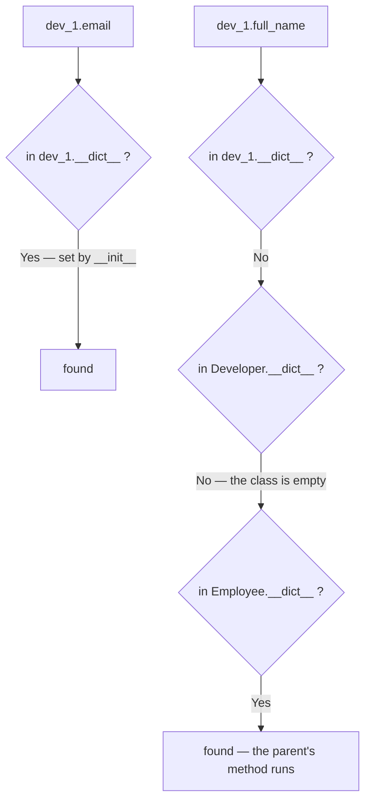
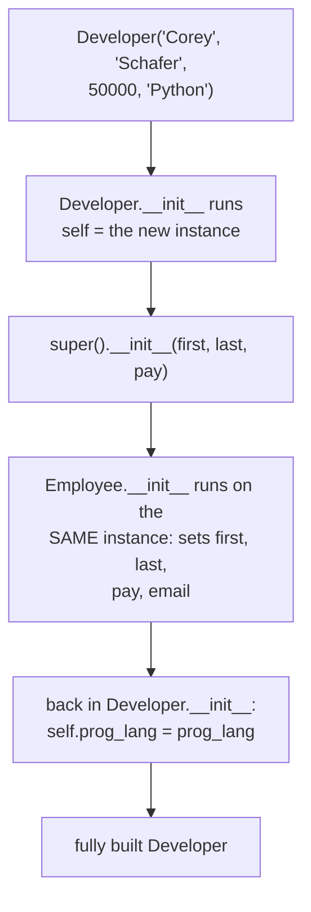
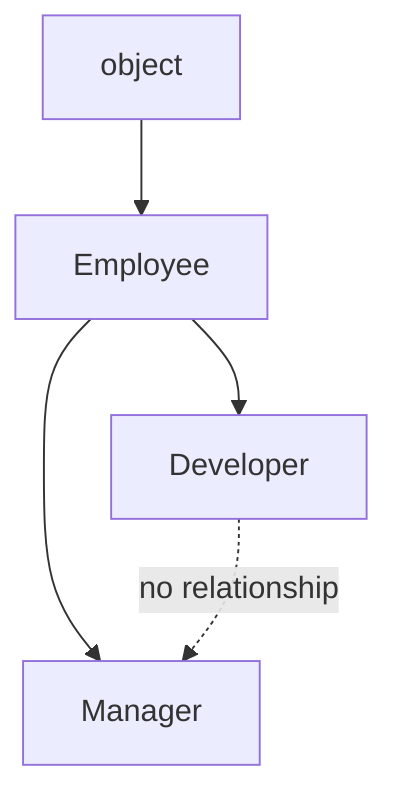

#python #oop #inheritance #python-utils


Three notes in, `Employee` handles one kind of person. Real organisations have several — developers, managers — and they overlap almost entirely: every one of them has a name, an email, and a salary. Inheritance is how you write the overlap once.

## The problem, stated concretely

Suppose you need a `Developer` that also tracks a programming language. Without inheritance, the only tool available is copy-paste:

```python
class Developer:
    raise_amount = 1.04

    def __init__(self, first, last, pay, prog_lang):
        self.first = first
        self.last = last
        self.pay = pay
        self.email = f'{first}.{last}@company.com'
        self.prog_lang = prog_lang

    def full_name(self):
        return f'{self.first} {self.last}'

    def apply_raise(self):
        self.pay = int(self.pay * self.raise_amount)
```

Every line except `prog_lang` is a character-for-character duplicate of `Employee`. Do the same for `Manager` and the email format now lives in three places. Change it in two of them and the third keeps quietly producing the old format — no error, no warning, just one class out of step.

## Inheriting: a subclass that adds nothing

Put the parent class in parentheses after the subclass name:

```python
class Developer(Employee):
    pass
```

That is the entire class. It defines no attributes and no methods of its own, and it already works:

```python
dev_1 = Developer('Corey', 'Schafer', 50000)
dev_2 = Developer('Test', 'User', 60000)

print(dev_1.email)        # Corey.Schafer@company.com
print(dev_1.full_name())  # Corey Schafer
```

`Developer` never defined `__init__`, never defined `full_name`, never mentioned `email` — and all three work. It got them from `Employee`.

## Where Python actually looks

Nothing was copied into `Developer` when it was defined. The subclass holds a reference to its parent, and attribute lookup **walks that chain at the moment you ask**, exactly the way the last note's instance-then-class lookup did — just with more steps.

You can print the chain:

```python
print(Developer.__mro__)
```

```
(<class '__main__.Developer'>,
 <class '__main__.Employee'>,
 <class 'object'>)
```

That's the **method resolution order** — the ordered list of places Python searches, first to last. `help(Developer)` prints the same list at the top of its output, along with which methods came from where, which makes it a good thing to reach for when a subclass behaves in a way you can't explain.



`object` at the end of the chain is Python's universal base class. Every class inherits from it whether you say so or not, which is where things like the default `<__main__.Employee object at 0x...>` display come from.

> [!info] The chain is searched **in order, and stops at the first hit**. That single sentence explains everything else in this note: a subclass customises the parent simply by defining a name the parent also defines, because the search reaches the subclass first and never gets any further.

## Overriding: change one value, leave the parent alone

Developers get a 10% raise instead of 4%. The whole change is one line in the subclass:

```python
class Developer(Employee):
    raise_amount = 1.10
```

```python
dev_1 = Developer('Corey', 'Schafer', 50000)
print(dev_1.pay)     # 50000
dev_1.apply_raise()
print(dev_1.pay)     # 55000

emp_1 = Employee('Plain', 'Person', 50000)
emp_1.apply_raise()
print(emp_1.pay)     # 52000 — still 4%
```

`apply_raise` was never touched, is still the parent's method, and now produces two different results depending on what called it.

> [!important] **This is the payoff for a decision made two notes ago.** `apply_raise` reads `self.raise_amount`, not `Employee.raise_amount`. `self` is a `Developer`, so the lookup starts at `Developer` and finds `1.10` there — the parent class is never consulted. Had the method been written `Employee.raise_amount`, it would have hardcoded the search to start at the parent, and no subclass could ever override it.

Note also which direction the influence flows. Setting `raise_amount` on `Developer` changes nothing for `Employee` or for any other subclass — a subclass can look at its parent, but a parent has no idea its subclasses exist. That one-way relationship is what makes it safe to specialise an existing class without auditing everything already using it.

## Extending `__init__` — accepting more than the parent does

A `Developer` should carry a programming language, and the parent's `__init__` has no room for one:

```python
Developer('Corey', 'Schafer', 50000, 'Python')
```

```
TypeError: Employee.__init__() takes 4 positional
arguments but 5 were given
```

Worth reading the class name in that message: the failure names `Employee.__init__`, because that is genuinely the method that ran. So the subclass needs an `__init__` of its own.

The tempting version copies the parent's four assignments and adds a fifth — and puts the email format back into two files. Instead, take the three arguments the parent already knows how to handle and **hand them to the parent**:

```python
class Developer(Employee):
    raise_amount = 1.10

    def __init__(self, first, last, pay, prog_lang):
        super().__init__(first, last, pay)
        self.prog_lang = prog_lang
```

```python
dev_1 = Developer('Corey', 'Schafer', 50000, 'Python')
print(dev_1.email)      # Corey.Schafer@company.com
print(dev_1.prog_lang)  # Python
```

`super()` means "the next class up the resolution order". So `super().__init__(first, last, pay)` calls `Employee.__init__` with this same instance, which sets `first`, `last`, `pay` and `email` on it — and only then does the subclass add the one attribute it actually cares about.



The same call can be written by naming the parent directly, passing the instance by hand — the sugar-free form from the first note:

```python
Employee.__init__(self, first, last, pay)
```

Both work identically here. `super()` is the one to reach for: it doesn't hardcode the parent's name, so renaming the parent or inserting a class into the middle of the chain doesn't require editing every subclass. The difference stops being cosmetic once a class inherits from more than one parent, where `super()` follows the resolution order and a hardcoded name can't.

> [!warning] **Forgetting `super().__init__(...)` does not raise anything.** The subclass constructs perfectly and only fails later, wherever the missing attributes are first touched:
> ```python
> def __init__(self, first, last, pay, prog_lang):
>     self.prog_lang = prog_lang   # no super() call
> ```
> ```python
> d = Developer('Corey', 'Schafer', 50000, 'Python')
> print(d.prog_lang)   # Python — looks fine
> print(d.email)
> # AttributeError: 'Developer' object has
> # no attribute 'email'
> ```
> Defining `__init__` in a subclass **replaces** the parent's rather than adding to it — same first-hit-wins rule as `raise_amount`. If the parent's set-up still needs to happen, the subclass has to ask for it explicitly.

## A subclass with behaviour of its own

`Developer` only tweaked what it inherited. A `Manager` adds something genuinely new — a list of employees it supervises, and methods to manage that list:

```python
class Manager(Employee):
    def __init__(self, first, last, pay, employees=None):
        super().__init__(first, last, pay)
        if employees is None:
            self.employees = []
        else:
            self.employees = list(employees)

    def add_employee(self, emp):
        if emp not in self.employees:
            self.employees.append(emp)

    def remove_employee(self, emp):
        if emp in self.employees:
            self.employees.remove(emp)

    def print_employees(self):
        for emp in self.employees:
            print('-->', emp.full_name())
```

```python
dev_1 = Developer('Corey', 'Schafer', 50000, 'Python')
dev_2 = Developer('Test', 'User', 60000, 'Java')

mgr_1 = Manager('Sue', 'Smith', 90000, [dev_1])

print(mgr_1.email)      # Sue.Smith@company.com
mgr_1.print_employees()
# --> Corey Schafer

mgr_1.add_employee(dev_2)
mgr_1.print_employees()
# --> Corey Schafer
# --> Test User

mgr_1.remove_employee(dev_1)
mgr_1.print_employees()
# --> Test User
```

`mgr_1.email` still comes from `Employee`; everything else is `Manager`'s own. That's the shape worth recognising — the parent supplies what all employees share, the subclass supplies only what makes this kind different.

Two details in that `__init__` are deliberate, and both are easy to get wrong.

> [!warning] **Never use a mutable default like `employees=[]`.** The default value is created **once**, when the `def` line is executed — not per call. Every manager built without an explicit list would then share the same list object:
> ```python
> def __init__(self, first, last, pay, employees=[]):
>     ...
>     self.employees = employees
> ```
> ```python
> m1 = Manager('Sue', 'Smith', 90000)
> m1.employees.append(dev_1)
>
> m2 = Manager('Bob', 'Jones', 90000)
> print(m2.employees)
> # [<__main__.Developer object at 0x...>]
> print(m1.employees is m2.employees)   # True
> ```
> Bob supervises someone he was never given. `None` as the default plus a fresh `[]` inside the body is the fix, because the body runs on every call. The same trap applies to dicts and sets, and to any function — this isn't specific to classes.

> [!tip] `list(employees)` rather than a bare `employees` is the second detail. Assigning the argument directly stores *the caller's own list*, so `add_employee` would reach out and modify a list the caller still holds:
> ```python
> team = [dev_1]
> mgr = Manager('Sue', 'Smith', 90000, team)
> mgr.add_employee(dev_2)
> print(len(team))   # 2 — the caller's list grew
> ```
> `list(...)` copies it, so the manager owns its own list from the start. Take a copy whenever a collection is passed in and then mutated.

## Asking about the family tree

Two built-ins answer questions about the chain rather than walking it. `isinstance` asks whether an object is an instance of a class — counting inherited types:

```python
print(isinstance(mgr_1, Manager))     # True
print(isinstance(mgr_1, Employee))    # True
print(isinstance(mgr_1, Developer))   # False
```

`issubclass` asks the same question one level up, about classes rather than instances:

```python
print(issubclass(Developer, Employee))   # True
print(issubclass(Manager, Employee))     # True
print(issubclass(Manager, Developer))    # False
```

Both `False` results come from the same fact: `Developer` and `Manager` each inherit from `Employee`, but neither appears in the other's resolution order. Sharing a parent doesn't make two classes related to each other.



Read those two functions as "is this name anywhere in the chain above?" — which is exactly the question the attribute lookup at the top of this note is answering every time you touch an attribute.

## Why this matters beyond employees

The pattern shows up most visibly in exception hierarchies. A library defines one base exception carrying all the shared machinery, then defines a subclass per error case that overrides a status code and a description and inherits everything else — often a two-line class body per error. Catching the base class catches every one of them at once, precisely because `isinstance` walks the chain.

That is the argument for inheritance in one sentence: shared behaviour is written and maintained in one place, and each specialisation costs only the lines where it genuinely differs.
