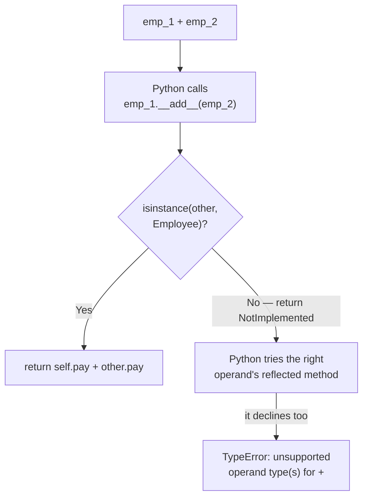

#python #oop #dunder #python-utils


Every method so far was one you call by name — `emp_1.full_name()`, `mgr_1.add_employee(...)`. Special methods are the other kind: you never call them directly, and Python calls them for you when something happens to your object. Printing it. Adding it to something. Asking its length.

They're written with two underscores on each side, which is why people say **dunder** — **double underscore**. `__init__` is one you already use: nothing in your code ever calls it, yet it runs every time an instance is created.

## The problem these solve

Print an instance and you get nothing useful:

```python
emp_1 = Employee('Corey', 'Schafer', 50000)
print(emp_1)
```

```
<__main__.Employee object at 0x102a25d30>
```

The class name and a memory address. That's the default `object` behaviour inherited by every class that doesn't say otherwise — technically accurate, useless in a log file, and actively annoying in a debugger.

## Two representations, because there are two audiences

Python asks for a string in two different situations, and they want different things:

- **`__repr__`** — unambiguous, aimed at **you**. What you want in a traceback, a log line, or the REPL.
- **`__str__`** — readable, aimed at whoever ends up seeing the output.

A good habit for `__repr__` is to return something you could **paste back into Python to recreate the object**:

```python
class Employee:
    def __init__(self, first, last, pay):
        self.first = first
        self.last = last
        self.pay = pay
        self.email = f'{first}.{last}@company.com'

    def full_name(self):
        return f'{self.first} {self.last}'

    def __repr__(self):
        return (f"Employee({self.first!r}, "
                f"{self.last!r}, {self.pay!r})")
```

```python
print(emp_1)
# Employee('Corey', 'Schafer', 50000)
```

That output is character-for-character the call that built the object.

> [!tip] **`!r` inside the f-string is doing real work — don't hand-write the quotes.** `{self.first!r}` means **insert the repr of this value**, which for a string includes its quotes, chosen correctly. Writing `'{self.first}'` with quotes typed in by hand looks equivalent and breaks on the first name containing an apostrophe:
> ```python
> # hand-written quotes, name is O'Brien:
> Employee('O'Brien', 'Schafer', 50000)   # not valid Python
>
> # with !r:
> Employee(**O'Brien**, 'Schafer', 50000)   # correct
> ```
> `!r` also renders the number without quotes and would show a `None` as `None` rather than as empty space — it picks the right form per value instead of assuming everything is a string.

Now `__str__`, which is free to be whatever reads best:

```python
    def __str__(self):
        return f'{self.full_name()} - {self.email}'
```

```python
print(emp_1)
# Corey Schafer - Corey.Schafer@company.com
```

Adding `__str__` changed what `print` shows, without touching `__repr__`:

```python
print(str(emp_1))    # Corey Schafer - Corey.Schafer@company.com
print(repr(emp_1))   # Employee('Corey', 'Schafer', 50000)
```

`str()` and `repr()` are the built-in functions; calling `emp_1.__str__()` and `emp_1.__repr__()` directly gives identical results, since that is all the built-ins do. Nobody writes it that way — but seeing it once makes the mechanism concrete: `str(x)` is a **request** that gets forwarded to a method on `x`.

### Which one gets used where

```python
print(emp_1)      # __str__
f'{emp_1}'        # __str__
f'{emp_1!r}'      # __repr__
str(emp_1)        # __str__
repr(emp_1)       # __repr__
[emp_1]           # __repr__  ← containers always use repr
```

That last line is the one that catches people:

```python
print([emp_1])
# [Employee('Corey', 'Schafer', 50000)]
```

Printing a **list** of employees does not use `__str__` at all. A container prints the `repr` of its contents, on the reasoning that if you're looking at a collection you're probably debugging.

> [!important] **If you only write one, write `__repr__`.** With `__repr__` alone, `str()` and `print()` fall back to it, so everything is covered. With `__str__` alone, `repr()` and containers still show `<__main__.Employee object at 0x...>` — so the exact places you most need a useful string are the ones left broken.

## Operator overloading — `__add__`

The `+` operator already behaves differently depending on what it's given:

```python
print(1 + 2)       # 3   — arithmetic
print('a' + 'b')   # ab  — concatenation
```

That isn't a special case built into `+`. `+` does one thing: it asks the left operand's `__add__` method to handle it.

```python
print(int.__add__(1, 2))       # 3
print(str.__add__('a', 'b'))   # ab
```

Two different `__add__` methods, two different behaviours, one operator. Your classes get to join in — which is also why adding two employees fails until you say what it should mean:

```python
emp_1 + emp_2
```

```
TypeError: unsupported operand type(s) for +:
'Employee' and 'Employee'
```

Define `__add__` and the error goes away. `self` is the left operand, `other` is the right:

```python
    def __add__(self, other):
        if not isinstance(other, Employee):
            return NotImplemented
        return self.pay + other.pay
```

```python
print(emp_1 + emp_2)   # 110000
```

> [!warning] **The type check is not optional.** Without it, `__add__` reaches for `other.pay` on whatever it was handed, and a wrong operand produces an error that points at the wrong thing entirely:
> ```python
> emp_1 + 5
> # AttributeError: 'int' object has no attribute 'pay'
> ```
> That message blames the integer for not being an employee. Returning `NotImplemented` instead produces the honest one:
> ```python
> emp_1 + 5
> # TypeError: unsupported operand type(s) for +:
> # 'Employee' and 'int'
> ```
> `NotImplemented` is a signal, not an error — it means **I can't handle this, ask the other operand**. Python then tries the right operand's reflected method, and only raises `TypeError` once both have declined. Returning it is what lets an unrelated class you've never heard of successfully add itself to yours.

> [!warning] **Returning a plain number makes `+` non-chainable, and this is worth seeing before you copy the pattern.** `emp_1 + emp_2` evaluates to an `int`, so the next `+` in a chain is an int on the left and an employee on the right:
> ```python
> emp_1 + emp_2 + emp_3
> # TypeError: unsupported operand type(s) for +:
> # 'int' and 'Employee'
> ```
> ```python
> sum([emp_1, emp_2])
> # TypeError: unsupported operand type(s) for +:
> # 'int' and 'Employee'
> ```
> (`sum` starts from `0`, so it hits the same wall on the very first addition.) Nothing here is broken as such — this is what **add two employees, get a number** logically means. It is the honest argument for the video's own aside that this example is contrived: an explicit `total_pay(employees)` function says what it does and composes properly. Overload an operator when the result is **the same kind of thing** as the operands — as `date + timedelta` gives another `date`. When it isn't, a named function is the better tool.



The documentation lists the matching methods for the rest — `__sub__`, `__mul__`, `__truediv__` and so on. They all work the same way.

## `__len__`

`len()` is the same story in a different costume:

```python
print(len('test'))         # 4
print('test'.__len__())    # 4
```

So a class can support `len()` by defining the method. Say `len(employee)` should give how many characters the full name takes up:

```python
    def __len__(self):
        return len(self.full_name())
```

```python
print(len(emp_1))   # 13
```

> [!warning] **`__len__` quietly decides your object's truthiness too.** When there's no `__bool__`, Python falls back on `__len__` to decide whether an object is true or false — so a length of zero makes the object itself false:
> ```python
> mgr = Manager('Sue', 'Smith', 90000)  # supervises nobody
> print(len(mgr))    # 0
> print(bool(mgr))   # False
>
> if mgr:
>     print(**this never runs**)
> ```
> Before `__len__` existed on the class, `if mgr:` was unconditionally true — every object is truthy by default. Adding a method that looks purely informational silently changed the meaning of every `if` statement that tests one of these objects.

Python also enforces what `__len__` may return: a non-negative integer, nothing else.

```python
def __len__(self): return 'four'
# TypeError: 'str' object cannot be
# interpreted as an integer

def __len__(self): return -1
# ValueError: __len__() should return >= 0
```

## Seeing them in real code

The standard library's `datetime` module is a readable place to watch all of this in use. `timedelta.__add__` checks the other operand's type and returns a new `timedelta` rather than a bare number — the composable shape described above — and falls back to `NotImplemented` when handed something else. `date.__repr__` is written to be pasted back in as a constructor call, and `date.__str__` is simply assigned the existing `isoformat` method, since the ISO string is already the readable form.

That's the practical value of this note beyond your own classes: a large amount of **how does this library make that work?** turns out to be dunder methods, and they are always findable by name.

> [!info] These are the ones worth knowing first, but the full set is much larger — comparison (`__eq__`, `__lt__`), iteration (`__iter__`), item access (`__getitem__`), context managers (`__enter__`/`__exit__`), and callables (`__call__`, which the class-based decorator note already used). Each follows the identical rule: some piece of Python syntax quietly forwards to a method, and defining that method opts your class into the syntax.
