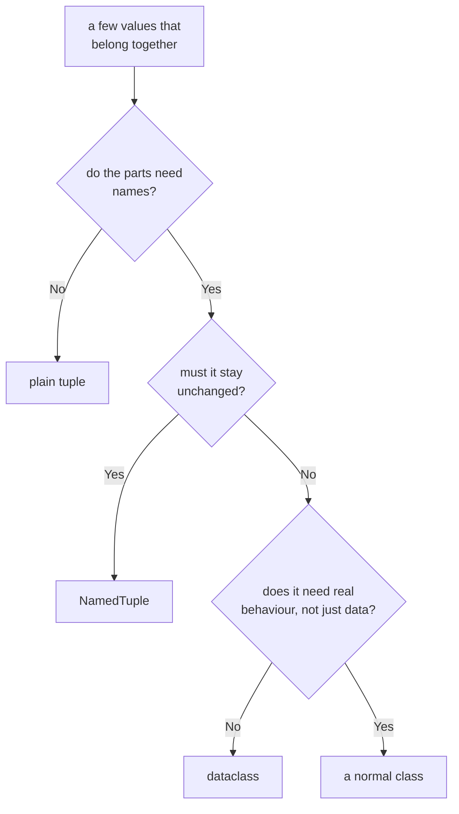

#python #oop #namedtuple #python-utils


The notes so far built classes upward — attributes, methods, inheritance, dunder methods. This one goes the other way. Sometimes you don't want a class at all; you want a small bundle of values that travel together and can be read by name. A named tuple is the cheapest thing that does that.

## The problem: positions carry no meaning

Represent a colour as a tuple and read the red channel out of it:

```python
color = (55, 155, 255)
print(color[0])   # 55
```

Correct, and unreadable. `color[0]` says nothing about what index zero *is*, and the tuple itself doesn't say whether these are RGB values, HSL values, or something else entirely. Come back in three months — or hand the file to someone else — and the only way to find out is to hunt for wherever the tuple was built.

## The dictionary attempt

The obvious fix is a dict, since keys are names:

```python
color = {'red': 55, 'green': 155, 'blue': 255}
print(color['red'])   # 55
```

Readable now. But it gives up three things that may have been the reason for choosing a tuple in the first place.

**It's mutable.** Nothing stops any code holding this from adding a key or changing a channel. If the value was meant to be a fixed record, a dict quietly stops enforcing that.

**Every instance costs the full literal.** Building fifty colours means typing the three key names fifty times, with fifty chances to typo `'gren'` into existence — a typo that raises nothing at write time and only fails wherever `'green'` is read.

**Access is heavier, in both syntax and memory.** Square brackets and quotes everywhere, no dot access:

```python
color.red
# AttributeError: 'dict' object has no attribute 'red'
```

```python
import sys
sys.getsizeof(color)   # 184 bytes as a dict
```

At a few colours that's irrelevant. At a million rows read out of a file, the difference between 184 bytes and 64 is over a hundred megabytes of nothing.

## `namedtuple`

A named tuple keeps everything a tuple gives you and adds the names:

```python
from collections import namedtuple

Color = namedtuple('Color', ['red', 'green', 'blue'])

color = Color(55, 155, 255)
```

```python
print(color.red)   # 55 — by name
print(color[0])    # 55 — still by position
print(color)       # Color(red=55, green=155, blue=255)
```

That last line is worth noticing on its own. A plain tuple prints `(55, 155, 255)`; this prints its own field names, so a value dumped into a log or a traceback explains itself — the `__repr__` idea from the last note, supplied for free.

The `namedtuple(...)` call **creates a class**, which is why the result is assigned to a capitalised name. `Color` is a type; `color` is an instance of it. Building more costs no more typing than a plain tuple:

```python
white = Color(255, 255, 255)
print(white.blue)   # 255
```

Arguments can be passed by keyword too, when the call site benefits from being explicit:

```python
Color(red=55, green=155, blue=255)
```

## It really is a tuple

Not "tuple-like" — a subclass of `tuple`, so everything that works on tuples works here:

```python
r, g, b = color        # unpacking
print(isinstance(color, tuple))   # True
```

Including immutability, which is the main reason to pick this over a dict or an ordinary class:

```python
color.red = 0
# AttributeError: can't set attribute

color[0] = 0
# TypeError: 'Color' object does not
# support item assignment
```

> [!warning] **Immutable does not mean "safe to use as a lookup key without thinking".** A named tuple hashes and compares **by value, ignoring its type** — so it is equal to a plain tuple with the same contents, and to a *different* named tuple class with the same contents:
> ```python
> Color(55, 155, 255) == (55, 155, 255)     # True
>
> Rgb = namedtuple('Rgb', ['red', 'green', 'blue'])
> Color(1, 2, 3) == Rgb(1, 2, 3)            # True
> ```
> They also collapse together in a set or as dict keys:
> ```python
> {Color(55, 155, 255), (55, 155, 255)}
> # {Color(red=55, green=155, blue=255)}  — one element
> ```
> This is inherited tuple behaviour, not a bug, and it's occasionally exactly what you want. But if two different record types must never compare equal, a named tuple is the wrong tool — that's a job for a class with its own `__eq__`, or a dataclass.

## The methods it comes with

Every named tuple carries a few extras, all prefixed with a single underscore — not because they're private, but so they can never collide with a field you named yourself.

```python
print(color._fields)
# ('red', 'green', 'blue')

print(color._asdict())
# {'red': 55, 'green': 155, 'blue': 255}
```

`_replace` is the one that matters most in practice. Since the value can't be modified, "changing" a field means building a new one — and `_replace` does that without retyping the fields you're keeping:

```python
darker = color._replace(red=0)
print(darker)   # Color(red=0, green=155, blue=255)
print(color)    # Color(red=55, green=155, blue=255)
```

The original is untouched, which is the whole point.

Fields can also carry defaults, filled from the right:

```python
Point = namedtuple('Point', ['x', 'y', 'z'],
                   defaults=[0, 0])

print(Point(5))         # Point(x=5, y=0, z=0)
print(Point(5, 6, 7))   # Point(x=5, y=6, z=7)
```

## The typed form

There's a second way to write the same thing, using class syntax and type annotations:

```python
from typing import NamedTuple

class Color(NamedTuple):
    red: int
    green: int
    blue: int
    alpha: int = 255
```

```python
c = Color(55, 155, 255)
print(c)          # Color(red=55, green=155, blue=255, alpha=255)
print(c.red)      # 55
print(c[0])       # 55
print(isinstance(c, tuple))   # True
```

Identical behaviour — same immutability, same `_replace`, same tuple-ness. What it adds is a place to put types, defaults written where you'd expect them, and room for methods of your own:

```python
class Point(NamedTuple):
    x: int
    y: int

    def distance_from_origin(self) -> float:
        return (self.x ** 2 + self.y ** 2) ** 0.5
```

```python
print(Point(3, 4).distance_from_origin())   # 5.0
```

> [!important] The annotations are **not** checked at runtime. `Color('red', 'green', 'blue')` builds happily despite `int` annotations — they're there for your editor, for type checkers, and for whoever reads the class. Runtime validation of field types is a different tool's job.

> [!tip] Reach for the `class` form when the record has more than a couple of fields, needs defaults, needs a method, or appears in function signatures where types help. The `namedtuple(...)` function form stays convenient for a quick two-or-three-field record, and for building a type dynamically at runtime — from a CSV header row, say, where the field names aren't known when the code is written.

## Choosing between the options



| | Names | Mutable | Equality | Per-instance cost |
|---|---|---|---|---|
| tuple | positions only | no | by value | lowest |
| `NamedTuple` | yes | no | by value, ignores type | same as a tuple |
| dict | yes | yes | by contents | ~3× a tuple |
| dataclass | yes | yes by default | by value **and** type | a normal object |
| class | yes | yes | by identity, unless you define `__eq__` | a normal object |

The honest summary is that a named tuple occupies a narrow but common spot: a **fixed record**, read far more often than it's built, where the fields want names and the value wants to stay put. Once any of those stops being true — a field needs to change in place, two record types must not compare equal, or the thing starts growing real behaviour — a dataclass or an ordinary class is the better fit, and the previous notes already cover how to build one.
