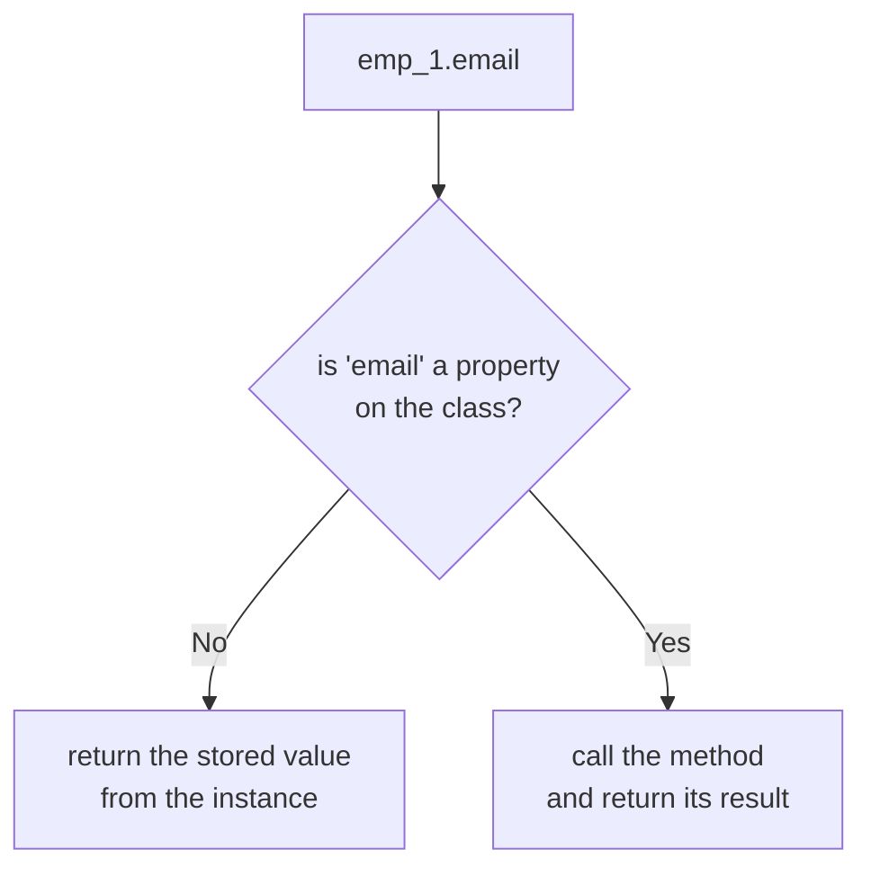

#python #oop #properties #python-utils


There's a bug lurking in the very first class these notes built, and it's the kind that only shows up once somebody uses your class in a way you didn't picture.

## Derived data goes stale

`__init__` computes the email once, from the first and last name:

```python
class Employee:
    def __init__(self, first, last):
        self.first = first
        self.last = last
        self.email = f'{first}.{last}@email.com'

    def full_name(self):
        return f'{self.first} {self.last}'
```

```python
emp_1 = Employee('John', 'Smith')
emp_1.first = 'Jim'

print(emp_1.first)         # Jim
print(emp_1.email)         # John.Smith@email.com  ← stale
print(emp_1.full_name())   # Jim Smith             ← correct
```

The email still says John. `full_name` doesn't have this problem, and the reason is the whole lesson: **it's computed when asked rather than stored when created.** `email` was frozen at construction and nothing updates it when its inputs change.

## The obvious fix, and what it costs

Make `email` a method too, exactly like `full_name`:

```python
    def email(self):
        return f'{self.first}.{self.last}@email.com'
```

Correct now — and it breaks every line of code anyone has already written. `emp_1.email` becomes `emp_1.email()`, everywhere, in code you don't control. A fix that forces a change on every caller isn't much of a fix.

What's wanted is to compute it like a method while **accessing** it like an attribute.

## `@property`

That's exactly what `@property` does:

```python
class Employee:
    def __init__(self, first, last):
        self.first = first
        self.last = last

    @property
    def email(self):
        return f'{self.first}.{self.last}@email.com'

    @property
    def full_name(self):
        return f'{self.first} {self.last}'
```

```python
emp_1 = Employee('John', 'Smith')
print(emp_1.email)       # John.Smith@email.com

emp_1.first = 'Jim'
print(emp_1.email)       # Jim.Smith@email.com   ← updated
print(emp_1.full_name)   # Jim Smith
```

No parentheses at either call site. The method body runs on every access, so the value can never go stale, and existing code that said `emp_1.email` keeps working unchanged.



> [!important] This is why `@property` matters beyond convenience: it means **a stored attribute can later become a computed one without breaking a single caller.** You are free to start simple and add the computation when you need it, rather than defensively wrapping every attribute in a getter on the chance you might.

Note also that `email` is no longer set in `__init__` at all — there's nothing to store. It exists only as a rule for producing a value.

## Assigning to a property

`full_name` is now readable as an attribute. Writable is a separate question:

```python
emp_1.full_name = 'Corey Schafer'
```

```
AttributeError: property 'full_name' of
'Employee' object has no setter
```

Read-only by default, and the message says precisely what's missing. Adding a setter is a second decorator, named after the property itself:

```python
    @full_name.setter
    def full_name(self, name):
        first, last = name.split()
        self.first = first
        self.last = last
```

```python
emp_1.full_name = 'Corey Schafer'

print(emp_1.first)   # Corey
print(emp_1.last)    # Schafer
print(emp_1.email)   # Corey.Schafer@email.com
```

Assigning to `full_name` ran the setter, which split the string and updated `first` and `last` — and since `email` is itself computed from those, it followed along for free.

Two details in that syntax are easy to get wrong. The decorator is `@full_name.setter`, using the **name of the existing property**, so a property must be defined before its setter. And the method underneath must have the **same name** as the property; the value being assigned arrives as its second parameter.

> [!warning] **`name.split()` here, not `name.split(' ')`.** Either way this setter assumes exactly two words, and unpacking is unforgiving about that:
> ```python
> emp_1.full_name = 'Corey'
> # ValueError: not enough values to unpack
> # (expected 2, got 1)
>
> emp_1.full_name = 'Mary Jane Smith'
> # ValueError: too many values to unpack (expected 2)
> ```
> Splitting on a literal `' '` adds a third failure that has nothing to do with the name at all — a stray double space produces an empty string in the middle and raises the same error:
> ```python
> 'Corey  Schafer'.split(' ')
> # ['Corey', '', 'Schafer']  → too many values
>
> 'Corey  Schafer'.split()
> # ['Corey', 'Schafer']      → fine
> ```
> If two-part names are genuinely all you support, `split()` at least stops punishing whitespace. If they aren't, `name.split(None, 1)` splits once and treats the remainder as the last name, giving `('Mary', 'Jane Smith')`.

## Deleters

The same pattern once more, for `del`:

```python
    @full_name.deleter
    def full_name(self):
        print('Delete Name!')
        self.first = None
        self.last = None
```

```python
del emp_1.full_name
# Delete Name!

print(emp_1.first, emp_1.last)   # None None
```

`del` on a property runs this method instead of removing anything — a hook for cleanup rather than a real deletion.

> [!info] Worth noticing what that leaves behind. `email` is still computed from `first` and `last`, so after the delete it happily produces `None.None@email.com` — no error, just nonsense. A deleter that puts the object into a state its other properties can't handle has moved the problem rather than solved it. Deleters are the least used of the three by a wide margin; most classes need only `@property`, and some need a setter.

## The other reason setters exist

Recomputing derived values is one use. The more common one in real code is **validating on assignment** — an attribute that plain assignment can't police:

```python
class Employee:
    def __init__(self, pay):
        self.pay = pay

    @property
    def pay(self):
        return self._pay

    @pay.setter
    def pay(self, value):
        if value < 0:
            raise ValueError('pay cannot be negative')
        self._pay = value
```

```python
e = Employee(50000)
e.pay = 60000
print(e.pay)      # 60000

e.pay = -1
# ValueError: pay cannot be negative

Employee(-5)
# ValueError: pay cannot be negative
```

The last line is the good part: `__init__` writes `self.pay = pay`, which goes through the setter like any other assignment, so the check applies at construction too without being written twice.

> [!warning] **The backing attribute must have a different name, or the property calls itself forever.**
> ```python
>     @property
>     def pay(self):
>         return self.pay      # ← reads the property again
> ```
> ```
> RecursionError: maximum recursion depth exceeded
> ```
> `self.pay` inside the getter is not **the stored value** — it's the very property being defined, so it re-enters itself until the stack runs out. Storing under `_pay` breaks the cycle, and the leading underscore is the usual signal for **internal; use the property instead**. You can see the real storage in the instance dict:
> ```python
> print(e.__dict__)   # {'_pay': 60000}
> ```
> The name `pay` appears nowhere in there — it lives on the class, as the property.

## When not to reach for it

`@property` is not a reason to wrap every attribute in a getter and setter. Plain attributes are the default in Python precisely because properties can be added later without breaking callers — that's the guarantee that makes starting simple safe.

Reach for one when the value is **derived** from other attributes and must not go stale, when assignment needs to **validate** or trigger something, or when an existing stored attribute needs to become computed without changing how it's used. Otherwise, leave it as an ordinary attribute.

One last thing to keep in mind: because it looks like an attribute, callers will assume it's cheap. A property that runs a query or a heavy computation on every access will get called in a loop by someone who has no way of knowing. If it's expensive, either cache it or make it an obvious method call.
