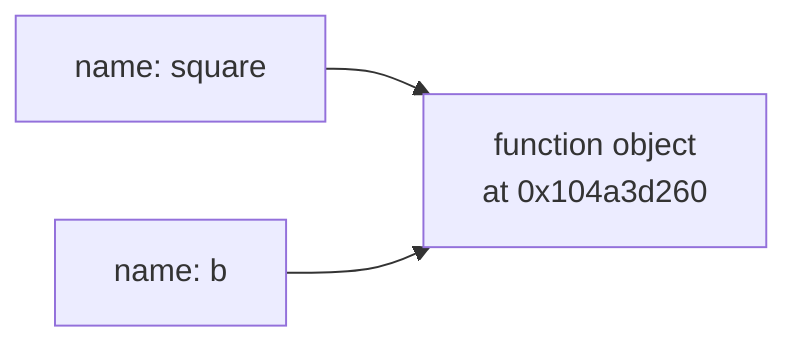

#python #decorators #first-class-functions #python-utils

# 01 · Functions Are Objects

## The two things a function name can mean

Take the simplest possible function:

```python
def square(n):
    return n * n
```

Now look at these two lines. They differ by two characters:

```python
a = square(5)   # a is 25
b = square      # b is the function itself
```

The first line says **run this function and keep the answer**. The second says **keep the function**.

This is the single most common point of confusion, so it's worth being blunt about the mechanism:

> [!important] **The parentheses are the run it operator.**
> `square` is the thing. `square(5)` is **the result of running the thing**. They are as different as a recipe and a cake.

Print them and Python tells you outright:

```python
print(square)      # <function square at 0x104a3d260>
print(square(5))   # 25
```

That first line is the giveaway. `<function square at 0x104a3d260>` is what Python prints for **an object it is holding in memory at a particular address** — the same shape of output you get for a list, a dict, or an instance of your own class. A function is not special syntax that the interpreter treats differently. It is a value, sitting in memory, that happens to be callable.

And once `b = square` has run, `b` is that same value. So this works:

```python
b = square
print(b(5))   # 25
```

`b` is not **a variable pretending to be a function**. `b` and `square` are two names pointing at one object.



> [!warning] **The half-way mistake.**
> When people are told to drop the parentheses, they often drop only the **argument**: `b = square()`. That still calls the function — now with no arguments — and usually raises `TypeError: square() missing 1 required positional argument`. The parentheses are what triggers the call; emptying them does not disarm them.

---

## Proving it's an object

If a function really is an ordinary object, it should survive everything an ordinary object survives. It does:

```python
square.__name__          # 'square'  — it has attributes
square.description = "squares a number"   # you can attach your own

funcs = [square, len, str.upper]          # it goes in a list
funcs[0](5)                               # 25

ops = {"sq": square, "len": len}          # it goes in a dict
ops["sq"](5)                              # 25
```

That `__name__` attribute is not a curiosity — it is the reason `functools.wraps` exists, because a careless decorator overwrites it.

---

## Why first-class

The formal definition is about the **language**, not about any one function:

> [!info] A language has **first-class functions** when its functions support every operation its other values support — principally: **assigned to a variable**, **passed as an argument**, and **returned from a function**.
>
> So **first-class function** is a statement about **Python**, not a special category of function you can write. Every Python function is first-class; there is no second-class kind — which is why the phrase sounds odd the first time you meet it. It only exists as a term because some languages **don't** have this, and in those you have to work around it. Python doesn't, so in practice the term's only job here is to name the three operations above.

Assignment is what this note covered. Passing a function in and returning one out are the other two operations — together they're the definition of a **higher-order function**, and a decorator is nothing but a higher-order function with nicer syntax.

---

## Where the simpler thing breaks

Assigning a function to a variable looks like a party trick until the alternative gets painful. Here is the alternative.

Say a review service has to run a different validation depending on the incoming payload's type. The obvious first version:

```python
def handle(kind, payload):
    if kind == "rating":
        return check_rating(payload)
    elif kind == "comment":
        return check_comment(payload)
    elif kind == "play_name":
        return check_play_name(payload)
    ...
```

With three kinds this is fine — genuinely fine, and you should write it. The problem starts at scale: an agent with a few dozen tools routed this way becomes one giant `if/elif` chain in a single function, every branch re-read on every call, and adding a tool means editing a function in the middle of a request path.

Because functions are objects, the branching collapses into a lookup:

```python
HANDLERS = {
    "rating":    check_rating,
    "comment":   check_comment,
    "play_name": check_play_name,
}

def handle(kind, payload):
    return HANDLERS[kind](payload)     # look it up, then call it
```

Note the two steps hiding in `HANDLERS[kind](payload)`: `HANDLERS[kind]` **fetches a function object**, and the trailing `(payload)` **runs it**. Same distinction as `square` vs `square(5)`, one line apart.

The dict version does not just look tidier. Adding a handler is now adding a row of data, not editing control flow — which is exactly how every agent framework maintains a tool registry, and how a router maps a path to a view.

> [!tip] `match`/`case` is often described as **Python's switch statement**, which makes it sound like the replacement for this pattern. It isn't. Its branches are written out in the source at each `case` line, so you can't hand it a dict assembled at runtime and have it call whichever function is stored under a matching key — the thing that makes the registry above extensible. `match`/`case` solves a different problem: readable branching on a value's **shape**, like unpacking a tuple or checking a class.

---

## Where this already sits in this vault's own code

This isn't a party trick reserved for toy examples — it's already sitting in code you've written, unremarked:

```python
# 00-Python-Utils/.../models.py
created_at: datetime = Field(default_factory=datetime.now)

# 00-Fast-API/.../routes.py
def list_reviews(session: Session = Depends(get_session)):
    ...
```

`datetime.now` and `get_session` are both functions, and both are written **without parentheses** — exactly the `b = square` shape from the top of this note, not `b = square()`.

```python
Field(default_factory=datetime.now)
```

You are handing SQLModel **the function**, not a timestamp. SQLModel calls it later, once per row inserted. Write `datetime.now()` instead and you hand it a single timestamp captured at import time — and every row in the table gets the moment your server booted. That is a real bug, silent, and it survives testing on a freshly-started server.

```python
session: Session = Depends(get_session)
```

Same shape. FastAPI is given **the function** `get_session` and calls it per request. Writing `Depends(get_session())` would call it now, at import, and hand `Depends` a generator object instead of the recipe for making one.

> [!tip] **The reading habit worth building.**
> Whenever a function name appears without parentheses, ask: **who is going to call this, and when?** The answer is always **someone else, later**. That deferral is the entire point — and it is the mechanism underneath callbacks, dependency injection, event handlers, retries, and decorators.
