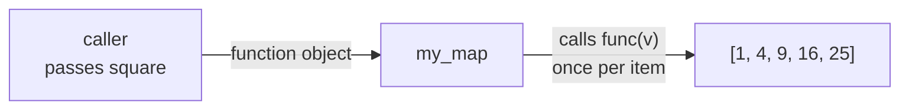
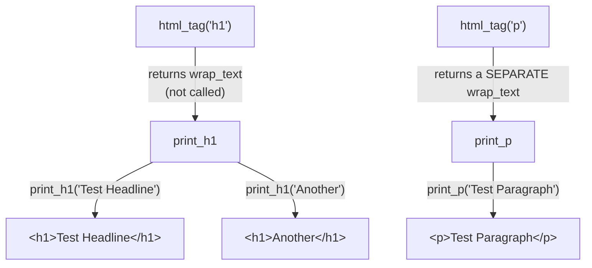

#python #decorators #higher-order-functions #python-utils


So we know function is an object we can put in a variable. Two operations remain, and they are the ones that **matter:**

> [!info] A **higher-order function** is a function that does at least one of:
> - **takes** a function as an argument, or
> - **returns** a function as its result.
>
> That is the whole definition. `map`, `sorted`, `filter`, and every decorator you have ever used are members of this set.

---

## Part 1 — Taking a function as an argument

### Break the simpler thing first

You need the squares of a list. The obvious loop:

```python
result = []
for n in nums:
    result.append(square(n))
```

Now you need the cubes. You write the same loop again with `cube` in the middle. Then lengths, then uppercase, then a rating-normaliser. Five loops, identical except for one call in the centre.

The thing that varies is a *function*. And functions are objects. So pass it in:

```python
def my_map(func, values):
    result = []
    for v in values:
        result.append(func(v))     # func is whatever was handed in
        # ^ parentheses HERE — this is the only place it runs
    return result

my_map(square, [1, 2, 3, 4, 5])    # [1, 4, 9, 16, 25]
my_map(cube,   [1, 2, 3, 4, 5])    # [1, 8, 27, 64, 125]
```

Look at where the parentheses are and are not. `square` is passed bare — `my_map(square(), ...)` would run it immediately with no argument and crash. The call happens once, inside the loop, on the parameter name `func`. The caller supplies *what to do*; `my_map` owns *when and how often to do it*.



---

## Part 2 — Returning a function

This is the half that trips people, and it is the half decorators are built on.

### The shape

```python
def html_tag(tag):
    def wrap_text(msg):
        print(f"<{tag}>{msg}</{tag}>")
    return wrap_text            # no parentheses — hand back the function itself
```

An inner function is defined, and the outer function returns it **unrun**. So calling `html_tag` does not print anything:

```python
print_h1 = html_tag("h1")
print(print_h1)      # <function html_tag.<locals>.wrap_text at 0x1052b4040>
```

Nothing has been printed yet. What came back is `wrap_text`, primed and waiting. Now run it — and run it repeatedly:

```python
print_h1("Test Headline")      # <h1>Test Headline</h1>
print_h1("Another Headline")   # <h1>Another Headline</h1>

print_p = html_tag("p")
print_p("Test Paragraph")      # <p>Test Paragraph</p>
```



`html_tag` is a **factory**: you call it once with configuration, and it hands back a specialised function you call many times with data. 

### The thing you should have noticed

`html_tag` finished running before `print_h1("Test Headline")` was ever called. Its parameter `tag` should be gone — the call is over, its frame is dead. Yet `wrap_text` still prints `<h1>`.

> [!important] The returned function **remembered** the value `tag` from the call that created it. That is a **closure**, and it is not a side note — 
> it is the mechanism that makes returning functions useful at all. Without it, a returned function could only ever use its own arguments and globals, and factories would be pointless.
>


