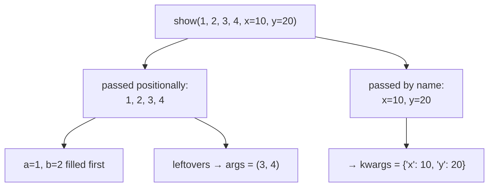
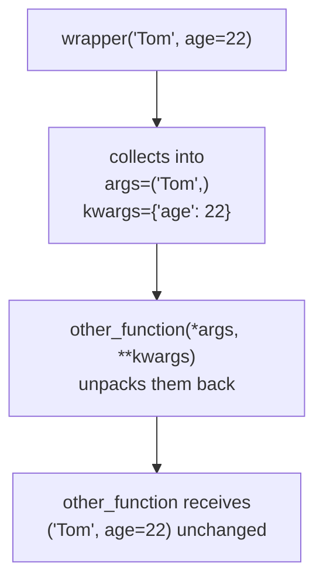

#python #decorators #args-kwargs #python-utils


Passing a function around is settled. Before going further, there's one piece of plumbing to get out of the way — the thing that eventually lets a single wrapper stand in front of *any* function, whatever arguments it takes. It only makes sense once the two ways of passing an argument are clear, so start there.

## Positional and keyword arguments

A function is defined once, with plain parameter names:

```python
def describe(name, age, city):
    print(f"{name} | {age} | {city}")
```

Nothing there marks a parameter as "positional" or "keyword". Those words describe **how the caller passes the value**, not how the function was written.

### Positional — matched by order

```python
describe("Tom", 22, "Pune")     # Tom | 22 | Pune
```

Python pairs them by position: first value to first parameter, second to second. Whatever variable names exist at the call site are irrelevant — only the sequence counts.

That's also the failure mode:

```python
describe(22, "Tom", "Pune")     # 22 | Tom | Pune
```

Legal, and silently wrong. Nothing checks that `22` is a plausible name; the order said so, so Python did it.

### Keyword — matched by name

```python
describe(name="Tom", age=22, city="Pune")     # Tom | 22 | Pune
describe(city="Pune", name="Tom", age=22)     # Tom | 22 | Pune
```

State which parameter each value belongs to and **order stops mattering**. Both calls are identical in effect. It costs more typing and buys two things: the call documents itself, and it can't be silently scrambled.

### Mixing, and the one rule

```python
describe("Tom", city="Pune", age=22)     # Tom | 22 | Pune
```

Fine — `"Tom"` fills `name` by position, the rest claim theirs by name. Reversed, it doesn't even compile:

```python
describe(name="Tom", 22, "Pune")
```

```
SyntaxError: positional argument follows keyword argument
```

The reason is mechanical rather than stylistic. Positional matching works by counting from the left; once a keyword argument appears, the count is broken and Python can no longer tell which slot a later bare value was meant for. So **every positional argument must come before every keyword argument**.

> [!warning] Two error messages worth recognising, because both read oddly the first time.
> ```python
> describe("Tom", 22, "Pune", name="Jerry")
> # TypeError: describe() got multiple values for argument 'name'
> ```
> `"Tom"` already filled `name` by position; `name="Jerry"` then tried to fill it again.
> ```python
> describe("Tom", 22)
> # TypeError: describe() missing 1 required positional
> # argument: 'city'
> ```
> Python says "positional argument" even though `city` could have been passed by keyword. It means *this parameter can be filled positionally*, not *you were required to use position*.

## `*args` — collect the leftover positional arguments

A fixed signature is a fixed promise. Hand it more than it asked for and it dies:

```python
def greet(name):
    print(f"hi {name}")

greet("Tom", "Jerry")
```

```
TypeError: greet() takes 1 positional argument but 2 were given
```

That's fine when you know what you'll be called with, and useless when you're writing something that must accept calls meant for *another* function. A `*` in the definition sweeps up however many positional arguments arrive:

```python
def show(*args):
    print("args =", args)
```

```python
show()             # args = ()
show(1)            # args = (1,)
show(1, 2, 3)      # args = (1, 2, 3)
show("Tom", 22)    # args = ('Tom', 22)
```

No call is ever an error. Zero arguments gives an empty tuple — and it really is a **tuple**, so indexing, `len()`, and looping all work normally.

## `**kwargs` — collect the leftover keyword arguments

`**` does the same job for arguments passed by name, collecting them into a **dict** where each parameter name becomes a key:

```python
def show(**kwargs):
    print("kwargs =", kwargs)
```

```python
show()                       # kwargs = {}
show(name="Tom")             # kwargs = {'name': 'Tom'}
show(name="Tom", age=22)     # kwargs = {'name': 'Tom', 'age': 22}
```

## Both together

```python
def show(*args, **kwargs):
    print("args =", args, " kwargs =", kwargs)

show(1, 2, name="Tom", age=22)
# args = (1, 2)  kwargs = {'name': 'Tom', 'age': 22}
```

Python sorts each value by **how it was passed**, not by what it is: bare values land in `args`, `key=value` pairs land in `kwargs`. Between them, the two catch any call that can be written.

Named parameters still work as usual and are filled first:

```python
def show(a, b, *args, **kwargs):
    print(f"a={a} b={b} args={args} kwargs={kwargs}")

show(1, 2, 3, 4, x=10, y=20)
# a=1 b=2 args=(3, 4) kwargs={'x': 10, 'y': 20}
```

`a` and `b` take the first two positional values; `*args` catches the overflow.



## The same symbols also *unpack*

This is the half that confuses people, and the half decorators depend on. At a **call site**, `*` and `**` do the reverse — they take a collection apart into separate arguments:

```python
def add(x, y, z):
    return x + y + z
```

```python
nums = [1, 2, 3]
add(*nums)          # 6 — exactly like writing add(1, 2, 3)

d = {"x": 1, "y": 2, "z": 3}
add(**d)            # 6 — exactly like writing add(x=1, y=2, z=3)
```

Same symbols, opposite jobs. **Where they appear decides which:**

| Where | What it does |
|---|---|
| in the `def` line | **collects** many arguments into one tuple / dict |
| at the call site | **unpacks** one tuple / dict back into many arguments |

## Where this is heading

Both halves together produce a shape you'll meet constantly from here on:

```python
def wrapper(*args, **kwargs):
    return other_function(*args, **kwargs)
```

Collect on the way in, unpack on the way out. A function written this way never has to know what the function it forwards to expects — it catches whatever arrived, then replays it in the identical shape. That is what will let a single piece of code stand in front of `display()`, `display_info(name, age)`, and anything else, without being rewritten for each one.



> [!tip] `args` and `kwargs` are only conventions — Python reads nothing but the `*` and `**`. `def f(*things, **stuff)` behaves identically. Every codebase uses `args` and `kwargs` though, so picking different names buys nothing and costs your reader a double-take.
